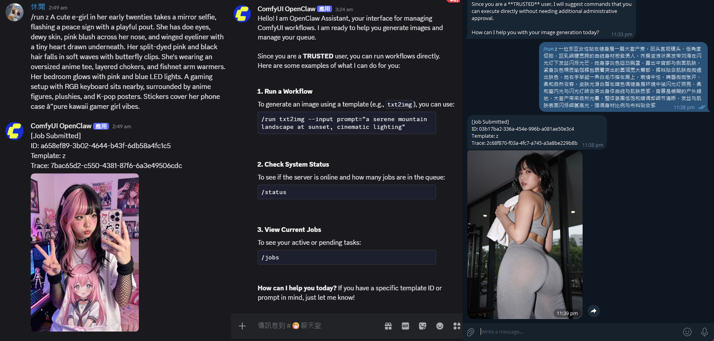
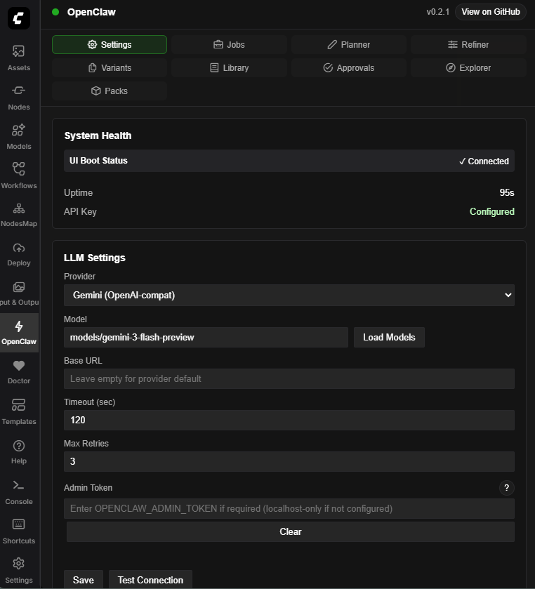

# ComfyUI-OpenClaw



ComfyUI-OpenClaw is a **security-first** ComfyUI custom node pack that adds:

- **LLM-assisted nodes** (planner/refiner/vision/batch variants)
- **A built-in extension UI** (`OpenClaw` panel)
- **A secure-by-default HTTP API** for automation (webhooks, triggers, schedules, approvals, presets)
- **Now supports major messaging platforms, including Discord, Telegram, WhatsApp, LINE, WeChat and KakaoTalk.**
- **And more exciting features being added continuously**

---

This project is intentionally **not** a general-purpose assistant platform with broad remote execution surfaces. It is designed to make **ComfyUI a reliable automation target** with an explicit admin boundary and hardened defaults.

**Security stance (how this project differs from convenience-first automation packs):**

- Localhost-first defaults; remote access is opt-in
- Explicit **Admin Token** boundary for write actions
- Webhooks are **deny-by-default** until auth is configured
- Encrypted webhook mode is **fail-closed** (invalid signature/decrypt/app-id checks are rejected)
- Strict outbound SSRF policy (callbacks + custom LLM base URLs)
- Pack lifecycle file paths and pack API inputs are validated and root-bounded to prevent path traversal
- Bridge worker endpoints enforce device-token auth, scope checks, and idempotency handling
- Replay risk is reduced with deterministic dedupe keys for event payloads without message IDs
- Cryptography dependency is optional and only required when encrypted webhook mode is enabled
- Secrets are never stored in browser storage (optional server-side key store is local-only convenience)
- Profile-driven startup hardening with fail-closed enforcement in hardened mode
- Startup module capability gates (disabled modules do not register routes/workers)

## Latest Updates - Click to expand

<details>
<summary><strong>Pack security hardening: path traversal defense and strict API validation</strong></summary>

- Added path traversal protection for pack uninstall and pack path resolution.
- Hardened pack install path construction by validating pack metadata segments (`name`, `version`) and enforcing root-bounded path resolution.
- Added stricter input validation on pack API route handlers for pack lifecycle operations.
- Expanded regression coverage for traversal attempts and invalid input handling in pack flows.

</details>

<details>
<summary><strong>Runtime profile hardening and bridge startup compatibility checks</strong></summary>

- Added explicit runtime profiles with centralized resolution so startup behavior is deterministic across environments.
- Added a hardened startup security gate that fails closed when mandatory controls are not correctly configured.
- Added module capability boundaries so routes/workers only boot when their owning module is enabled.
- Added a bridge protocol handshake path with version compatibility checks during sidecar startup.
- Expanded regression coverage for profile resolution, startup gating, module boundaries, and bridge handshake behavior.

</details>

<details>
<summary><strong>Connector platform parity and sidecar worker runtime improvements</strong></summary>

- Added stronger KakaoTalk response handling:
  - strict QuickReply cap with safe truncation
  - empty-response guard to avoid invalid platform payloads
  - more predictable output shaping and sanitization behavior
- Added WeChat Official Account encrypted webhook support:
  - AES encrypted ingress (`encrypt_type=aes`) with signature verification and fail-closed decrypt/app-id validation
  - expanded event normalization coverage (`subscribe`, `unsubscribe`, `CLICK`, `VIEW`, `SCAN`)
  - deterministic dedupe behavior for event payloads without `MsgId`
  - bounded ACK-first flow with deferred reply handling for slow paths
- Added sidecar worker bridge alignment end-to-end:
  - worker poll/result/heartbeat bridge endpoints
  - contract-driven sidecar client endpoint resolution and idempotency header behavior
  - dedicated E2E test coverage for worker route registration, auth, and round-trip behavior

</details>

<details>
<summary><strong>Security Hardening: Auth/Observability boundaries, connector command controls, registry trust policy, transform isolation, integrity checks, and safe tooling controls</strong></summary>

- Delivered observability tier hardening with explicit sensitivity split:
  - Public-safe: `/openclaw/health`
  - Observability token: `/openclaw/config`, `/openclaw/events`, `/openclaw/events/stream`
  - Admin-only: `/openclaw/logs/tail`, `/openclaw/trace/{prompt_id}`, `/openclaw/secrets/status`, `/openclaw/security/doctor`
- Delivered constrained transform isolation hardening:
  - process-boundary execution via `TransformProcessRunner`
  - timeout/output caps and network-deny worker posture
  - feature-gated default-off behavior for safer rollout
- Delivered approval/checkpoint integrity hardening:
  - canonical JSON + SHA-256 integrity envelopes
  - tamper detection and fail-closed handling on integrity violations
  - migration-safe loading behavior for legacy persistence files
- Delivered external tooling execution policy:
  - allowlist-driven tool definitions (`data/tools_allowlist.json`)
  - strict argument validation, bounded timeout/output, and redacted output handling
  - gated by `OPENCLAW_ENABLE_EXTERNAL_TOOLS` plus admin access policy
- Extended security doctor coverage with wave-2 checks:
  - validates transform isolation posture
  - reports external tooling posture
  - verifies integrity module availability
- Auth-coverage contract tests were updated to include new tool routes and prevent future route-auth drift regressions.
- Added connector command authorization hardening:
  - separates command visibility from command execution privileges
  - centralizes per-command access checks to reduce cross-platform auth drift
  - supports explicit allow-list policy controls for sensitive command classes
  - adds operator-configurable command policy controls via `OPENCLAW_COMMAND_OVERRIDES` and `OPENCLAW_COMMAND_ALLOW_FROM_{PUBLIC|RUN|ADMIN}`
- Added registry anti-abuse controls for remote distribution paths:
  - bounded request-rate controls and deduplication windows reduce abuse and accidental hot loops
  - stale anti-abuse state pruning keeps long-running deployments stable
- Added registry preflight and trust-policy hardening:
  - static package safety checks are enforced before activation paths
  - policy-driven signature/trust posture supports audit and strict enforcement modes
  - registry trust mode is operator-controlled via `OPENCLAW_REGISTRY_POLICY` and preflight verification enforces fail-closed file-path requirements

</details>

<details>
<summary><strong>Sprint A: closes out with five concrete reliability and security improvements</strong></summary>

- Configuration save/apply now returns explicit apply metadata, so callers can see what was actually applied, what requires restart, and which effective provider/model is active.
- The Settings update flow adds defensive guards against stale or partial state, reducing accidental overwrites.
- Provider/model precedence is now deterministic across save, test, and chat paths, and prevents model contamination when switching providers.
- In localhost convenience mode (no admin token configured), chat requests enforce same-origin CSRF protection: same-origin requests are allowed, cross-origin requests are denied.
- Model-list fetching now uses a bounded in-memory cache keyed by provider and base URL, with a 5-minute TTL and LRU eviction cap to improve responsiveness and stability.

</details>

<details>
<summary><strong>Sprint B: ships security doctor diagnostics, registry quarantine gates, and constrained transforms defaults</strong></summary>

- Added the Security Doctor surface (`GET /openclaw/security/doctor`) for operator-focused security posture checks across endpoint exposure, token boundaries, SSRF posture, state-dir permissions, redaction drift, runtime mode, feature flags, and API key posture.
- Added optional remote pack registry quarantine controls with explicit lifecycle states, SHA256 integrity verification, bounded local persistence, and per-entry audit trail; this path remains disabled by default and fail-closed.
- Added optional constrained transform execution with trusted-directory + integrity pinning, timeout and output-size caps, and bounded chain execution semantics; transforms remain disabled by default and mapping-only behavior remains intact unless explicitly enabled.

</details>

<details>
<summary><strong>Settings contract, frontend graceful degradation, and provider drift governance</strong></summary>

- Enforced a strict settings write contract with schema-coerced values and explicit unknown-key rejection, reducing save/apply regressions across ComfyUI variants.
- Hardened frontend behavior to degrade safely when optional routes or runtime capabilities are unavailable, with clearer recovery hints instead of brittle failures.
- Added provider alias/deprecation governance and normalization coverage to reduce preset drift as upstream model IDs and endpoint shapes evolve.

</details>

<details>
<summary><strong>Mapping v1, job event stream, and operator doctor</strong></summary>

- Added webhook mapping engine v1 with declarative field mapping + type coercion, enabling external payload normalization without custom adapter code paths.
- Added real-time job event stream support via SSE (`/openclaw/events/stream`) with bounded buffering and polling fallback (`/openclaw/events`) for compatibility.
- Added Operator Doctor diagnostics tooling for runtime/deployment checks (Python/Node environment, state-dir posture, and contract readiness signals).

</details>

<details>
<summary><strong>Security doctor, registry quarantine, and constrained transforms</strong></summary>

- Added Security Doctor diagnostics surface (`GET /openclaw/security/doctor`) for operator-focused security posture checks and guarded remediation flow.
- Added optional remote registry quarantine lifecycle controls with integrity verification, bounded local persistence, and explicit trust/audit gates.
- Added optional constrained transform execution with integrity pinning, timeout/output caps, and bounded chain semantics; default posture remains disabled/fail-closed.

</details>

---

## Table of Contents

- [Installation](#installation)
- [Quick Start (Minimal)](#quick-start-minimal)
  - [Configure an LLM key](#1-configure-an-llm-key-for-plannerrefinervision-helpers)
  - [Configure webhook auth](#2-configure-webhook-auth-required-for-webhook)
  - [Set an Admin Token](#3-optional-recommended-set-an-admin-token)
- [Nodes](#nodes)
- [Extension UI](#extension-ui)
- [API Overview](#api-overview)
  - [Observability](#observability-read-only)
  - [LLM config](#llm-config-non-secret)
  - [Webhooks](#webhooks)
  - [Triggers + approvals](#triggers--approvals-admin)
  - [Schedules](#schedules-admin)
  - [Presets](#presets-admin)
  - [Packs](#packs-admin)
  - [Bridge](#bridge-sidecar-optional)
- [Templates](#templates)
- [Execution Budgets](#execution-budgets)
- [LLM Failover](#llm-failover)
- [Advanced Security and Runtime Setup](#advanced-security-and-runtime-setup)
  - [Runtime hardening and startup gates](#runtime-hardening-and-startup-gates)
  - [Remote registry sync and constrained transforms](#remote-registry-sync-and-constrained-transforms)
  - [Connector command authorization policy](#connector-command-authorization-policy)
- [State Directory & Logs](#state-directory--logs)
- [Troubleshooting](#troubleshooting)
- [Tests](#tests)
- [Updating](#updating)
- [Remote Control (Connector)](#remote-control-connector)
- [Security](#security)

---

## Installation

- ComfyUI-Manager: install as a custom node (recommended for most users), then restart ComfyUI.
- Git (manual):
  - `git clone <repo> ComfyUI/custom_nodes/comfyui-openclaw`

Alternative install options:

1. Copy/clone this repository into your ComfyUI `custom_nodes` folder
2. Restart ComfyUI.

If the UI loads but endpoints return 404, ComfyUI likely did not load the Python part of the pack (see Troubleshooting).

## Quick Start (Minimal)

### 1 Configure an LLM key (for Planner/Refiner/vision helpers)

Set at least one of:

- `OPENCLAW_LLM_API_KEY` (generic)
- Provider-specific keys from the provider catalog (preferred; see `services/providers/catalog.py`)

Provider/model configuration can be set via env or `/openclaw/config` (admin boundary; localhost-only convenience if no Admin Token configured).

Notes:

- Recommended: set API keys via environment variables.
- Optional: for single-user localhost setups, you can store a provider API key from the Settings tab (UI Key Store (Advanced)).
  - This writes to the server-side secret store (`{STATE_DIR}/secrets.json`).
  - Environment variables always take priority over stored keys.

### 2) Configure webhook auth (required for `/webhook*`)

Webhooks are **deny-by-default** unless auth is configured:

- `OPENCLAW_WEBHOOK_AUTH_MODE=bearer` and `OPENCLAW_WEBHOOK_BEARER_TOKEN=...`
- or `OPENCLAW_WEBHOOK_AUTH_MODE=hmac` and `OPENCLAW_WEBHOOK_HMAC_SECRET=...`
- or `OPENCLAW_WEBHOOK_AUTH_MODE=bearer_or_hmac` to accept either
- optional replay protection: `OPENCLAW_WEBHOOK_REQUIRE_REPLAY_PROTECTION=1`

### 3) Optional (recommended): set an Admin Token

Admin/write actions (save config, `/llm/test`, key store) are protected by the **Admin Token**:

- If `OPENCLAW_ADMIN_TOKEN` (or legacy `MOLTBOT_ADMIN_TOKEN`) is set, clients must send it via `X-OpenClaw-Admin-Token`.
- If no admin token is configured, admin actions are allowed on **localhost only** (convenience mode). Do not use this mode on shared/public deployments.

Remote admin actions are denied by default. If you understand the risk and need remote administration, opt in explicitly:

- `OPENCLAW_ALLOW_REMOTE_ADMIN=1`

### Windows env var tips (PowerShell / CMD / portable .bat / Desktop)

- PowerShell (current session only):
  - `$env:OPENCLAW_LLM_API_KEY="<YOUR_API_KEY>"`
  - `$env:OPENCLAW_ADMIN_TOKEN="<YOUR_ADMIN_TOKEN>"`
- PowerShell (persistent; takes effect in new shells):
  - `setx OPENCLAW_LLM_API_KEY "<YOUR_API_KEY>"`
  - `setx OPENCLAW_ADMIN_TOKEN "<YOUR_ADMIN_TOKEN>"`
- CMD (current session only): `set OPENCLAW_LLM_API_KEY=<YOUR_API_KEY>`
- Portable `.bat` launchers: add `set OPENCLAW_LLM_API_KEY=...` / `set OPENCLAW_ADMIN_TOKEN=...` before launching ComfyUI.
- ComfyUI Desktop: if env vars are not passed through reliably, prefer the Settings UI key store for localhost-only convenience, or set system-wide env vars.

## Nodes

Nodes are exported as `Moltbot*` class names for compatibility, but appear as `openclaw:*` display names in ComfyUI:

- `openclaw: Prompt Planner`
- `openclaw: Prompt Refiner`
- `openclaw: Image to Prompt`
- `openclaw: Batch Variants`

See `web/docs/` for node usage notes.

## Extension UI



The frontend lives in `web/` and is served by ComfyUI as an extension panel. It uses the backend routes below (preferring `/api/openclaw/*`).

## API Overview

### Base paths

Routes are registered to support both:

- New prefix: `/openclaw/*`
- Legacy prefix: `/moltbot/*`

And both:

- Direct: `/openclaw/...`
- ComfyUI API shim: `/api/openclaw/...`

Use `/api/...` from browsers and extension JS.

### Observability (read-only)

- `GET /openclaw/health` -pack status, key presence, and basic metrics
- `GET /openclaw/logs/tail?n=50` - log tail (supports `trace_id` / `prompt_id` filters)
- `GET /openclaw/trace/{prompt_id}` -trace timeline (redacted)
- `GET /openclaw/capabilities` -feature/capability probe for frontend compatibility
- `GET /openclaw/jobs` -currently a stub (returns an empty list)

Access control:

- loopback is allowed
- remote access requires `OPENCLAW_OBSERVABILITY_TOKEN` via `X-OpenClaw-Obs-Token`

### LLM config (non-secret)

- `GET /openclaw/config` -effective config + sources + provider catalog (observability-protected)
- `PUT /openclaw/config` -update non-secret config (admin boundary)
- `POST /openclaw/llm/test` -test connectivity (admin boundary)
- `POST /openclaw/llm/chat` -connector chat completion path (admin boundary)
- `GET /openclaw/llm/models` -fetch model list for selected provider/base URL

Notes:

- Queue submission uses `OPENCLAW_COMFYUI_URL` (default `http://127.0.0.1:8188`).
- `PUT /openclaw/config` now returns apply metadata so callers can reason about what actually took effect:
  - `apply.ok`, `apply.requires_restart`, `apply.applied_keys`
  - `apply.effective_provider`, `apply.effective_model`
- Provider/model precedence is strict:
  - explicit request values > persisted config > provider defaults
  - model is revalidated against provider when provider changes (prevents cross-provider contamination)
- `POST /openclaw/llm/chat` in localhost convenience mode (no admin token configured):
  - allows same-origin loopback requests
  - denies cross-origin requests with CSRF error
- `/openclaw/llm/models` cache behavior:
  - key: `(provider, base_url)`
  - TTL: 5 minutes
  - capacity: 16 entries (LRU eviction)
- Custom `base_url` is protected by SSRF policy:
  - built-in provider hosts are allowlisted by default
  - allow additional exact hosts via `OPENCLAW_LLM_ALLOWED_HOSTS=host1,host2`
  - or opt in to any public host via `OPENCLAW_ALLOW_ANY_PUBLIC_LLM_HOST=1`
  - `OPENCLAW_ALLOW_INSECURE_BASE_URL=1` disables SSRF blocking (not recommended)

### Webhooks

- `POST /openclaw/webhook` -authenticate + validate schema and return normalized payload (no queue submission)
- `POST /openclaw/webhook/validate` -dry-run render (no queue submission; includes render budgets + warnings)
- `POST /openclaw/webhook/submit` -full pipeline: auth -normalize -idempotency -render -submit to queue

**Payload mapping**:

- Submit arbitrary payloads (GitHub, Discord, etc.) by adding `X-Webhook-Mapping-Profile: github_push` (or `discord_message`).
- The internal engine maps fields to the canonical schema before validation.

**Job events**:

- `GET /openclaw/events/stream` -SSE endpoint for real-time job lifecycle events (queued, running, completed, failed).
- `GET /openclaw/events` -JSON polling fallback.
- Supports `Last-Event-ID` header to resume streams without data loss.

Request schema (minimal):

```json
{
  "version": 1,
  "template_id": "portrait_v1",
  "profile_id": "SDXL-v1",
  "inputs": { "requirements": "..." },
  "job_id": "optional",
  "trace_id": "optional",
  "callback": { "url": "https://example.com/callback" }
}
```

Auth headers:

- Bearer: `Authorization: Bearer <token>`
- HMAC: `X-OpenClaw-Signature: sha256=<hex>` (legacy header: `X-Moltbot-Signature`)
  - optional replay protection: `X-OpenClaw-Timestamp` and `X-OpenClaw-Nonce` (legacy `X-Moltbot-*`)

Callback allowlist:

- `OPENCLAW_CALLBACK_ALLOW_HOSTS=example.com,api.example.com`
- `OPENCLAW_CALLBACK_TIMEOUT_SEC=10`
- `OPENCLAW_CALLBACK_MAX_RETRIES=3`

### Triggers + approvals (admin)

- `POST /openclaw/triggers/fire` -fire a template with optional approval gate
- `GET /openclaw/approvals`
- `GET /openclaw/approvals/{approval_id}`
- `POST /openclaw/approvals/{approval_id}/approve` -can auto-execute
- `POST /openclaw/approvals/{approval_id}/reject`

Admin boundary:

- `OPENCLAW_ADMIN_TOKEN` via `X-OpenClaw-Admin-Token`
- strict localhost auth is enabled by default (`OPENCLAW_STRICT_LOCALHOST_AUTH=1`)

### Schedules (admin)

- `GET/POST /openclaw/schedules`
- `GET/PUT/DELETE /openclaw/schedules/{schedule_id}`
- `POST /openclaw/schedules/{schedule_id}/toggle`
- `POST /openclaw/schedules/{schedule_id}/run`
- `GET /openclaw/schedules/{schedule_id}/runs`
- `GET /openclaw/runs`

### Presets (admin)

- `GET /openclaw/presets` and `GET /openclaw/presets/{preset_id}`:
  - public-read is allowed only when `OPENCLAW_PRESETS_PUBLIC_READ=1` **and** `OPENCLAW_STRICT_LOCALHOST_AUTH=0`
  - otherwise requires admin token
- `POST/PUT/DELETE /openclaw/presets*` always require admin token

### Packs (admin)

- `GET /openclaw/packs`
- `POST /openclaw/packs/import` (multipart upload)
- `GET /openclaw/packs/export/{name}/{version}`
- `DELETE /openclaw/packs/{name}/{version}`

Packs are **versioned zip bundles** (templates/presets/profiles) with an integrity manifest (file hashes).
Import/export is designed to be **reproducible** and hardened against common archive attacks (path traversal, zip bombs).

Operational notes:

- Packs are **local-only by default** (no auto-download).
- Packs management requires the Admin Token boundary (or localhost-only convenience mode).
- UI: `OpenClaw` panel -> `Packs` tab.
- Verification: `python -m unittest tests.test_packs_integrity -v`

### Bridge (sidecar; optional)

Sidecar bridge routes are registered under `/openclaw/bridge/*` and `/moltbot/bridge/*`.
This repository provides both bridge API routes and a sidecar worker runtime path.

Bridge route groups:

- Core bridge routes:
  - `GET /bridge/health`
  - `POST /bridge/submit`
  - `POST /bridge/deliver`
  - `POST /bridge/handshake` (protocol compatibility check during sidecar startup)
- Worker bridge routes:
  - `GET /bridge/worker/poll`
  - `POST /bridge/worker/result/{job_id}`
  - `POST /bridge/worker/heartbeat`

Enablement and auth (device token model):

- `OPENCLAW_BRIDGE_ENABLED=1`
- `OPENCLAW_BRIDGE_DEVICE_TOKEN=...`
- optional allowlist: `OPENCLAW_BRIDGE_ALLOWED_DEVICE_IDS=dev1,dev2`

Callback delivery allowlist (sidecar HTTP adapter):

- `OPENCLAW_BRIDGE_CALLBACK_HOST_ALLOWLIST=example.com`

Standalone worker runtime:

- Entrypoint: `python scripts/start_sidecar.py`
- Required:
  - `OPENCLAW_BRIDGE_URL`
  - `OPENCLAW_WORKER_TOKEN`
- Optional:
  - `OPENCLAW_WORKER_ID`
- Current implementation note:
  - worker queue/result/heartbeat persistence is in-memory (MVP); use persistent backing for production durability.

## Advanced Security and Runtime Setup

### Runtime hardening and startup gates

- Runtime profile resolution, startup security enforcement, module startup boundaries, and bridge protocol compatibility are documented in:
  - `docs/runtime_hardening_and_startup.md`
- Key settings:
  - `OPENCLAW_RUNTIME_PROFILE` (`minimal` or `hardened`)
  - `OPENCLAW_BRIDGE_ENABLED`
  - `OPENCLAW_BRIDGE_DEVICE_TOKEN`, `OPENCLAW_BRIDGE_ALLOWED_DEVICE_IDS`

### Remote registry sync and constrained transforms

- Optional remote registry sync and constrained transform execution are documented in:
  - `docs/advanced_registry_and_transforms.md`
- Key settings:
  - `OPENCLAW_ENABLE_REGISTRY_SYNC`, `OPENCLAW_REGISTRY_POLICY`
  - `OPENCLAW_ENABLE_TRANSFORMS`, `OPENCLAW_TRANSFORM_*`

### Connector command authorization policy

- Connector command authorization and allow-from policies are documented in:
  - `docs/connector.md#command-authorization-policy`
- Key settings:
  - `OPENCLAW_COMMAND_OVERRIDES`
  - `OPENCLAW_COMMAND_ALLOW_FROM_PUBLIC`
  - `OPENCLAW_COMMAND_ALLOW_FROM_RUN`
  - `OPENCLAW_COMMAND_ALLOW_FROM_ADMIN`

## Templates

Templates live in `data/templates/`.

- Any `data/templates/<template_id>.json` file is runnable (template ID = filename stem).
- `data/templates/manifest.json` is optional metadata (e.g. defaults).
- Rendering performs **strict placeholder substitution**:
  - Only exact string values matching `{{key}}` are replaced
  - Partial substitutions (e.g. `"foo {{bar}}"`) are intentionally not supported

For the full step-by-step guide (where to put exported workflow JSON, how to author `manifest.json`, how to verify `/openclaw/templates`, and how to use `/run`), see `tests/TEST_SOP.md`.

### Basic `/run` usage (chat)

**Free-text prompt mode (no `key=value` needed):**

```
/run z "a cinematic portrait" seed=-1
```

The connector will map the free text into a prompt field using:

- `allowed_inputs` if a single key is declared in `manifest.json`, or
- fallback order: `positive_prompt` -> `prompt` -> `text` -> `positive` -> `caption`.

**Key=value mode (explicit mapping):**

```
/run z positive_prompt="a cat" seed=-1
```

Important:

- Ensure your workflow uses the same placeholder (e.g., `"text": "{{positive_prompt}}"`).
- `seed=-1` gives random seeds; a fixed seed reproduces outputs.

## Execution Budgets

Queue submissions are protected by concurrency caps and render size budgets (`services/execution_budgets.py`).

Environment variables:

- `OPENCLAW_MAX_INFLIGHT_SUBMITS_TOTAL` (default: 2)
- `OPENCLAW_MAX_INFLIGHT_SUBMITS_WEBHOOK` (default: 1)
- `OPENCLAW_MAX_INFLIGHT_SUBMITS_TRIGGER` (default: 1)
- `OPENCLAW_MAX_INFLIGHT_SUBMITS_SCHEDULER` (default: 1)
- `OPENCLAW_MAX_INFLIGHT_SUBMITS_BRIDGE` (default: 1)
- `OPENCLAW_MAX_RENDERED_WORKFLOW_BYTES` (default: 524288)

If budgets are exceeded, callers should expect `429` (concurrency) or `413` (oversized render).

## LLM Failover

Failover is integrated into `services/llm_client.py` and controlled via runtime config:

- `OPENCLAW_FALLBACK_MODELS` (CSV)
- `OPENCLAW_FALLBACK_PROVIDERS` (CSV)
- `OPENCLAW_MAX_FAILOVER_CANDIDATES` (int, 1-)

## State Directory & Logs

By default, state is stored in a platform user-data directory:

- Windows: `%LOCALAPPDATA%\\comfyui-openclaw\\`
- macOS: `~/Library/Application Support/comfyui-openclaw/`
- Linux: `~/.local/share/comfyui-openclaw/`

Override:

- `OPENCLAW_STATE_DIR=/path/to/state`

Logs:

- `openclaw.log` (legacy `moltbot.log` is still supported)

## Troubleshooting

### UI shows Backend Not Loaded / endpoints return 404

This means ComfyUI did not load the Python part of the pack or route registration failed.

Steps:

1. Check ComfyUI startup logs for import errors while loading the custom node pack (search for `openclaw`, `Route registration failed`, `ModuleNotFoundError`).
2. Confirm the pack folder is directly under `custom_nodes/` and contains `__init__.py`.
3. Run the smoke import check inside the same Python environment ComfyUI uses:

   ```bash
   python scripts/openclaw_smoke_import.py
   # or
   python scripts/openclaw_smoke_import.py --verbose
   ```

4. Manually verify the endpoints used by the Settings tab:

   - `GET /api/openclaw/health`
   - `GET /api/openclaw/config`
   - `GET /api/openclaw/logs/tail?n=50`

Notes:

- If your pack folder name is not `comfyui-openclaw`, the smoke script may need `OPENCLAW_PACK_IMPORT_NAME=your-folder-name`.
- If imports fail with a `services.*` module error, check for name collisions with other custom nodes and prefer package-relative imports.

### Operator Doctor

Run the built-in diagnostic tool to verify environment readiness (libraries, permissions, contract files):

```bash
python scripts/operator_doctor.py
# Or check JSON output:
python scripts/operator_doctor.py --json
```

### Webhooks return `403 auth_not_configured`

Set webhook auth env vars (see Quick Start) and restart ComfyUI.

### Admin Token: server-side vs UI

`OPENCLAW_ADMIN_TOKEN` is a **server-side environment variable**.
The Settings UI can **use** an Admin Token for authenticated requests, but **cannot set or persist** the server token.

Full setup steps: see `tests/TEST_SOP.md`.

## Tests

Run unit tests from the repo root:

```bash
python3 -m unittest discover -s tests -p "test_*.py"
```

## Updating

- Git install: `git pull` inside `custom_nodes/comfyui-openclaw/`, then restart ComfyUI.
- ComfyUI-Manager install: update from Manager UI, then restart ComfyUI.

## Remote Control (Connector)

OpenClaw includes a standalone **Connector** process that allows you to control your local instance securely via **Telegram**, **Discord**, **LINE**, **WhatsApp**, **WeChat**, and **KakaoTalk**.

- **Status & Queue**: Check job progress remotely.
- **Run Jobs**: Submit templates via chat commands.
- **Approvals**: Approve/Reject paused workflows from your phone.
- **Secure**: Outbound-only for Telegram/Discord. LINE/WhatsApp/WeChat/KakaoTalk require inbound HTTPS (webhook).
- **WeChat encrypted mode**: Official Account encrypted webhook mode is supported when AES settings are configured.
- **KakaoTalk response safety**: QuickReply limits and safe fallback handling are enforced for reliable payload behavior.

- [See Setup Guide (`docs/connector.md`)](docs/connector.md)

## Security

Read `SECURITY.md` before exposing any endpoint beyond localhost. The project is designed to be secure-by-default (deny-by-default auth, SSRF protections, redaction, bounded outputs), but unsafe deployment can still create risk.

---

## Disclaimer (Security & Liability)

This project is provided **as-is** without warranty of any kind. You are solely responsible for:

- **API keys / Admin tokens**: creation, storage, rotation, and revocation
- **Runtime configuration**: environment variables, config files, UI settings
- **Network exposure**: tunnels, reverse proxies, public endpoints
- **Data handling**: logs, prompts, outputs, and any content generated or transmitted

### Key Handling Guidance (all environments)

- **Prefer environment variables** for API keys and admin tokens.
- **UI key storage (if enabled)** is for local, single-user setups only.
- **Never commit secrets** or embed them in versioned files.
- **Rotate tokens** regularly and after any suspected exposure.

### Common Deployment Contexts (you must secure each)

- **Local / single-user**: treat keys as secrets; avoid long-term browser storage.
- **LAN / shared machines**: require admin tokens, restrict IPs, disable unsafe endpoints.
- **Public / tunneled / reverse-proxy**: enforce strict allowlists, HTTPS, least-privilege access.
- **Desktop / portable / scripts**: ensure secrets are not logged or persisted by launchers.

### No Liability

The maintainers and contributors **accept no responsibility** for:

- Unauthorized access or misuse of your instance
- Loss of data, keys, or generated content
- Any direct or indirect damages resulting from use of this software

By using this project, you acknowledge and accept these terms.
