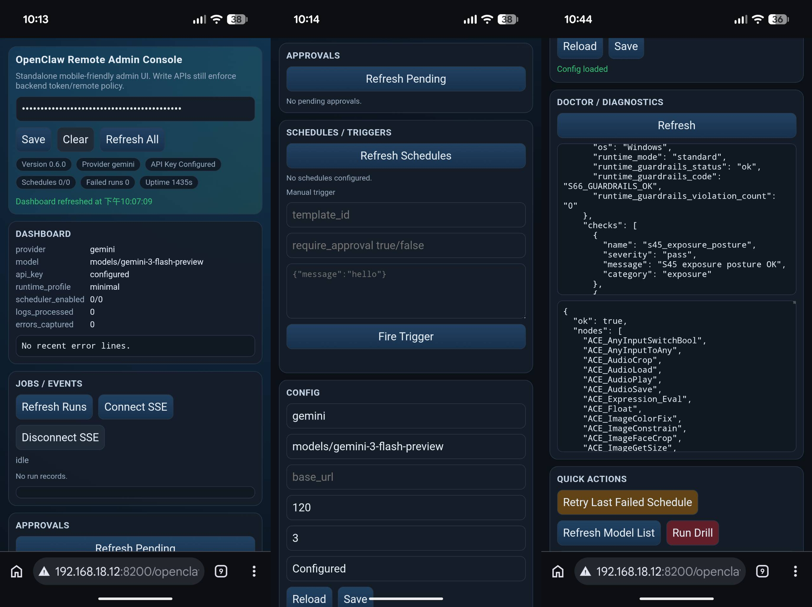
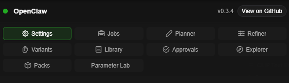

# ComfyUI-OpenClaw


ComfyUI-OpenClaw is a **security-first orchestration layer** for ComfyUI that combines hardened automation APIs, embedded operator UX, and production deployment controls:

- **LLM-assisted nodes** (planner/refiner/vision/batch variants)
- **A built-in extension UI** (`OpenClaw` panel)
- **A standalone Remote Admin Console** (`/openclaw/admin`) for mobile/remote browser operations
- **A secure-by-default HTTP API** for automation (webhooks, triggers, schedules, approvals, presets)
- **Public-ready control-plane split architecture** (embedded UX + externalized high-risk control surfaces)
- **Verification-first hardening lanes** (route drift, real-backend E2E, adversarial fuzz/mutation gates)
- **Now supports 7 major messaging platforms, including Discord, Telegram, WhatsApp, LINE, WeChat, KakaoTalk, and Slack.**
- **And more exciting features being added continuously**

This project is designed to make **ComfyUI a reliable automation target** with an explicit admin boundary and hardened defaults.

<div align="center">
  
</div>

## Security stance (how this project differs from convenience-first automation packs):

- Public MAE route-plane posture is a hard guarantee: startup gate + CI no-skip drift suites must both pass
- Control Plane Split is enforced for public posture: high-risk control surfaces are externalized while embedded UI stays on safe UX/read paths
- Profile-driven startup hardening with fail-closed enforcement in hardened mode
- Explicit **Admin Token** boundary for write actions
- Startup module capability gates (disabled modules do not register routes/workers)
- Localhost-first defaults; remote access is opt-in
- Localhost no-origin CSRF override posture is explicitly surfaced at startup and in Security Doctor, with audit visibility for operator review
- Strict outbound SSRF policy (callbacks + custom LLM base URLs)
- Webhooks are **deny-by-default** until auth is configured
- Encrypted webhook mode is **fail-closed** (invalid signature/decrypt/app-id checks are rejected)
- Bridge worker endpoints enforce device-token auth, scope checks, and idempotency handling
- Secrets are never stored in browser storage (optional server-side key store is local-only convenience)
- Cryptography dependency is required for secrets-at-rest encryption paths; WeChat AES ingress remains optional via `pycryptodomex`
- Tamper-evident, append-only audit trails for sensitive write/admin paths
- Hardened external tool sandbox posture with fail-closed checks and filesystem path guards
- Pack lifecycle file paths and pack API inputs are validated and root-bounded to prevent path traversal
- Replay risk is reduced with deterministic dedupe keys for event payloads without message IDs
- Endpoint inventory metadata and route drift tests to catch unclassified API exposure regressions
- Retry partition hardening now separates rate-limit and transport retry budgets with deterministic degrade decisions and lane-level diagnostics/audit evidence
- Adversarial verification is execution-gated (bounded fuzz + mutation smoke) in CI and local full-test/pre-push workflows with replayable artifacts
- Wave E closeout hardening: deployment profile gates and critical flow parity are now enforced together with signed policy posture control, bounded anomaly telemetry, adversarial fuzz validation, and mutation-baseline regression sensitivity checks
- Wave A/B/C closeout hardening: runtime/config/session stability contracts, strict outbound and supply-chain controls, and capability-aware operator guidance with bounded Parameter Lab/compare workflows
- Runtime guardrails are enforced as a runtime-only contract with diagnostics, clamping, and reject-on-persist behavior for safety-critical limits (timeouts/retries/queue bounds/provider safety defaults)
- Cryptographic lifecycle drills are automated with machine-readable evidence for rotation, revoke, key-loss recovery, and token-compromise fail-closed exercises
- Management query paths now use deterministic pagination normalization and bounded scans to reduce malformed-input abuse and unbounded admin/list query cost
- Compatibility matrix freshness/drift governance is operator-visible via Doctor checks and a repeatable refresh workflow with evidence output, reducing stale deployment assumptions before release

Deployment profiles and hardening checklists:
- [Security Deployment Guide](docs/security_deployment_guide.md) (local / LAN / public templates + self-check command)
- [Security Key/Token Lifecycle SOP](docs/security_key_lifecycle_sop.md) (trust-root, secrets key, and bridge token rotation/revocation/disaster recovery)
- [Security Checklist](docs/security_checklist.md) (pre-exposure operational checklist for connector and ingress boundaries)
- [Runtime Hardening and Startup](docs/runtime_hardening_and_startup.md) (runtime profile, startup gate, and hardened baseline behaviors)


<details><summary><h2>Latest Updates - Click to expand</h2></summary>

<details>

<summary><strong>Core runtime maintainability and contract hardening batch</strong></summary>

- Refactored startup/bootstrap responsibilities into clearer service slices to keep the entry path thin and easier to validate.
- Hardened provider adapter error contracts with safer HTTP error propagation and retry-after handling consistency.
- Replaced fragile JSON object extraction logic in LLM output parsing with stdlib decoder-based behavior for stronger edge-case resilience.
- Unified node/runtime consistency by converging shared image encoding helpers and internal node naming compatibility paths.
- Added and aligned regression coverage, then completed full verification gate pass (detect-secrets, pre-commit, backend unit suites, and frontend Playwright E2E).

</details>

<details>

<summary><strong>Security and reliability hotfix chain: startup gate cleanup, atomic audit writes, and clearer CSRF override posture</strong></summary>

- Cleaned up unreachable startup security-gate code after fatal raise paths, keeping fail-closed behavior explicit and reducing maintenance ambiguity.
- Hardened append-only audit integrity by making hash-chain write flow atomic under a process lock to avoid concurrent chain-fork risk.
- Added explicit startup warning when localhost no-origin override is enabled, plus a dedicated Security Doctor posture check/violation mapping for operator visibility.
- Added focused regression coverage for startup warning/doctor posture and audit lock path behavior.
- Completed full verification gate pass (detect-secrets, pre-commit, backend unit suites, and frontend Playwright E2E).

</details>

<details>

<summary><strong>Standalone remote admin mobile console for phone/desktop operations</strong></summary>

- Added an independent remote admin entry page at `/openclaw/admin` (legacy `/moltbot/admin`), separate from the ComfyUI side panel.
- Added a mobile-first admin console layout for operational flows:
  - dashboard (health, provider/key state, scheduler/runs summary, recent error lines)
  - jobs/events (recent runs + SSE connect/poll fallback)
  - approvals (approve/reject)
  - schedules/triggers (toggle/run/fire)
  - config (read + guarded write)
  - doctor/diagnostics and quick actions (retry/model refresh/drill via existing policy gates)
- Preserved backend security boundaries: remote write actions still require explicit admin-token and remote-admin policy conditions.
- Completed full verification gate pass (detect-secrets, pre-commit, backend unit suites, and frontend Playwright E2E).

</details>

<details>

<summary><strong>Executor lane split and callback I/O isolation for better saturation resilience</strong></summary>

- Added dedicated executor lanes for LLM vs I/O workloads with bounded worker controls.
- Migrated callback delivery and outbound HTTP callback paths to the I/O lane, reducing interference with LLM execution paths.
- Added queue/saturation diagnostics and executor metrics exposure in health/stat telemetry.
- Added targeted regression coverage for lane split behavior and callback I/O lane migration.
- Completed full verification gate pass (detect-secrets, pre-commit, backend unit suites, and frontend Playwright E2E).

</details>

<details>

<summary><strong>Runtime lifecycle consistency, structured logging opt-in, and generated OpenAPI spec</strong></summary>

- Completed a focused runtime operability and contract maturity batch with full SOP verification:
  - added graceful shutdown/reset consistency hooks so scheduler/failover runtime state flushes and resets are deterministic
  - added opt-in structured JSON logging for core execution paths (including queue submit and LLM client) with bounded metadata events
  - added machine-readable OpenAPI spec generation and committed `docs/openapi.yaml` for integrator/review tooling use
  - added regression coverage for runtime lifecycle state handling, structured logging behavior, and OpenAPI generation drift
  - completed full verification gate pass (detect-secrets, pre-commit, backend unit suites, and frontend Playwright E2E)

</details>

<details>

<summary><strong>Assist streaming UX and frontend fetch-wrapper safety hardening</strong></summary>

- Completed a focused assist UX + frontend transport reliability batch with full SOP verification:
  - added optional streaming assist paths for Planner/Refiner with incremental preview updates and staged progress events
  - added backend streaming endpoints for planner/refiner assist flows with capability-gated frontend enablement and safe fallback to the existing non-stream path
  - added frontend live preview rendering for Planner/Refiner while preserving cancel/stale-response safety behavior
  - added idempotent fetch-wrapper composition guards to prevent duplicate wrapper stacking during repeated frontend bootstrap/setup
  - added backend/parser/frontend regression coverage for streaming assist behavior and fetch-wrapper idempotence, plus full verification gate pass (detect-secrets, pre-commit, backend unit suites, and frontend Playwright E2E)

</details>

<details>

<summary><strong>Recent hardening and reliability improvements: runtime guardrails, crypto drills, compatibility governance, and safer management queries</strong></summary>

- Completed a focused reliability + operations hardening batch with full SOP verification:
  - consolidated shared frontend/backed helper paths to reduce duplicated cancellation, JSON parsing, and import-fallback logic
  - added runtime guardrails diagnostics/contract enforcement so runtime-only safety limits stay visible and cannot be persisted back into config
  - added cryptographic lifecycle drill automation with machine-readable evidence for rotation, revoke, key-loss recovery, and token-compromise scenarios
  - added compatibility matrix governance metadata plus a refresh workflow script and operator-doctor freshness/drift warnings
  - hardened management query pagination behavior with deterministic malformed-input handling, bounded scans, and clearer cursor diagnostics for admin/event list paths
  - completed full verification gate pass (detect-secrets, pre-commit, backend unit suites, and frontend Playwright E2E)

</details>

<details>

<summary><strong>Latest completion: automation composer endpoint, safer payload drafting, and full verification pass</strong></summary>

- Completed the automation payload composer flow for safe draft generation:
  - added a new admin-only compose endpoint for trigger/webhook payload drafts (generate-only, no execution side effects)
  - added strict server-side validation and normalization for trigger/webhook draft payloads
  - added tool-calling schema support for automation payload composition with deterministic fallback behavior
  - exposed composer capability flag for frontend/runtime feature probing
  - added and extended backend tests for API handler, composer service, schema/validator coverage, and capability contract
  - completed full validation gate pass (detect-secrets, pre-commit, backend test lanes, adversarial smoke gate, and frontend Playwright E2E)

</details>

<details>

<summary><strong>Slack app support closeout: secure Events API ingress, connector parity, and no-skip verification lanes</strong></summary>

- Completed Slack implementation hardening chain with full SOP validation:
  - added Slack Events API adapter with signed ingress checks, replay/dedupe handling, bot-loop suppression, allowlist enforcement, and thread-aware reply delivery
  - wired Slack runtime policy into existing connector authorization boundaries so command trust behavior stays consistent with other platforms
  - added dedicated Slack verification lanes for ingress contract coverage and real-backend flow parity, both enforced by skip-policy and full-test scripts
  - added optional Slack Socket Mode fallback transport with fail-closed startup checks and transport-parity behavior aligned to Events API safety controls
  - expanded observability redaction coverage for Slack token families and added endpoint-level drift tests for logs/trace/config safety
  - aligned local full-test scripts so Slack phase-2 suites run explicitly as part of the Slack integration gate step
  - synchronized verification evidence through detect-secrets, pre-commit, backend unit + real lanes, adversarial gate, and frontend E2E full pass

</details>

<details>

<summary><strong>Post-Wave E closeout: Hardening chain completed</strong></summary>

- Completed on 2026-02 with full SOP validation:
  - Bundle A: established security invariants registry and startup/CI invariant gates, plus route-plane explicit-classification governance to prevent unmanaged endpoint exposure drift
  - Bundle B: converged outbound egress to a single safe path and added CI/local dependency parity preflight to prevent local-pass/CI-fail runtime drift
  - Bundle C: added adversarial verification execution gates (bounded fuzz + mutation smoke with artifacts) and dual-lane retry partition hardening for deterministic degrade/audit behavior
  - end-to-end verification evidence was synchronized across CI, local full-test scripts, and implementation records

</details>

<details>

<summary><strong>Wave E closeout: deployment guardrails, contract parity, and verification hardening chain completed</strong></summary>

- Completed Wave E with full SOP validation:
  - Bundle A delivered startup deployment gate enforcement and deployment-profile matrix parity, then locked critical operator flow parity (including degraded-path behavior)
  - Bundle B closed security contract parity gaps across token/mapping/route/signature state matrices and threat-intel resilience paths
  - Bundle C completed signed policy posture control, bounded security anomaly telemetry, deterministic adversarial fuzz harness coverage, and mutation-baseline evidence generation
  - full detect-secrets + pre-commit + backend unit + frontend E2E gate passed and evidence is recorded in the Bundle C implementation record

</details>

<details>

<summary><strong>Wave D closeout: control-plane split, ingress and supply-chain hardening, and verification governance baseline</strong></summary>

- Completed Wave D closeout full SOP validation:
  - enforced split-mode control-plane boundaries for public deployments while preserving embedded daily UX flows
  - finalized external control-plane adapter reliability behavior and split-mode degraded/blocked-action guidance
  - completed secrets-at-rest hardening v2 with split-compatible secret-reference behavior
  - closed bridge token lifecycle, legacy webhook ingress clamp, and public MAE route-plane enforcement gaps
  - replaced registry signature placeholder posture with trust-root based cryptographic verification and signer governance
  - established verification governance baseline with skip-budget enforcement, reject/degrade triple-assert contracts, and defect-first record lint gating
</details>

<details>

<summary><strong>Wave A/B/C closeout: stability baseline, high-risk security gates, and operator UX completion</strong></summary>

- Completed baseline runtime/config/connector stability improvements:
  - runtime provenance and manager-aware environment freshness checks
  - safer config merge behavior for object arrays
  - connector session invalidation resilience for 401/410 revoke paths
  - durable replay/idempotency storage for webhook/bridge flows
  - stricter outbound egress policy controls for callback and LLM targets
- Completed high-risk security and supply-chain hardening:
  - stronger external tool path resolution and allowlist enforcement
  - bridge/device binding hardening with mTLS validation controls
  - pack archive canonicalization and full manifest coverage enforcement
  - global DoS governance (quota/priority/storage controls)
  - signed release provenance pipeline and SBOM-integrity validation
- Completed Wave C operator UX and functionality closeout:
  - Wave C functionality closeout accepted on 2026-02-18 with full SOP validation
  - deterministic operator guidance banners and deep-link recovery behavior
  - capability-aware in-canvas quick actions with guarded mutation flow
  - Parameter Lab schema lock and bounded sweep/compare orchestration
  - compare winner-selection safety contract and expanded Wave C regression coverage

</details>

<details>

<summary><strong>Audit trail and external tool sandbox hardening closeout</strong></summary>

- Added non-repudiation audit coverage for sensitive config/secrets/tools/approvals/bridge and startup-dangerous-override paths.
- Standardized audit envelopes and append-only hash-chain logging to improve forensic traceability.
- Added stricter external tool sandbox controls:
  - hardened-mode fail-closed when sandbox posture/runtime is unsafe
  - explicit network allowlist requirement when tooling enables egress
  - pre-exec filesystem path allowlist enforcement for tool arguments
- Expanded security regression coverage for audit contract paths and sandbox policy enforcement.

</details>

<details>
<summary><strong>Endpoint inventory hardening and route drift detection coverage</strong></summary>

- Added explicit endpoint security metadata across API handlers so auth/risk posture is machine-readable and auditable.
- Added route inventory manifest generation to inspect registered API surfaces consistently.
- Added drift regression tests that fail when any registered endpoint is missing security metadata.
- Extended drift coverage to include optional bridge and packs routes to prevent false-green route scans.

</details>

<details>
<summary><strong>Operator UX improvements: context toolbox, parameter lab history/replay, and compare workflow baseline</strong></summary>

- Added in-canvas OpenClaw quick actions on node context menus: Inspect, Doctor, Queue Status, Compare, and Settings.
- Improved operator recovery flow by wiring quick actions to capability-aware targets with deterministic fallback guidance when optional endpoints are unavailable.
- Added Parameter Lab history flow so operators can browse saved experiments, load details, and replay run parameters back into the current graph.
- Added compare workflow baseline in Parameter Lab, including a dedicated compare endpoint with bounded fan-out and stricter payload validation.
- Expanded auth and regression coverage so compare routes remain admin-protected and route-registration drift is caught earlier.

</details>

<details>
<summary><strong>Pack security hardening: path traversal defense and strict API validation</strong></summary>

- Added path traversal protection for pack uninstall and pack path resolution.
- Hardened pack install path construction by validating pack metadata segments (`name`, `version`) and enforcing root-bounded path resolution.
- Added stricter input validation on pack API route handlers for pack lifecycle operations.
- Expanded regression coverage for traversal attempts and invalid input handling in pack flows.

</details>

<details>
<summary><strong>Runtime profile hardening and bridge startup compatibility checks</strong></summary>

- Added explicit runtime profiles with centralized resolution so startup behavior is deterministic across environments.
- Added a hardened startup security gate that fails closed when mandatory controls are not correctly configured.
- Added module capability boundaries so routes/workers only boot when their owning module is enabled.
- Added a bridge protocol handshake path with version compatibility checks during sidecar startup.
- Expanded regression coverage for profile resolution, startup gating, module boundaries, and bridge handshake behavior.

</details>

<details>
<summary><strong>Connector platform parity and sidecar worker runtime improvements</strong></summary>

- Added stronger KakaoTalk response handling:
  - strict QuickReply cap with safe truncation
  - empty-response guard to avoid invalid platform payloads
  - more predictable output shaping and sanitization behavior
- Added WeChat Official Account encrypted webhook support:
  - AES encrypted ingress (`encrypt_type=aes`) with signature verification and fail-closed decrypt/app-id validation
  - expanded event normalization coverage (`subscribe`, `unsubscribe`, `CLICK`, `VIEW`, `SCAN`)
  - deterministic dedupe behavior for event payloads without `MsgId`
  - bounded ACK-first flow with deferred reply handling for slow paths
- Added sidecar worker bridge alignment end-to-end:
  - worker poll/result/heartbeat bridge endpoints
  - contract-driven sidecar client endpoint resolution and idempotency header behavior
  - dedicated E2E test coverage for worker route registration, auth, and round-trip behavior

</details>

<details>
<summary><strong>Security Hardening: Auth/Observability boundaries, connector command controls, registry trust policy, transform isolation, integrity checks, and safe tooling controls</strong></summary>

- Delivered observability tier hardening with explicit sensitivity split:
  - Public-safe: `/openclaw/health`
  - Observability token: `/openclaw/config`, `/openclaw/events`, `/openclaw/events/stream`
  - Admin-only: `/openclaw/logs/tail`, `/openclaw/trace/{prompt_id}`, `/openclaw/secrets/status`, `/openclaw/security/doctor`
- Delivered constrained transform isolation hardening:
  - process-boundary execution via `TransformProcessRunner`
  - timeout/output caps and network-deny worker posture
  - feature-gated default-off behavior for safer rollout
- Delivered approval/checkpoint integrity hardening:
  - canonical JSON + SHA-256 integrity envelopes
  - tamper detection and fail-closed handling on integrity violations
  - migration-safe loading behavior for legacy persistence files
- Delivered external tooling execution policy:
  - allowlist-driven tool definitions (`data/tools_allowlist.json`)
  - strict argument validation, bounded timeout/output, and redacted output handling
  - gated by `OPENCLAW_ENABLE_EXTERNAL_TOOLS` plus admin access policy
- Extended security doctor coverage with wave-2 checks:
  - validates transform isolation posture
  - reports external tooling posture
  - verifies integrity module availability
- Auth-coverage contract tests were updated to include new tool routes and prevent future route-auth drift regressions.
- Added connector command authorization hardening:
  - separates command visibility from command execution privileges
  - centralizes per-command access checks to reduce cross-platform auth drift
  - supports explicit allow-list policy controls for sensitive command classes
  - adds operator-configurable command policy controls via `OPENCLAW_COMMAND_OVERRIDES` and `OPENCLAW_COMMAND_ALLOW_FROM_{PUBLIC|RUN|ADMIN}`
- Added registry anti-abuse controls for remote distribution paths:
  - bounded request-rate controls and deduplication windows reduce abuse and accidental hot loops
  - stale anti-abuse state pruning keeps long-running deployments stable
- Added registry preflight and trust-policy hardening:
  - static package safety checks are enforced before activation paths
  - policy-driven signature/trust posture supports audit and strict enforcement modes
  - registry trust mode is operator-controlled via `OPENCLAW_REGISTRY_POLICY` and preflight verification enforces fail-closed file-path requirements

</details>

<details>
<summary><strong>Sprint A: closes out with five concrete reliability and security improvements</strong></summary>

- Configuration save/apply now returns explicit apply metadata, so callers can see what was actually applied, what requires restart, and which effective provider/model is active.
- The Settings update flow adds defensive guards against stale or partial state, reducing accidental overwrites.
- Provider/model precedence is now deterministic across save, test, and chat paths, and prevents model contamination when switching providers.
- In localhost convenience mode (no admin token configured), chat requests enforce same-origin CSRF protection: same-origin requests are allowed, cross-origin requests are denied.
- Model-list fetching now uses a bounded in-memory cache keyed by provider and base URL, with a 5-minute TTL and LRU eviction cap to improve responsiveness and stability.

</details>

<details>
<summary><strong>Sprint B: ships security doctor diagnostics, registry quarantine gates, and constrained transforms defaults</strong></summary>

- Added the Security Doctor surface (`GET /openclaw/security/doctor`) for operator-focused security posture checks across endpoint exposure, token boundaries, SSRF posture, state-dir permissions, redaction drift, runtime mode, feature flags, and API key posture.
- Added optional remote pack registry quarantine controls with explicit lifecycle states, SHA256 integrity verification, bounded local persistence, and per-entry audit trail; this path remains disabled by default and fail-closed.
- Added optional constrained transform execution with trusted-directory + integrity pinning, timeout and output-size caps, and bounded chain execution semantics; transforms remain disabled by default and mapping-only behavior remains intact unless explicitly enabled.

</details>

<details>
<summary><strong>Settings contract, frontend graceful degradation, and provider drift governance</strong></summary>

- Enforced a strict settings write contract with schema-coerced values and explicit unknown-key rejection, reducing save/apply regressions across ComfyUI variants.
- Hardened frontend behavior to degrade safely when optional routes or runtime capabilities are unavailable, with clearer recovery hints instead of brittle failures.
- Added provider alias/deprecation governance and normalization coverage to reduce preset drift as upstream model IDs and endpoint shapes evolve.

</details>

<details>
<summary><strong>Mapping v1, job event stream, and operator doctor</strong></summary>

- Added webhook mapping engine v1 with declarative field mapping + type coercion, enabling external payload normalization without custom adapter code paths.
- Added real-time job event stream support via SSE (`/openclaw/events/stream`) with bounded buffering and polling fallback (`/openclaw/events`) for compatibility.
- Added Operator Doctor diagnostics tooling for runtime/deployment checks (Python/Node environment, state-dir posture, and contract readiness signals).

</details>

<details>
<summary><strong> Security doctor, registry quarantine, and constrained transforms</strong></summary>

- Added Security Doctor diagnostics surface (`GET /openclaw/security/doctor`) for operator-focused security posture checks and guarded remediation flow.
- Added optional remote registry quarantine lifecycle controls with integrity verification, bounded local persistence, and explicit trust/audit gates.
- Added optional constrained transform execution with integrity pinning, timeout/output caps, and bounded chain semantics; default posture remains disabled/fail-closed.

</details>

</details>

## Table of Contents

- [Installation](#installation)
- [Quick Start (Minimal)](#quick-start-minimal)
  - [Configure an LLM key](#1-configure-an-llm-key-for-plannerrefinervision-helpers)
  - [Configure webhook auth](#2-configure-webhook-auth-required-for-webhook)
  - [Set an Admin Token](#3-optional-recommended-set-an-admin-token)
- [Remote Admin Console (Mobile UI)](#remote-admin-console-mobile-ui)
  - [Environment variables for remote admin](#environment-variables-for-remote-admin)
  - [Connection from phone or other devices](#connection-from-phone-or-other-devices)
  - [Basic operations](#basic-operations)
  - [Reverse proxy and exposure notes](#reverse-proxy-and-exposure-notes)
- [Nodes](#nodes)
- [Extension UI](#extension-ui)
  - [Sidebar Modules](#sidebar-modules)
- [Operator UX Features](#operator-ux-features)
- [API Overview](#api-overview)
  - [Observability](#observability-read-only)
  - [LLM config](#llm-config-non-secret)
  - [Webhooks](#webhooks)
  - [Triggers + approvals](#triggers--approvals-admin)
  - [Schedules](#schedules-admin)
  - [Presets](#presets-admin)
  - [Packs](#packs-admin)
  - [Bridge](#bridge-sidecar-optional)
- [Templates](#templates)
- [Execution Budgets](#execution-budgets)
- [LLM Failover](#llm-failover)
- [Advanced Security and Runtime Setup](#advanced-security-and-runtime-setup)
  - [Runtime hardening and startup gates](#runtime-hardening-and-startup-gates)
  - [Remote registry sync and constrained transforms](#remote-registry-sync-and-constrained-transforms)
  - [Connector command authorization policy](#connector-command-authorization-policy)
- [State Directory & Logs](#state-directory--logs)
- [Troubleshooting](#troubleshooting)
- [Tests](#tests)
- [Updating](#updating)
- [Remote Control (Connector)](#remote-control-connector)
- [Security](#security)
  - [Security Deployment Guide](#security-deployment-guide)
  - [Deployment Self-check Command](#deployment-self-check-command)

---

## Installation

- ComfyUI-Manager: install as a custom node (recommended for most users), then restart ComfyUI.
- Git (manual):
  - `git clone <repo> ComfyUI/custom_nodes/comfyui-openclaw`

Alternative install options:

1. Copy/clone this repository into your ComfyUI `custom_nodes` folder
2. Restart ComfyUI.

If the UI loads but endpoints return 404, ComfyUI likely did not load the Python part of the pack (see Troubleshooting).

## Quick Start (Minimal)

### 1 Configure an LLM key (for Planner/Refiner/vision helpers)

Set at least one of:

- `OPENCLAW_LLM_API_KEY` (generic)
- Provider-specific keys from the provider catalog (preferred; see `services/providers/catalog.py`)

Provider/model configuration can be set via env or `/openclaw/config` (admin boundary; localhost-only convenience if no Admin Token configured).

Notes:

- Recommended: set API keys via environment variables.
- Optional: for single-user localhost setups, you can store a provider API key from the Settings tab (UI Key Store (Advanced)).
  - This writes to the server-side secret store (`{STATE_DIR}/secrets.json`).
  - Environment variables always take priority over stored keys.

### 2 Configure webhook auth (required for `/webhook*`)

Webhooks are **deny-by-default** unless auth is configured:

- `OPENCLAW_WEBHOOK_AUTH_MODE=bearer` and `OPENCLAW_WEBHOOK_BEARER_TOKEN=...`
- or `OPENCLAW_WEBHOOK_AUTH_MODE=hmac` and `OPENCLAW_WEBHOOK_HMAC_SECRET=...`
- or `OPENCLAW_WEBHOOK_AUTH_MODE=bearer_or_hmac` to accept either
- optional replay protection: `OPENCLAW_WEBHOOK_REQUIRE_REPLAY_PROTECTION=1`

### 3 Optional (recommended): set an Admin Token

Admin/write actions (save config, `/llm/test`, key store) are protected by the **Admin Token**:

- If `OPENCLAW_ADMIN_TOKEN` (or legacy `MOLTBOT_ADMIN_TOKEN`) is set, clients must send it via `X-OpenClaw-Admin-Token`.
- If no admin token is configured, admin actions are allowed on **localhost only** (convenience mode). Do not use this mode on shared/public deployments.

Remote admin actions are denied by default. If you understand the risk and need remote administration, opt in explicitly:

- `OPENCLAW_ALLOW_REMOTE_ADMIN=1`

### Windows env var tips (PowerShell / CMD / portable .bat / Desktop)

- PowerShell (current session only):
  - `$env:OPENCLAW_LLM_API_KEY="<YOUR_API_KEY>"`
  - `$env:OPENCLAW_ADMIN_TOKEN="<YOUR_ADMIN_TOKEN>"`
  - `$env:OPENCLAW_LOG_TRUNCATE_ON_START="1"` (optional: clear previous `openclaw.log` at startup)
- PowerShell (persistent; takes effect in new shells):
  - `setx OPENCLAW_LLM_API_KEY "<YOUR_API_KEY>"`
  - `setx OPENCLAW_ADMIN_TOKEN "<YOUR_ADMIN_TOKEN>"`
  - `setx OPENCLAW_LOG_TRUNCATE_ON_START "1"` (optional)
- CMD (current session only): `set OPENCLAW_LLM_API_KEY=<YOUR_API_KEY>`
- Portable `.bat` launchers: add `set OPENCLAW_LLM_API_KEY=...` / `set OPENCLAW_ADMIN_TOKEN=...` (optionally `set OPENCLAW_LOG_TRUNCATE_ON_START=1`) before launching ComfyUI.
- ComfyUI Desktop: if env vars are not passed through reliably, prefer the Settings UI key store for localhost-only convenience, or set system-wide env vars.

## Remote Admin Console (Mobile UI)

The project now includes a standalone admin UI endpoint for mobile/remote operations:

- primary: `/openclaw/admin`
- legacy alias: `/moltbot/admin`

This page is independent from the embedded ComfyUI side panel and is intended for phone/desktop browsers.

### Environment variables for remote admin

Recommended baseline before enabling remote administration:

- `OPENCLAW_ADMIN_TOKEN=<strong-secret>`
  - required for authenticated write/admin operations from remote devices
- `OPENCLAW_ALLOW_REMOTE_ADMIN=1`
  - explicit opt-in for remote admin write paths
- `OPENCLAW_OBSERVABILITY_TOKEN=<strong-secret>` (recommended)
  - tokenized read access for observability routes in non-localhost scenarios

Optional but commonly used with planner/refiner workflows:

- `OPENCLAW_LLM_API_KEY=<provider-key>` (or provider-specific key vars)

### Connection from phone or other devices

1. Start ComfyUI with external listen enabled (example):
   - `python main.py --listen 0.0.0.0 --port 8200`
2. Use your host LAN IP (for example `192.168.x.x`) and open:
   - `http://<HOST_LAN_IP>:<PORT>/openclaw/admin`
3. Enter the admin token in the page input and click `Save`.
4. Click `Refresh All` to verify health and API reachability.

Notes:

- On Windows, if a port fails with bind errors (for example WinError 10013), choose a different port outside excluded ranges.
- If write actions are denied remotely, verify both `OPENCLAW_ADMIN_TOKEN` and `OPENCLAW_ALLOW_REMOTE_ADMIN=1`.

### Basic operations

After token save, typical flow is:

- `Dashboard`: confirm provider/model/key status and recent errors
- `Jobs / Events`: refresh runs, connect SSE stream, verify event updates
- `Approvals`: approve/reject pending items
- `Schedules / Triggers`: toggle schedules, run now, or fire manual trigger
- `Config`: reload and safely update provider/model/base URL/retry/timeout
- `Doctor / Diagnostics`: inspect security doctor + preflight inventory output
- `Quick Actions`: retry failed schedule, refresh model list, or run drill (subject to existing policy/tool availability)

### Reverse proxy and exposure notes

Do **not** expose ComfyUI/OpenClaw admin endpoints directly to the public internet without a hardened edge.

Minimum recommendations:

- terminate TLS at reverse proxy (HTTPS only)
- add authentication at edge (in addition to OpenClaw admin token)
- restrict source IP ranges when possible
- apply request-rate limits and connection limits
- keep server and node package on current patched versions

For internet-facing deployment templates and hardening checklist, follow:

- `docs/security_deployment_guide.md`

## Nodes

Nodes are exported as `Moltbot*` class names for compatibility, but appear as `openclaw:*` display names in ComfyUI:

- `openclaw: Prompt Planner`
- `openclaw: Prompt Refiner`
- `openclaw: Image to Prompt`
- `openclaw: Batch Variants`

See `web/docs/` for node usage notes.

## Extension UI


The frontend lives in `web/` and is served by ComfyUI as an extension panel. It uses the backend routes below (preferring `/api/openclaw/*`).

### Sidebar Modules



The OpenClaw sidebar includes these built-in tabs. Some tabs are capability-gated and may be hidden when the related backend feature is disabled.

| Tab | What it does | Related docs |
| --- | --- | --- |
| `Settings` | Health/config/log visibility, provider/model setup, model connectivity checks, and optional localhost key storage. | [Quick Start](#quick-start-minimal), [LLM config](#llm-config-non-secret), [Troubleshooting](#troubleshooting) |
| `Jobs` | Tracks prompt IDs, polls trace/history, and shows output previews for recent jobs. | [Observability](#observability-read-only), [Remote Control (Connector)](#remote-control-connector) |
| `Planner` | Uses assist endpoint to generate structured prompt plans (positive/negative/params). | [Configure an LLM key](#1-configure-an-llm-key-for-plannerrefinervision-helpers), [Nodes](#nodes) |
| `Refiner` | Refines existing prompts with optional image context and issue/goal input. | [Configure an LLM key](#1-configure-an-llm-key-for-plannerrefinervision-helpers), [Nodes](#nodes) |
| `Variants` | Local helper for generating batch variant parameter JSON (seed/range-style sweeps). | [Nodes](#nodes), [Operator UX Features](#operator-ux-features) |
| `Library` | Manages reusable prompt/params presets and provides pack-oriented library operations in one place. | [Presets](#presets-admin), [Packs](#packs-admin) |
| `Approvals` | Lists approval gates and supports approve/reject operations. | [Triggers + approvals](#triggers--approvals-admin), [Remote Control (Connector)](#remote-control-connector) |
| `Explorer` | Inventory/preflight diagnostics and snapshot/checkpoint troubleshooting workflows. | [Operator UX Features](#operator-ux-features), [Troubleshooting](#troubleshooting) |
| `Packs` | Dedicated pack lifecycle tab for import/export/delete under admin boundary. | [Packs](#packs-admin) |
| `Parameter Lab` | Runs bounded sweep/compare experiments, stores history, and replays parameters back into the graph. | [Operator UX Features](#operator-ux-features) |

## Operator UX Features

### In-canvas context toolbox

Right-click a node and open the `OpenClaw` menu to access:

- `Inspect`: jump to the Explorer troubleshooting path.
- `Doctor`: run diagnostics and show readiness feedback.
- `Queue Status`: jump directly to queue/job monitoring.
- `Compare`: open Parameter Lab in compare setup mode for the selected node.
- `Settings`: jump to OpenClaw settings.

These actions are capability-aware and degrade to safe guidance when optional backend capabilities are unavailable.

### Parameter Lab history and replay

Parameter Lab now supports experiment history and run replay:

- `History` lists saved experiments from local state.
- `Load` opens stored experiment details and run statuses.
- `Replay` applies a selected run's parameter values back into the active workflow graph.

This makes iterative tuning and backtracking faster without manually retyping prior parameter sets.

### Compare workflow baseline

Parameter Lab includes a baseline compare flow for model/widget A/B style checks:

- Use `Compare` from the node context toolbox, or `Compare Models` inside Parameter Lab.
- The compare planner generates bounded runs from one selected comparison dimension.
- Backend compare submission is validated and admin-protected.
- Compare experiments are persisted and visible in history alongside sweep experiments.

Current scope is focused on bounded compare orchestration and replay-ready records; richer side-by-side evaluation and winner handoff are still being expanded.

### Operator guidance and quick recovery

Operator actions are wired for faster recovery loops:

- queue/status routing prefers the dedicated monitor view when available
- doctor checks surface immediate readiness feedback
- compare and history flows are connected so experiments can be reviewed and replayed quickly

## API Overview

### Base paths

Routes are registered to support both:

- New prefix: `/openclaw/*`
- Legacy prefix: `/moltbot/*`

And both:

- Direct: `/openclaw/...`
- ComfyUI API shim: `/api/openclaw/...`

Use `/api/...` from browsers and extension JS.

Machine-readable API spec:

- Generated OpenAPI spec: `docs/openapi.yaml` (derived from `docs/release/api_contract.md`; regenerate with `python scripts/generate_openapi_spec.py`)
- UI entry route: `GET /openclaw/admin` (legacy `GET /moltbot/admin`) serves the standalone remote admin console HTML shell; backend write actions still enforce admin-token and remote-admin policy.

### Observability (read-only)

- `GET /openclaw/health` -pack status, key presence, and basic metrics
- `GET /openclaw/logs/tail?n=50` - log tail (supports `trace_id` / `prompt_id` filters)
- `GET /openclaw/trace/{prompt_id}` -trace timeline (redacted)
- `GET /openclaw/capabilities` -feature/capability probe for frontend compatibility
  - includes feature flags such as `assist_planner`, `assist_refiner`, and optional `assist_streaming` (when incremental assist preview is available)
- `GET /openclaw/jobs` -currently a stub (returns an empty list)

Access control:

- loopback is allowed
- remote access requires `OPENCLAW_OBSERVABILITY_TOKEN` via `X-OpenClaw-Obs-Token`

### LLM config (non-secret)

- `GET /openclaw/config` -effective config + sources + provider catalog (observability-protected)
- `PUT /openclaw/config` -update non-secret config (admin boundary)
- `POST /openclaw/llm/test` -test connectivity (admin boundary)
- `POST /openclaw/llm/chat` -connector chat completion path (admin boundary)
- `GET /openclaw/llm/models` -fetch model list for selected provider/base URL
- `POST /openclaw/assist/planner` -planner structured prompt generation (admin boundary)
- `POST /openclaw/assist/refiner` -prompt refinement with optional image context (admin boundary)
- `POST /openclaw/assist/planner/stream` -optional SSE-style planner streaming path (`text/event-stream`, admin boundary)
- `POST /openclaw/assist/refiner/stream` -optional SSE-style refiner streaming path (`text/event-stream`, admin boundary)

Notes:

- Queue submission uses `OPENCLAW_COMFYUI_URL` (default `http://127.0.0.1:8188`).
- Planner/Refiner UI uses capability-gated assist streaming when available and falls back to the non-stream endpoints automatically.
- `PUT /openclaw/config` now returns apply metadata so callers can reason about what actually took effect:
  - `apply.ok`, `apply.requires_restart`, `apply.applied_keys`
  - `apply.effective_provider`, `apply.effective_model`
- Provider/model precedence is strict:
  - explicit request values > persisted config > provider defaults
  - model is revalidated against provider when provider changes (prevents cross-provider contamination)
- `POST /openclaw/llm/chat` in localhost convenience mode (no admin token configured):
  - allows same-origin loopback requests
  - denies cross-origin requests with CSRF error
  - if `OPENCLAW_LOCALHOST_ALLOW_NO_ORIGIN=true`, requests missing `Origin` / `Sec-Fetch-Site` are allowed for local tooling compatibility; this posture is explicitly surfaced in startup logs, Security Doctor, and audit events
- `/openclaw/llm/models` cache behavior:
  - key: `(provider, base_url)`
  - TTL: 5 minutes
  - capacity: 16 entries (LRU eviction)
- Custom `base_url` is protected by SSRF policy:
  - built-in provider hosts are allowlisted by default
  - allow additional exact hosts via `OPENCLAW_LLM_ALLOWED_HOSTS=host1,host2`
  - or opt in to any public host via `OPENCLAW_ALLOW_ANY_PUBLIC_LLM_HOST=1`
  - `OPENCLAW_ALLOW_INSECURE_BASE_URL=1` disables SSRF blocking (not recommended)
- Local providers (`ollama`, `lmstudio`) are loopback-only by design:
  - valid targets: `localhost` / `127.0.0.1` / `::1`
  - do **not** enable `OPENCLAW_ALLOW_INSECURE_BASE_URL` just to use local LLM
  - recommended examples:
    - Ollama: `http://127.0.0.1:11434`
    - LM Studio: `http://localhost:1234/v1`

### Webhooks

- `POST /openclaw/webhook` -authenticate + validate schema and return normalized payload (no queue submission)
- `POST /openclaw/webhook/validate` -dry-run render (no queue submission; includes render budgets + warnings)
- `POST /openclaw/webhook/submit` -full pipeline: auth -normalize -idempotency -render -submit to queue

**Payload mapping**:

- Submit arbitrary payloads (GitHub, Discord, etc.) by adding `X-Webhook-Mapping-Profile: github_push` (or `discord_message`).
- The internal engine maps fields to the canonical schema before validation.

**Job events**:

- `GET /openclaw/events/stream` -SSE endpoint for real-time job lifecycle events (queued, running, completed, failed).
- `GET /openclaw/events` -JSON polling fallback.
- Supports `Last-Event-ID` header to resume streams without data loss.

Request schema (minimal):

```json
{
  "version": 1,
  "template_id": "portrait_v1",
  "profile_id": "SDXL-v1",
  "inputs": { "requirements": "..." },
  "job_id": "optional",
  "trace_id": "optional",
  "callback": { "url": "https://example.com/callback" }
}
```

Auth headers:

- Bearer: `Authorization: Bearer <token>`
- HMAC: `X-OpenClaw-Signature: sha256=<hex>` (legacy header: `X-Moltbot-Signature`)
  - optional replay protection: `X-OpenClaw-Timestamp` and `X-OpenClaw-Nonce` (legacy `X-Moltbot-*`)

Callback allowlist:

- `OPENCLAW_CALLBACK_ALLOW_HOSTS=example.com,api.example.com`
- `OPENCLAW_CALLBACK_TIMEOUT_SEC=10`
- `OPENCLAW_CALLBACK_MAX_RETRIES=3`

### Triggers + approvals (admin)

- `POST /openclaw/triggers/fire` -fire a template with optional approval gate
- `GET /openclaw/approvals`
- `GET /openclaw/approvals/{approval_id}`
- `POST /openclaw/approvals/{approval_id}/approve` -can auto-execute
- `POST /openclaw/approvals/{approval_id}/reject`

Admin boundary:

- `OPENCLAW_ADMIN_TOKEN` via `X-OpenClaw-Admin-Token`
- strict localhost auth is enabled by default (`OPENCLAW_STRICT_LOCALHOST_AUTH=1`)

### Schedules (admin)

- `GET/POST /openclaw/schedules`
- `GET/PUT/DELETE /openclaw/schedules/{schedule_id}`
- `POST /openclaw/schedules/{schedule_id}/toggle`
- `POST /openclaw/schedules/{schedule_id}/run`
- `GET /openclaw/schedules/{schedule_id}/runs`
- `GET /openclaw/runs`

### Presets (admin)

- `GET /openclaw/presets` and `GET /openclaw/presets/{preset_id}`:
  - public-read is allowed only when `OPENCLAW_PRESETS_PUBLIC_READ=1` **and** `OPENCLAW_STRICT_LOCALHOST_AUTH=0`
  - otherwise requires admin token
- `POST/PUT/DELETE /openclaw/presets*` always require admin token

### Packs (admin)

- `GET /openclaw/packs`
- `POST /openclaw/packs/import` (multipart upload)
- `GET /openclaw/packs/export/{name}/{version}`
- `DELETE /openclaw/packs/{name}/{version}`

Packs are **versioned zip bundles** (templates/presets/profiles) with an integrity manifest (file hashes).
Import/export is designed to be **reproducible** and hardened against common archive attacks (path traversal, zip bombs).

Operational notes:

- Packs are **local-only by default** (no auto-download).
- Packs management requires the Admin Token boundary (or localhost-only convenience mode).
- UI: `OpenClaw` panel -> `Packs` tab.
- Verification: `python -m unittest tests.test_packs_integrity -v`

### Bridge (sidecar; optional)

Sidecar bridge routes are registered under `/openclaw/bridge/*` and `/moltbot/bridge/*`.
This repository provides both bridge API routes and a sidecar worker runtime path.

Bridge route groups:

- Core bridge routes:
  - `GET /bridge/health`
  - `POST /bridge/submit`
  - `POST /bridge/deliver`
  - `POST /bridge/handshake` (protocol compatibility check during sidecar startup)
- Worker bridge routes:
  - `GET /bridge/worker/poll`
  - `POST /bridge/worker/result/{job_id}`
  - `POST /bridge/worker/heartbeat`

Enablement and auth (device token model):

- `OPENCLAW_BRIDGE_ENABLED=1`
- `OPENCLAW_BRIDGE_DEVICE_TOKEN=...`
- optional allowlist: `OPENCLAW_BRIDGE_ALLOWED_DEVICE_IDS=dev1,dev2`

Callback delivery allowlist (sidecar HTTP adapter):

- `OPENCLAW_BRIDGE_CALLBACK_HOST_ALLOWLIST=example.com`

Standalone worker runtime:

- Entrypoint: `python scripts/start_sidecar.py`
- Required:
  - `OPENCLAW_BRIDGE_URL`
  - `OPENCLAW_WORKER_TOKEN`
- Optional:
  - `OPENCLAW_WORKER_ID`
- Current implementation note:
  - worker queue/result/heartbeat persistence is in-memory (MVP); use persistent backing for production durability.

## Advanced Security and Runtime Setup

### Runtime hardening and startup gates

- Runtime profile resolution, startup security enforcement, module startup boundaries, and bridge protocol compatibility are documented in:
  - `docs/runtime_hardening_and_startup.md`
- Key settings:
  - `OPENCLAW_RUNTIME_PROFILE` (`minimal` or `hardened`)
  - `OPENCLAW_BRIDGE_ENABLED`
  - `OPENCLAW_BRIDGE_DEVICE_TOKEN`, `OPENCLAW_BRIDGE_ALLOWED_DEVICE_IDS`

### Remote registry sync and constrained transforms

- Optional remote registry sync and constrained transform execution are documented in:
  - `docs/advanced_registry_and_transforms.md`
- Key settings:
  - `OPENCLAW_ENABLE_REGISTRY_SYNC`, `OPENCLAW_REGISTRY_POLICY`
  - `OPENCLAW_ENABLE_TRANSFORMS`, `OPENCLAW_TRANSFORM_*`

### Connector command authorization policy

- Connector command authorization and allow-from policies are documented in:
  - `docs/connector.md#command-authorization-policy`
- Key settings:
  - `OPENCLAW_COMMAND_OVERRIDES`
  - `OPENCLAW_COMMAND_ALLOW_FROM_PUBLIC`
  - `OPENCLAW_COMMAND_ALLOW_FROM_RUN`
  - `OPENCLAW_COMMAND_ALLOW_FROM_ADMIN`

## Templates

Templates live in `data/templates/`.

- Any `data/templates/<template_id>.json` file is runnable (template ID = filename stem).
- `data/templates/manifest.json` is optional metadata (e.g. defaults).
- Rendering performs **strict placeholder substitution**:
  - Only exact string values matching `{{key}}` are replaced
  - Partial substitutions (e.g. `"foo {{bar}}"`) are intentionally not supported

For the full step-by-step guide (where to put exported workflow JSON, how to author `manifest.json`, how to verify `/openclaw/templates`, and how to use `/run`), see `tests/TEST_SOP.md`.

### Basic `/run` usage (chat)

**Free-text prompt mode (no `key=value` needed):**

```
/run z "a cinematic portrait" seed=-1
```

The connector will map the free text into a prompt field using:

- `allowed_inputs` if a single key is declared in `manifest.json`, or
- fallback order: `positive_prompt` -> `prompt` -> `text` -> `positive` -> `caption`.

**Key=value mode (explicit mapping):**

```
/run z positive_prompt="a cat" seed=-1
```

Important:

- Ensure your workflow uses the same placeholder (e.g., `"text": "{{positive_prompt}}"`).
- `seed=-1` gives random seeds; a fixed seed reproduces outputs.

## Execution Budgets

Queue submissions are protected by concurrency caps and render size budgets (`services/execution_budgets.py`).

Environment variables:

- `OPENCLAW_MAX_INFLIGHT_SUBMITS_TOTAL` (default: 2)
- `OPENCLAW_MAX_INFLIGHT_SUBMITS_WEBHOOK` (default: 1)
- `OPENCLAW_MAX_INFLIGHT_SUBMITS_TRIGGER` (default: 1)
- `OPENCLAW_MAX_INFLIGHT_SUBMITS_SCHEDULER` (default: 1)
- `OPENCLAW_MAX_INFLIGHT_SUBMITS_BRIDGE` (default: 1)
- `OPENCLAW_MAX_RENDERED_WORKFLOW_BYTES` (default: 524288)

If budgets are exceeded, callers should expect `429` (concurrency) or `413` (oversized render).

## LLM Failover

Failover is integrated into `services/llm_client.py` and controlled via runtime config:

- `OPENCLAW_FALLBACK_MODELS` (CSV)
- `OPENCLAW_FALLBACK_PROVIDERS` (CSV)
- `OPENCLAW_MAX_FAILOVER_CANDIDATES` (int, 1-)

## State Directory & Logs

By default, state is stored in a platform user-data directory:

- Windows: `%LOCALAPPDATA%\\comfyui-openclaw\\`
- macOS: `~/Library/Application Support/comfyui-openclaw/`
- Linux: `~/.local/share/comfyui-openclaw/`

Override:

- `OPENCLAW_STATE_DIR=/path/to/state`

Logs:

- `openclaw.log` (legacy `moltbot.log` is still supported)
- Optional startup truncation: set `OPENCLAW_LOG_TRUNCATE_ON_START=1` to clear the active log file once at process startup (useful to avoid stale-history noise in UI log views).
- Optional structured JSON logs for selected core paths:
  - set `OPENCLAW_LOG_FORMAT=json` (or `OPENCLAW_STRUCTURED_LOGS=1`) before startup
  - default behavior remains plain text logs (no structured log emission unless opt-in)

## Troubleshooting

### UI shows Backend Not Loaded / endpoints return 404

This means ComfyUI did not load the Python part of the pack or route registration failed.

Steps:

1. Check ComfyUI startup logs for import errors while loading the custom node pack (search for `openclaw`, `Route registration failed`, `ModuleNotFoundError`).
2. Confirm the pack folder is directly under `custom_nodes/` and contains `__init__.py`.
3. Run the smoke import check inside the same Python environment ComfyUI uses:

   ```bash
   python scripts/openclaw_smoke_import.py
   # or
   python scripts/openclaw_smoke_import.py --verbose
   ```

4. Manually verify the endpoints used by the Settings tab:

   - `GET /api/openclaw/health`
   - `GET /api/openclaw/config`
   - `GET /api/openclaw/logs/tail?n=50`

Notes:

- If your pack folder name is not `comfyui-openclaw`, the smoke script may need `OPENCLAW_PACK_IMPORT_NAME=your-folder-name`.
- If imports fail with a `services.*` module error, check for name collisions with other custom nodes and prefer package-relative imports.

### Operator Doctor

Run the built-in diagnostic tool to verify environment readiness (libraries, permissions, contract files):

```bash
python scripts/operator_doctor.py
# Or check JSON output:
python scripts/operator_doctor.py --json
```

### Webhooks return `403 auth_not_configured`

Set webhook auth env vars (see Quick Start) and restart ComfyUI.

### LLM model list shows `HTTP 403 ... Private/reserved IP blocked: 127.0.0.1`

This error usually means your OpenClaw version is older than the local-loopback SSRF fix.
For local providers, `127.0.0.1` and `localhost` are valid targets and do not require insecure SSRF flags.

Checklist:

1. Update OpenClaw to the latest release.
2. For Ollama:
   - run `ollama serve`
   - verify `http://127.0.0.1:11434/api/tags` is reachable on the same machine
3. In OpenClaw Settings:
   - Provider: `Ollama (Local)` or `LM Studio (Local)`
   - Base URL: leave empty (use provider default) or set loopback URL explicitly
4. Keep these flags disabled:
   - `OPENCLAW_ALLOW_ANY_PUBLIC_LLM_HOST=0`
   - `OPENCLAW_ALLOW_INSECURE_BASE_URL=0`

### Admin Token: server-side vs UI

`OPENCLAW_ADMIN_TOKEN` is a **server-side environment variable**.
The Settings UI can **use** an Admin Token for authenticated requests, but **cannot set or persist** the server token.

Full setup steps: see `tests/TEST_SOP.md`.

## Tests

Run unit tests from the repo root:

```bash
python3 -m unittest discover -s tests -p "test_*.py"
```

## Updating

- Git install: `git pull` inside `custom_nodes/comfyui-openclaw/`, then restart ComfyUI.
- ComfyUI-Manager install: update from Manager UI, then restart ComfyUI.

## Remote Control (Connector)

OpenClaw includes a standalone **Connector** process that allows you to control your local instance securely via **Telegram**, **Discord**, **LINE**, **WhatsApp**, **WeChat**, and **KakaoTalk**.

- **Status & Queue**: Check job progress remotely.
- **Run Jobs**: Submit templates via chat commands.
- **Approvals**: Approve/Reject paused workflows from your phone.
- **Secure**: Outbound-only for Telegram/Discord. LINE/WhatsApp/WeChat/KakaoTalk require inbound HTTPS (webhook).
- **WeChat encrypted mode**: Official Account encrypted webhook mode is supported when AES settings are configured.
- **KakaoTalk response safety**: QuickReply limits and safe fallback handling are enforced for reliable payload behavior.

- [See Setup Guide (`docs/connector.md`)](docs/connector.md)

## Security

Read `SECURITY.md` before exposing any endpoint beyond localhost. The project is designed to be secure-by-default (deny-by-default auth, SSRF protections, redaction, bounded outputs), but unsafe deployment can still create risk.

### Security Deployment Guide

- [Security Deployment Guide](docs/security_deployment_guide.md)
- Includes three copy-paste deployment profiles (`local`, `lan`, `public`) and step-by-step checklists.

### Deployment Self-check Command

Validate current env against deployment profile:

```bash
python scripts/check_deployment_profile.py --profile local
python scripts/check_deployment_profile.py --profile lan
python scripts/check_deployment_profile.py --profile public
```

Fail on warnings too (recommended for hardened/public pipelines):

```bash
python scripts/check_deployment_profile.py --profile public --strict-warnings
```

---

## Disclaimer (Security & Liability)

This project is provided **as-is** without warranty of any kind. You are solely responsible for:

- **API keys / Admin tokens**: creation, storage, rotation, and revocation
- **Runtime configuration**: environment variables, config files, UI settings
- **Network exposure**: tunnels, reverse proxies, public endpoints
- **Data handling**: logs, prompts, outputs, and any content generated or transmitted

### Key Handling Guidance (all environments)

- **Prefer environment variables** for API keys and admin tokens.
- **UI key storage (if enabled)** is for local, single-user setups only.
- **Never commit secrets** or embed them in versioned files.
- **Rotate tokens** regularly and after any suspected exposure.

### Common Deployment Contexts (you must secure each)

- **Local / single-user**: treat keys as secrets; avoid long-term browser storage.
- **LAN / shared machines**: require admin tokens, restrict IPs, disable unsafe endpoints.
- **Public / tunneled / reverse-proxy**: enforce strict allowlists, HTTPS, least-privilege access.
- **Desktop / portable / scripts**: ensure secrets are not logged or persisted by launchers.

### No Liability

The maintainers and contributors **accept no responsibility** for:

- Unauthorized access or misuse of your instance
- Loss of data, keys, or generated content
- Any direct or indirect damages resulting from use of this software

By using this project, you acknowledge and accept these terms.
