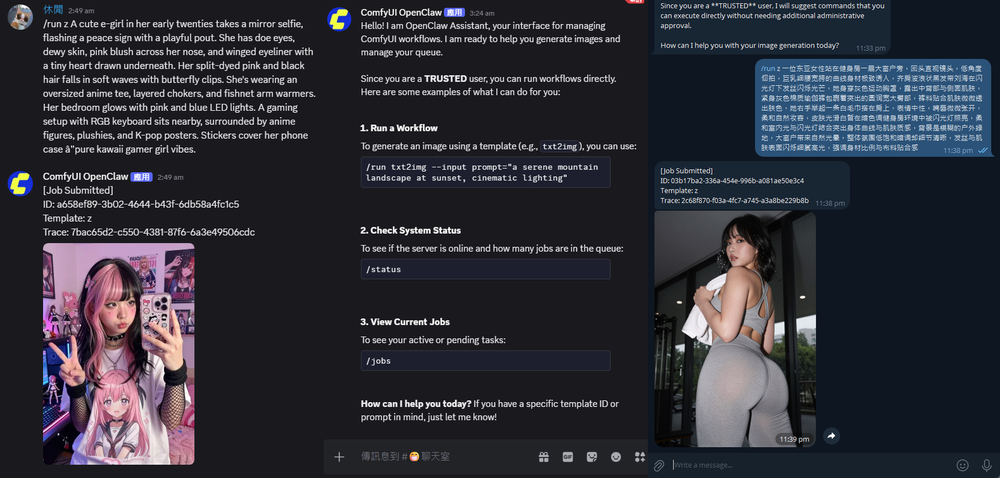
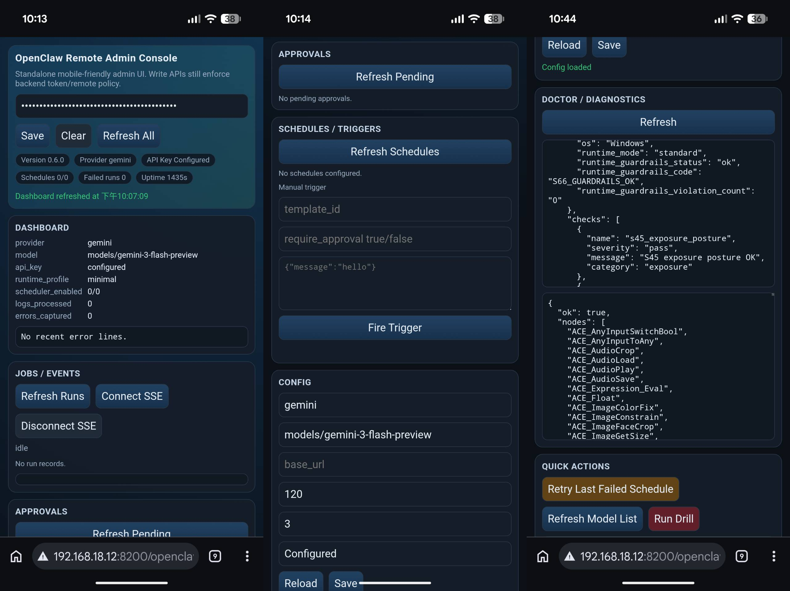
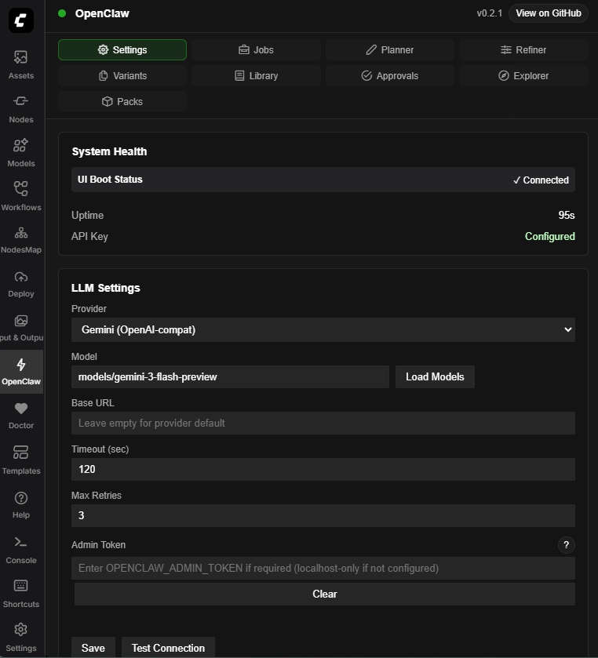
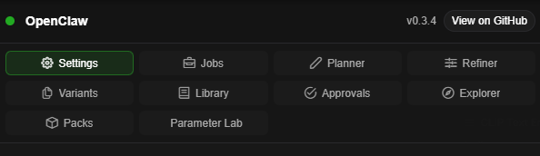

# ComfyUI-OpenClaw



ComfyUI-OpenClaw is a **security-first orchestration layer** for ComfyUI that combines hardened automation APIs, embedded operator UX, and production deployment controls:

- **LLM-assisted nodes** (planner/refiner/vision/batch variants)
- **A built-in extension UI** (`OpenClaw` panel)
- **A standalone Remote Admin Console** (`/openclaw/admin`) for mobile/remote browser operations
- **A secure-by-default HTTP API** for automation (webhooks, triggers, schedules, approvals, presets, rewrite recipes, model manager)
- **Public-ready control-plane split architecture** (embedded UX + externalized high-risk control surfaces)
- **Verification-first hardening lanes** (staged coverage governance, test-debt governance, route drift, real-backend E2E, adversarial fuzz/mutation gates)
- **Now supports 8 major messaging platforms, including Discord, Telegram, WhatsApp, LINE, WeChat, KakaoTalk, Slack, and Feishu/Lark.**
- **And more exciting features being added continuously**

<br>

**Supported product boundary:**

- **Primary artifact**: ComfyUI custom node pack
- **First-class runtime identity**: embedded operator platform
- **Optional attached subsystem**: connector-capable control surface via the sidecar runtime
- **Decision record**: [ADR-0002 Product Boundary And Packaging Contract](docs/adr/ADR-0002-product-boundary-and-packaging-contract.md)
- **Connector packaging status**: [ADR-0003 Connector Extraction Feasibility And Split-Package Seams](docs/adr/ADR-0003-connector-extraction-feasibility-and-seams.md)

<br>

---
<br>

<div align="center">
  
</div>

<br>
<br>

```
ComfyUI Process (single Python process + shared aiohttp app)
│
├── ComfyUI Core (owned by ComfyUI)
│   ├── Native routes: /prompt, /history, /view, /upload, /ws, ...
│   └── Execution engine + model runtime
│
└── OpenClaw package (loaded from custom_nodes/comfyui-openclaw)
    ├── Registers OpenClaw-managed routes into the same PromptServer app:
    │   ├── /openclaw/*
    │   ├── /api/openclaw/* (browser/API shim)
    │   └── Legacy aliases: /moltbot/* and /api/moltbot/*
    ├── Security/runtime modules (startup gate, RBAC, CSRF, HMAC, audit, SSRF controls)
    ├── Automation services (approvals, schedules, presets, webhook/assist flows)
    ├── State + secrets storage (openclaw_state/*)
    ├── Embedded frontend extension (OpenClaw sidebar tabs) + remote admin page (/openclaw/admin)
    └── ComfyUI nodes exported by this pack (planner/refiner/image-to-prompt/batch variants)

Optional companion process (outside the ComfyUI process):
└── Connector sidecar (Telegram/Discord/LINE/WhatsApp/WeChat/Kakao/Slack/Feishu) -> calls OpenClaw HTTP APIs
```

This project is designed to make **ComfyUI a reliable automation target** with an explicit admin boundary and hardened defaults.
<br>

<details><summary><h2>Security stance (how this project differs from convenience-first automation packs) - Click to expand</h2></summary>

- Public and hardened deployment postures are fail-closed by design: shared-surface acknowledgement, startup gates, route-plane governance, and control-plane split all aim to reduce accidental exposure.
- Admin writes, webhook ingress, and bridge worker paths are protected as explicit trust boundaries rather than convenience-only localhost helpers.
- Connector ingress keeps allowlist and policy checks as first-class controls, with degraded/public posture handled deliberately instead of silently widening access.
- Interactive connector actions are treated as a security boundary too: callback-capable platforms use signed envelopes, timestamp/replay guards, dedupe, and explicit policy mapping instead of trusting button actions as implicit admin intent.
- Outbound egress is constrained: callback delivery and custom LLM base URLs stay behind SSRF-safe validation, exact-host policy, scoped private-network allowance, and explicit insecure overrides.
- Secret handling stays server-side: browser storage is not used for secrets, local secret-manager integration is opt-in, and secrets-at-rest / token lifecycle controls are treated as operational boundaries.
- Multi-tenant mode is isolation-first: tenant mismatches fail closed across config, secret sources, connector installations, approvals, visibility, and execution budgets.
- Connector multi-workspace and multi-account bindings are secret-ref-only and fail-closed by design, so tenant/binding mismatches degrade to explicit rejection paths instead of silently reusing the wrong installation context.
- Operator-facing and audit payloads default to redaction for provider reasoning-like content and explicitly marked internal maintenance/helper prompt material, while diagnostics and runtime guardrails remain explicit and tamper-evident.
- Verification is part of the security model: route drift checks, coverage governance, adversarial gates, and doctor/compatibility diagnostics are all wired into CI-parity workflows.

Deployment profiles and hardening references:
- [Security Deployment Guide](docs/security_deployment_guide.md)
- [Security Key/Token Lifecycle SOP](docs/security_key_lifecycle_sop.md)
- [Security Checklist](docs/security_checklist.md)
- [Runtime Hardening and Startup](docs/runtime_hardening_and_startup.md)
- [Threat Model](docs/release/threat_model.md)
- [Frontend Migration Decision](docs/ui_framework_migration_decision.md)

</details>


<details><summary><h2>Latest Updates - Click to expand</h2></summary>

<details>

<summary><strong>Startup lifecycle diagnostics, connector SecretRef service boundaries, and internal prompt isolation aligned with the current runtime</strong></summary>

- Health diagnostics now distinguish required startup readiness, optional warmup degradation, and fatal startup failures; optional warmups run after route registration and no longer block baseline API availability.
- Connector/service launch planning now has a secret-blind env-backed SecretRef boundary that preserves supported connector credential references without expanding raw token values, while rejecting raw secrets, legacy marker strings, unsupported envs, and runtime-only auth tokens.
- Operator-visible and audit payload sanitization now removes explicitly marked internal maintenance/helper prompt content before normal reasoning redaction, while leaving ordinary user text intact.

</details>

<details>

<summary><strong>Host compatibility anchors and inactive-branch preflight diagnostics aligned with current ComfyUI hosts</strong></summary>

- Refreshed the published compatibility matrix for current ComfyUI, standalone frontend, and desktop reference anchors, keeping desktop embedded-frontend lag explicit instead of assuming standalone-frontend parity.
- Updated workflow portability and preflight diagnostics so muted or bypassed workflow branches are separated from actionable missing-node/model failures when frontend workflow metadata is available.
- Explorer now surfaces inactive-branch findings as suppressed diagnostics, so operators can still inspect them without treating them as current workflow blockers.
- Tightened repository ignore rules so public release documentation is not accidentally hidden from version control.

</details>

<details>

<summary><strong>Slack interactive callbacks, canonical node categories, and hardening governance aligned with the current runtime</strong></summary>

- Added Slack interactive callback handling for Block Kit actions, modal submissions, and workflow-style payloads, with signed ingress verification, replay/idempotency checks, bounded external errors, and policy-aware routing for run-affecting actions.
- Aligned shipped node metadata on the canonical `openclaw` category while keeping legacy `Moltbot*` class aliases available for existing workflows.
- Tightened node and frontend maintainability by moving batch-variant randomized seed imports to module scope and keeping tab DOM wiring on shared text-safe helper paths.
- Added explicit verification ownership for the `safe_io` and security-boundary hotspot families so future coverage ratchets depend on targeted regressions instead of broad coverage alone.
- Hardened exception-boundary governance around selected startup and connector paths so unexpected route/bootstrap or trust-parsing failures are surfaced instead of silently masked.

</details>

<details>

<summary><strong>Packaging boundaries, node portability guidance, config ownership seams, and connector extraction diagnostics aligned with the current runtime</strong></summary>

- Made the supported packaging model explicit: the ComfyUI custom node pack remains the primary artifact, the embedded operator platform is the first-class runtime identity, and the connector stays an optional attached subsystem rather than a separate published package.
- Added a stable node portability contract so inventory/preflight diagnostics can expose OpenClaw node metadata and deterministic replacement hints when a workflow depends on nodes that are not available in the current host.
- Consolidated the remaining high-churn package-boundary import hotspots onto shared import-fallback helpers so minimal or partially optional environments degrade predictably instead of crashing on module import.
- Split runtime-config ownership into focused storage, policy, and operator-projection seams while keeping the public runtime-config facade and precedence contract stable for existing callers and operators.
- Added admin-only connector extraction diagnostics at `/openclaw/connector/extraction-contract` (with legacy `/moltbot/*` parity) so maintainers can query the current no-split recommendation, seam families, and blockers from one machine-readable source of truth.

</details>

<details>

<summary><strong>Verification governance, config bootstrap hygiene, and connector env hardening aligned with the current runtime</strong></summary>

- Promoted the staged coverage-ratchet baseline to the enforced `45%` floor, added retained review-cycle evidence for hotspot families, and wired backend coverage collection through one shared local/CI helper instead of ad hoc `fail_under` edits.
- Added focused connector and config/bootstrap hotspot regressions, reviewed the governed hotspot-family coverage summaries, and retired the temporary promotion-gap exceptions now that both promotion-blocking families are represented by explicit review evidence.
- Added fail-closed test-debt governance for no-skip modules and mutation-survivor allowlist entries, with explicit `reason` and `review_after` metadata now enforced by the standard full-test flow.
- Hardened pack metadata/version fallback parsing and made config/bootstrap imports side-effect-safe, so pack version fallback stays deterministic and importing config helpers no longer creates the state directory or log file before first real use.
- Added bounded connector numeric env parsing for delivery, media, timeout, rate-limit, command-length, OAuth TTL, and bind-port settings, so malformed values degrade to documented defaults or clamps with warnings instead of crashing startup.

</details>

See full update history: [docs/release/recent_updates.md](docs/release/recent_updates.md)

</details>

## Table of Contents

- [Installation](#installation)
- [Quick Start (Minimal)](#quick-start-minimal)
  - [Configure an LLM key](#1-configure-an-llm-key-for-plannerrefinervision-helpers)
  - [Configure webhook auth](#2-configure-webhook-auth-required-for-webhook)
  - [Set an Admin Token](#3-optional-recommended-set-an-admin-token)
- [Remote Admin Console (Mobile UI)](#remote-admin-console-mobile-ui)
  - [Environment variables for remote admin](#environment-variables-for-remote-admin)
  - [Connection from phone or other devices](#connection-from-phone-or-other-devices)
  - [Basic operations](#basic-operations)
  - [Reverse proxy and exposure notes](#reverse-proxy-and-exposure-notes)
- [Nodes](#nodes)
  - [Node Portability and Workflow Fallback](#node-portability-and-workflow-fallback)
- [Extension UI](#extension-ui)
  - [Sidebar Modules](#sidebar-modules)
- [Operator UX Features](#operator-ux-features)
  - [Notification Center](#notification-center)
- [API Overview](#api-overview)
- [Templates](#templates)
- [Execution Budgets](#execution-budgets)
- [LLM Failover](#llm-failover)
- [Advanced Security and Runtime Setup](#advanced-security-and-runtime-setup)
- [State Directory & Logs](#state-directory--logs)
- [Audit Chain Verification](#audit-chain-verification)
- [Troubleshooting](#troubleshooting)
- [Tests](#tests)
- [Updating](#updating)
- [Remote Control (Connector)](#remote-control-connector)
- [Security](#security)
  - [Security Deployment Guide](#security-deployment-guide)
  - [Deployment Self-check Command](#deployment-self-check-command)

---

## Installation

- ComfyUI-Manager: install as a custom node (recommended for most users), then restart ComfyUI.
- Git (manual):
  - `git clone <repo> ComfyUI/custom_nodes/comfyui-openclaw`

Alternative install options:

1. Copy/clone this repository into your ComfyUI `custom_nodes` folder
2. Restart ComfyUI.

If the UI loads but endpoints return 404, ComfyUI likely did not load the Python part of the pack (see Troubleshooting).

## Quick Start (Minimal)

### 1 Configure an LLM key (for Planner/Refiner/vision helpers)

Set at least one of:

- `OPENCLAW_LLM_API_KEY` (generic)
- Provider-specific keys from the provider catalog (preferred; see `services/providers/catalog.py`)

Provider/model configuration can be set via env or `/openclaw/config` (admin boundary; localhost-only convenience if no Admin Token configured).

Notes:

- Recommended: set API keys via environment variables.
- Optional: for single-user localhost setups, you can store a provider API key from the Settings tab (UI Key Store (Advanced)).
  - This writes to the encrypted server-side secret store (`{STATE_DIR}/secrets.enc.json`).
  - Environment variables always take priority over stored keys.
- Built-in local-provider defaults use loopback-only OpenAI-compatible URLs:
  - `Ollama (Local)` -> `http://127.0.0.1:11434/v1`
  - `LM Studio (Local)` -> `http://localhost:1234/v1`

### 2 Configure webhook auth (required for `/webhook*`)

Webhooks are **deny-by-default** unless auth is configured:

- `OPENCLAW_WEBHOOK_AUTH_MODE=bearer` and `OPENCLAW_WEBHOOK_BEARER_TOKEN=...`
- or `OPENCLAW_WEBHOOK_AUTH_MODE=hmac` and `OPENCLAW_WEBHOOK_HMAC_SECRET=...`
- or `OPENCLAW_WEBHOOK_AUTH_MODE=bearer_or_hmac` to accept either
- optional replay protection: `OPENCLAW_WEBHOOK_REQUIRE_REPLAY_PROTECTION=1`

### 3 Optional (recommended): set an Admin Token

Admin/write actions (save config, `/llm/test`, key store) are protected by the **Admin Token**:

- If `OPENCLAW_ADMIN_TOKEN` (or legacy `MOLTBOT_ADMIN_TOKEN`) is set, clients must send it via `X-OpenClaw-Admin-Token`.
- If no admin token is configured, admin actions are allowed on **localhost only** (convenience mode). Do not use this mode on shared/public deployments.

Remote admin actions are denied by default. If you understand the risk and need remote administration, opt in explicitly:

- `OPENCLAW_ALLOW_REMOTE_ADMIN=1`

Public profile boundary acknowledgement (required when `OPENCLAW_DEPLOYMENT_PROFILE=public`):

- `OPENCLAW_PUBLIC_SHARED_SURFACE_BOUNDARY_ACK=1`
  - set this only after your reverse proxy path allowlist + network ACL explicitly block ComfyUI-native high-risk routes (`/prompt`, `/history*`, `/view*`, `/upload*`, `/ws`, and `/api/*` equivalents)

### Windows env var tips (PowerShell / CMD / portable .bat / Desktop)

- PowerShell (current session only):
  - `$env:OPENCLAW_LLM_API_KEY="<YOUR_API_KEY>"`
  - `$env:OPENCLAW_ADMIN_TOKEN="<YOUR_ADMIN_TOKEN>"`
  - `$env:OPENCLAW_LOG_TRUNCATE_ON_START="1"` (optional: clear previous `openclaw.log` at startup)
- PowerShell (persistent; takes effect in new shells):
  - `setx OPENCLAW_LLM_API_KEY "<YOUR_API_KEY>"`
  - `setx OPENCLAW_ADMIN_TOKEN "<YOUR_ADMIN_TOKEN>"`
  - `setx OPENCLAW_LOG_TRUNCATE_ON_START "1"` (optional)
- CMD (current session only): `set OPENCLAW_LLM_API_KEY=<YOUR_API_KEY>`
- Portable `.bat` launchers: add `set OPENCLAW_LLM_API_KEY=...` / `set OPENCLAW_ADMIN_TOKEN=...` (optionally `set OPENCLAW_LOG_TRUNCATE_ON_START=1`) before launching ComfyUI.
- Windows note: changing env vars in System Properties or with `setx` does not update an already-running portable ComfyUI process; fully restart the launcher so `python_embeded\\python.exe` inherits the new values.
- ComfyUI Desktop: if env vars are not passed through reliably, prefer the Settings UI key store for localhost-only convenience, or set system-wide env vars.

## Remote Admin Console (Mobile UI)

The project now includes a standalone admin UI endpoint for mobile/remote operations:

- primary: `/openclaw/admin`
- legacy alias: `/moltbot/admin`

This page is independent from the embedded ComfyUI side panel and is intended for phone/desktop browsers.

Implementation shape:

- static shell: `web/admin_console.html`
- runtime app module: `web/admin_console_app.js`
- runtime API client module: `web/admin_console_api.js`

### Environment variables for remote admin

Recommended baseline before enabling remote administration:

- `OPENCLAW_ADMIN_TOKEN=<strong-secret>`
  - required for authenticated write/admin operations from remote devices
- `OPENCLAW_ALLOW_REMOTE_ADMIN=1`
  - explicit opt-in for remote admin write paths
- `OPENCLAW_OBSERVABILITY_TOKEN=<strong-secret>` (recommended)
  - tokenized read access for observability routes in non-localhost scenarios

Optional but commonly used with planner/refiner workflows:

- `OPENCLAW_LLM_API_KEY=<provider-key>` (or provider-specific key vars)

### Connection from phone or other devices

1. Start ComfyUI with external listen enabled (example):
   - `python main.py --listen 0.0.0.0 --port 8200`
2. Use your host LAN IP (for example `192.168.x.x`) and open:
   - `http://<HOST_LAN_IP>:<PORT>/openclaw/admin`
3. Enter the admin token in the page input and click `Save`.
4. Click `Refresh All` to verify health and API reachability.

Notes:

- On Windows, if a port fails with bind errors (for example WinError 10013), choose a different port outside excluded ranges.
- If write actions are denied remotely, verify both `OPENCLAW_ADMIN_TOKEN` and `OPENCLAW_ALLOW_REMOTE_ADMIN=1`.
- Remote Admin being reachable from LAN does not imply LAN-hosted custom LLM targets are allowed. SSRF rules for `base_url` remain separate and require either the scoped LLM private-network setting for the configured target or the broader insecure override.

### Basic operations

After token save, typical flow is:

- `Dashboard`: confirm provider/model/key status and recent errors
- `Jobs / Events`: refresh runs, connect SSE stream, verify event updates
- `Approvals`: approve/reject pending items
- `Schedules / Triggers`: toggle schedules, run now, or fire manual trigger
- `Config`: reload and safely update provider/model/base URL/retry/timeout
- `Doctor / Diagnostics`: inspect security doctor + preflight inventory output
- `Quick Actions`: retry failed schedule, refresh model list, or run drill (subject to existing policy/tool availability)

### Reverse proxy and exposure notes

Do **not** expose ComfyUI/OpenClaw admin endpoints directly to the public internet without a hardened edge.

Minimum recommendations:

- terminate TLS at reverse proxy (HTTPS only)
- add authentication at edge (in addition to OpenClaw admin token)
- restrict source IP ranges when possible
- apply request-rate limits and connection limits
- keep server and node package on current patched versions
- if running `OPENCLAW_DEPLOYMENT_PROFILE=public`, set `OPENCLAW_PUBLIC_SHARED_SURFACE_BOUNDARY_ACK=1` only after enforcing reverse-proxy path allowlist + network ACL boundary controls

For internet-facing deployment templates and hardening checklist, follow:

- `docs/security_deployment_guide.md`

## Nodes

Nodes are exported as `Moltbot*` class names for compatibility, but appear as `openclaw:*` display names in ComfyUI:

- `openclaw: Prompt Planner`
- `openclaw: Prompt Refiner`
- `openclaw: Image to Prompt`
- `openclaw: Batch Variants`

The current node category is `openclaw`; serialized workflows that still reference the legacy `Moltbot*` class names continue to load through retained compatibility aliases.

See `web/docs/` for node usage notes.

### Node Portability and Workflow Fallback

Current builds expose a stable portability contract for the shipped OpenClaw nodes so workflow diagnostics can distinguish "custom node missing" from a generic import/runtime failure:

- inventory/preflight surfaces can expose package-level node portability metadata for `openclaw:*` nodes alongside the normal node inventory view
- when a workflow references an unavailable OpenClaw node, current diagnostics prefer deterministic replacement guidance instead of an opaque missing-node failure
- muted or bypassed root nodes and subgraph branches are reported as suppressed diagnostics when the submitted workflow shape exposes enough frontend metadata, so inactive branches do not become actionable missing-node/model failures
- the compatibility class exports (`Moltbot*`) remain in place for existing workflows, but portability guidance is anchored on the canonical `openclaw:*` node identities

If you are moving a workflow between hosts, treat the portability metadata and replacement hints as the supported migration path before attempting ad hoc node renames. The troubleshooting guide covers the operator-facing interpretation of those signals.

## Extension UI



The frontend lives in `web/` and is served by ComfyUI as an extension panel. It uses the backend routes below (preferring `/api/openclaw/*`).

Current sidebar composition keeps `web/openclaw_ui.js` as the shell root and routes specialized browser logic through focused modules:

- actions and submit/cancel wiring: `web/openclaw_actions.js`
- queue polling and transient banners: `web/openclaw_queue_monitor.js` and `web/openclaw_banner_manager.js`
- persistent operator notifications: `web/openclaw_notification_center.js`
- tab registration/remount behavior: `web/openclaw_tabs.js`
- shared error + compatibility helpers: `web/openclaw_utils.js`

New shell/tab wiring should use the shared text-safe DOM helpers in `web/openclaw_utils.js` instead of duplicating ad hoc element construction in individual tabs.

Canonical DOM/class ownership is now centered on `openclaw-*`; legacy `moltbot-*` class compatibility is still supported through shared runtime aliasing instead of duplicated markup in each tab template.

The sidebar now also resolves and stamps its active host surface (`standalone_frontend` vs desktop-embedded host) at mount time so frontend-host drift is explicit and testable instead of inferred from runtime accidents.

### Sidebar Modules



The OpenClaw sidebar includes these built-in tabs. Some tabs are capability-gated and may be hidden when the related backend feature is disabled.

| Tab | What it does | Related docs |
| --- | --- | --- |
| `Settings` | Health/config/log visibility, provider/model setup, model connectivity checks, and optional localhost key storage. | [Quick Start](#quick-start-minimal), [LLM config](#llm-config-non-secret), [Troubleshooting](#troubleshooting) |
| `Jobs` | Tracks prompt IDs, consumes deterministic event/task cursor metadata for polling, and shows output previews for recent jobs across classic history refs and asset-backed output refs through the same `/view` contract; refs that only expose asset-service identifiers stay explicit as an operator-visible fallback state instead of silently upgrading to `/api/assets`. | [Observability](#observability-read-only), [Remote Control (Connector)](#remote-control-connector) |
| `Planner` | Uses assist endpoint to generate structured prompt plans (positive/negative/params). | [Configure an LLM key](#1-configure-an-llm-key-for-plannerrefinervision-helpers), [Nodes](#nodes) |
| `Refiner` | Refines existing prompts with optional image context and issue/goal input. | [Configure an LLM key](#1-configure-an-llm-key-for-plannerrefinervision-helpers), [Nodes](#nodes) |
| `Variants` | Local helper for generating batch variant parameter JSON (seed/range-style sweeps). | [Nodes](#nodes), [Operator UX Features](#operator-ux-features) |
| `Library` | Manages reusable prompt/params presets and provides pack-oriented library operations in one place. | [Presets](#presets-admin), [Packs](#packs-admin) |
| `Approvals` | Lists approval gates and supports approve/reject operations, including the same approval objects now surfaced through Slack and Feishu interactive connector actions. | [Triggers + approvals](#triggers--approvals-admin), [Remote Control (Connector)](#remote-control-connector) |
| `Explorer` | Inventory/preflight diagnostics and snapshot/checkpoint troubleshooting workflows, including snapshot-first inventory refresh state (`snapshot_ts`, `scan_state`, `stale`, `last_error`) and suppressed inactive-branch findings. | [Operator UX Features](#operator-ux-features), [Troubleshooting](#troubleshooting) |
| `Packs` | Dedicated pack lifecycle tab for import/export/delete under admin boundary. | [Packs](#packs-admin) |
| `PNG Info` | Inspects saved generation images through drag-and-drop, file picker, or scoped paste, parses A1111 infotext plus ComfyUI `prompt` / `workflow` metadata, shows extracted prompt and generation fields when recoverable, and keeps raw metadata visible for operator inspection. | [API Overview](#api-overview), [Troubleshooting](#troubleshooting) |
| `Model Manager` | Searches model catalog/install records, queues managed downloads, monitors task lifecycle, and imports completed tasks into the managed install root with the same trusted download/import contract used by the backend model manager APIs. | [Model manager](#model-manager-admin-f54), [API Overview](#api-overview) |
| `Parameter Lab` | Runs bounded sweep/compare experiments, stores history, and replays parameters back into the graph. | [Operator UX Features](#operator-ux-features) |

## Operator UX Features

### Notification Center

The sidebar includes a persistent `Notification Center` for operator-facing alerts that should survive reloads:

- warning/error banners and selected durable toasts are mirrored into a local notification store
- entries are deduplicated by source-specific keys and keep an unread count
- `Acknowledge` clears unread state without hiding the item
- `Dismiss` removes the item from the active panel while preserving historical storage
- notification message/source fields are rendered as escaped text, not trusted as HTML, so operator-facing payloads cannot turn stored notification content into live markup
- action-enabled entries can deep-link back to the affected surface, such as `Model Manager` or `Jobs`

Current examples include queue-monitor incidents and managed-model failures that need operator follow-up.

### In-canvas context toolbox

Right-click a node and open the `OpenClaw` menu to access:

- `Inspect`: jump to the Explorer troubleshooting path.
- `Doctor`: run diagnostics and show readiness feedback.
- `Queue Status`: jump directly to queue/job monitoring.
- `Compare`: open Parameter Lab in compare setup mode for the selected node.
- `Settings`: jump to OpenClaw settings.

These actions are capability-aware and degrade to safe guidance when optional backend capabilities are unavailable.

### Parameter Lab history and replay

Parameter Lab now supports experiment history and run replay:

- `History` lists saved experiments from local state.
- `Load` opens stored experiment details and run statuses.
- `Replay` applies a selected run's parameter values back into the active workflow graph.

This makes iterative tuning and backtracking faster without manually retyping prior parameter sets.

### Compare workflow baseline

Parameter Lab includes a baseline compare flow for model/widget A/B style checks:

- Use `Compare` from the node context toolbox, or `Compare Models` inside Parameter Lab.
- The compare planner generates bounded runs from one selected comparison dimension.
- Backend compare submission is validated and admin-protected.
- Compare experiments are persisted and visible in history alongside sweep experiments.

Current scope is focused on bounded compare orchestration and replay-ready records; richer side-by-side evaluation and winner handoff are still being expanded.

### Operator guidance and quick recovery

Operator actions are wired for faster recovery loops:

- queue/status routing prefers the dedicated monitor view when available
- doctor checks surface immediate readiness feedback
- compare and history flows are connected so experiments can be reviewed and replayed quickly

## API Overview

This README keeps only the route-family view. Detailed endpoint shapes, auth contracts, response semantics, and release-facing compatibility rules live in the API contract and related docs.

Base path notes:

- primary prefix: `/openclaw/*`
- legacy prefix: `/moltbot/*`
- browser/extension callers should prefer `/api/openclaw/*`
- standalone admin UI entry: `GET /openclaw/admin`

Main API families:

- Observability: health, capabilities, logs, traces, event feeds
- Admin diagnostics: preflight inventory snapshot/status, doctor-facing readiness views
- Config + LLM: effective config, provider tests, model lists, assist planner/refiner
- Connector diagnostics: installation state, resolution, callback/tenant binding evidence, audit views, extraction seam metadata, and static service-env SecretRef propagation policy
- Webhooks + events: validate, submit, callback delivery, SSE/polling status
- Admin operations: approvals, schedules, presets, rewrite recipes
- Model Manager + Packs: search, download/import lifecycle, pack import/export
- Bridge / sidecar: worker poll/result/heartbeat and bridge health/submit routes

Primary references:

- [API contract](docs/release/api_contract.md)
- [Config and secrets contract](docs/release/config_secrets_contract.md)
- [Connector guide](docs/connector.md)
- [Sidecar guide](docs/sidecar.md)
- [OpenAPI spec](docs/openapi.yaml)

Key operational notes:

- Observability remains token-gated for remote access and redacts provider reasoning-like content plus marked internal maintenance/helper content by default.
- Event/model-download polling and preflight inventory are snapshot/cursor-driven contracts; clients should consume `snapshot_ts`, `scan_state`, `stale`, and cursor metadata instead of assuming full-refresh polling.
- Output/history-facing consumers should keep using the bounded `/history` + `/view` contract; refs that only upstream asset services can resolve remain explicit `asset_api_required` compatibility states.
- Connector diagnostics expose redacted token references only, and `/openclaw/connector/extraction-contract` is structural packaging metadata and static SecretRef policy rather than a live installation-health, environment, or token-status feed.

## Advanced Security and Runtime Setup

Use this section as an index only. The source of truth for deployment posture, config/secrets behavior, package boundaries, and optional high-risk subsystems lives in the docs below.

Start here:

- [Runtime hardening and startup](docs/runtime_hardening_and_startup.md)
- [Security deployment guide](docs/security_deployment_guide.md)
- [Security checklist](docs/security_checklist.md)
- [Config and secrets contract](docs/release/config_secrets_contract.md)

Architecture and boundary decisions:

- [Config surface ADR](docs/adr/ADR-0001-config-surface-unification.md)
- [Product boundary ADR](docs/adr/ADR-0002-product-boundary-and-packaging-contract.md)
- [Connector extraction ADR](docs/adr/ADR-0003-connector-extraction-feasibility-and-seams.md)

Subsystem-specific guides:

- [Advanced registry and transforms](docs/advanced_registry_and_transforms.md)
- [Connector guide](docs/connector.md)
- [Security deployment guide](docs/security_deployment_guide.md)

High-level operator reminders:

- canonical configuration surface: `OPENCLAW_*` (legacy `MOLTBOT_*` aliases remain compatibility-only)
- config precedence: `env > runtime override > persisted config > default`
- deployment posture, shared-port boundary, and reverse-proxy rules should be taken from the deployment guide rather than duplicated in README

## Templates

Templates live in `data/templates/`.

- Any `data/templates/<template_id>.json` file is runnable (template ID = filename stem).
- `data/templates/manifest.json` is optional metadata (e.g. defaults).
- Rendering performs **strict placeholder substitution**:
  - Only exact string values matching `{{key}}` are replaced
  - Partial substitutions (e.g. `"foo {{bar}}"`) are intentionally not supported

For the full step-by-step guide (where to put exported workflow JSON, how to author `manifest.json`, how to verify `/openclaw/templates`, and how to use `/run`), see `tests/TEST_SOP.md`.

### Basic `/run` usage (chat)

**Free-text prompt mode (no `key=value` needed):**

```
/run z "a cinematic portrait" seed=-1
```

The connector will map the free text into a prompt field using:

- `allowed_inputs` if a single key is declared in `manifest.json`, or
- fallback order: `positive_prompt` -> `prompt` -> `text` -> `positive` -> `caption`.

**Key=value mode (explicit mapping):**

```
/run z positive_prompt="a cat" seed=-1
```

Important:

- Ensure your workflow uses the same placeholder (e.g., `"text": "{{positive_prompt}}"`).
- `seed=-1` gives random seeds; a fixed seed reproduces outputs.

## Execution Budgets

Queue submissions are protected by concurrency caps and render size budgets (`services/execution_budgets.py`).

Environment variables:

- `OPENCLAW_MAX_INFLIGHT_SUBMITS_TOTAL` (default: 2)
- `OPENCLAW_MAX_INFLIGHT_SUBMITS_WEBHOOK` (default: 1)
- `OPENCLAW_MAX_INFLIGHT_SUBMITS_TRIGGER` (default: 1)
- `OPENCLAW_MAX_INFLIGHT_SUBMITS_SCHEDULER` (default: 1)
- `OPENCLAW_MAX_INFLIGHT_SUBMITS_BRIDGE` (default: 1)
- `OPENCLAW_MAX_INFLIGHT_SUBMITS_PER_TENANT` (default: 1, only when multi-tenant mode is enabled)
- `OPENCLAW_MAX_RENDERED_WORKFLOW_BYTES` (default: 524288)

If budgets are exceeded, callers should expect `429` (concurrency) or `413` (oversized render).

## LLM Failover

Failover is integrated into `services/llm_client.py` and controlled via runtime config:

- `OPENCLAW_FALLBACK_MODELS` (CSV)
- `OPENCLAW_FALLBACK_PROVIDERS` (CSV)
- `OPENCLAW_MAX_FAILOVER_CANDIDATES` (int, 1-)

## State Directory & Logs

By default, state is stored in a platform user-data directory:

- Windows: `%LOCALAPPDATA%\\comfyui-openclaw\\`
- macOS: `~/Library/Application Support/comfyui-openclaw/`
- Linux: `~/.local/share/comfyui-openclaw/`

Override:

- `OPENCLAW_STATE_DIR=/path/to/state`

Logs:

- `openclaw.log` (legacy `moltbot.log` is still supported)
- `audit.log` for append-only audit events, plus retained rotated audit segments when log retention is enabled
- `audit.log.key` when OpenClaw generates and persists the local audit chain key instead of receiving one from environment/config
- Importing config helpers alone does not create the state directory or log files on current builds; writable paths are created lazily on first logger bootstrap or persisted-write paths.
- Optional startup truncation: set `OPENCLAW_LOG_TRUNCATE_ON_START=1` to clear the active log file once at process startup (useful to avoid stale-history noise in UI log views).
- Optional structured JSON logs for selected core paths:
  - set `OPENCLAW_LOG_FORMAT=json` (or `OPENCLAW_STRUCTURED_LOGS=1`) before startup
  - default behavior remains plain text logs (no structured log emission unless opt-in)

## Audit Chain Verification

Operators can verify retained audit-log continuity with:

```bash
python scripts/verify_audit_chain.py
```

Machine-readable output:

```bash
python scripts/verify_audit_chain.py --json
```

Notes:

- The verifier checks the current `audit.log` and any retained rotated audit segments in the state directory.
- When OpenClaw is not given an audit chain key explicitly, it persists a local `audit.log.key` sidecar so retained-chain verification still works across restart and rotation.
- A failed verification should be treated as an operator-facing integrity incident and investigated before assuming the retained audit trail is trustworthy.

## Troubleshooting

Common operator issues now live in a dedicated troubleshooting guide:

- [Troubleshooting guide](docs/troubleshooting.md)

Quick jumps:

- backend not loaded / route 404 startup failures
- Operator Doctor usage
- Jobs preview fallback for asset-api-only output refs
- audit chain verification after restart or rotation
- webhook auth not configured
- loopback LLM SSRF validation errors
- Remote Admin vs private-LAN LLM target behavior
- server-side Admin Token vs UI token usage

## Tests

Use [tests/TEST_SOP.md](tests/TEST_SOP.md) as the authoritative validation workflow.

Quick entry points:

- full acceptance workflow: [tests/TEST_SOP.md](tests/TEST_SOP.md)
- E2E-specific procedure: [tests/E2E_TESTING_SOP.md](tests/E2E_TESTING_SOP.md)
- verification-governance policy/details: [docs/release/verification_governance.md](docs/release/verification_governance.md)

The SOP already defines:

- the docs-only exception for strictly documentation/planning/SOP changes
- one-command full test scripts for Windows and Linux/WSL
- the CI-parity backend coverage and governance workflow

## Updating

- Git install: `git pull` inside `custom_nodes/comfyui-openclaw/`, then restart ComfyUI.
- ComfyUI-Manager install: update from Manager UI, then restart ComfyUI.

## Remote Control (Connector)

OpenClaw includes a standalone **Connector** process that allows you to control your local instance securely via **Telegram**, **Discord**, **LINE**, **WhatsApp**, **WeChat**, **KakaoTalk**, **Slack**, and **Feishu/Lark**.

The connector currently remains an **optional attached subsystem inside this repo/package boundary**. Current builds expose extraction diagnostics for maintainers, but do **not** treat a standalone connector package or separate-repo distribution as a supported release shape.

- **Status & Queue**: Check job progress remotely.
- **Run Jobs**: Submit templates via chat commands.
- **Approvals**: Approve/Reject paused workflows from your phone.
- **Secure**: Outbound-only for Telegram/Discord. LINE/WhatsApp/WeChat/KakaoTalk/Slack require inbound HTTPS (webhook), while Slack can also use Socket Mode and Feishu can run in either webhook or long-connection mode with a dedicated callback ingress path.
- **Telegram topics**: Forum topic commands keep their topic context for immediate replies and delayed result delivery.
- **WeChat encrypted mode**: Official Account encrypted webhook mode is supported when AES settings are configured.
- **KakaoTalk response safety**: QuickReply limits and safe fallback handling are enforced for reliable payload behavior.
- **Slack multi-workspace and interactive mode**: Workspace installs can be handled through connector-managed OAuth install/callback routes with per-workspace token binding, fail-closed health diagnostics, and signed interactive callback handling for action payloads.
- **Feishu/Lark multi-account mode**: Connector-managed account/workspace bindings support tenant-aware installation resolution, interactive approval cards, and signed callback handling without exposing raw app secrets or widening command trust implicitly.
- **Bounded connector numeric envs**: Delivery/media/time-budget settings, bind ports, rate limits, and command-length knobs now clamp or fall back to documented defaults with warnings instead of crashing connector startup on malformed values.
- **Startup diagnostics**: `/openclaw/health` reports startup readiness, optional warmup degradation, and fatal startup details without making optional warmups block baseline API availability.
- **SecretRef service boundaries**: Connector service-env planning preserves only supported env-backed credential references and rejects raw secrets, legacy marker strings, unsupported envs, and runtime-only auth tokens.
- **Internal prompt isolation**: Operator-visible and audit payloads remove explicitly marked internal maintenance/helper prompt content before normal reasoning redaction.
- **Packaging diagnostics**: Admin operators/maintainers can inspect `/openclaw/connector/extraction-contract` for the current in-repo recommendation, the static service-env SecretRef propagation policy, and the minimum seam families required before any future split.

- [See Setup Guide (`docs/connector.md`)](docs/connector.md)

## Security

Read [SECURITY.md](docs/SECURITY.md) before exposing any endpoint beyond localhost. The project is designed to be secure-by-default (deny-by-default auth, SSRF protections, redaction, bounded outputs), but unsafe deployment can still create risk.

### Security Deployment Guide

- [Security Deployment Guide](docs/security_deployment_guide.md)
- Includes three copy-paste deployment profiles (`local`, `lan`, `public`) and step-by-step checklists.

### Deployment Self-check Command

Validate current env against deployment profile:

```bash
python scripts/check_deployment_profile.py --profile local
python scripts/check_deployment_profile.py --profile lan
python scripts/check_deployment_profile.py --profile public
```

Fail on warnings too (recommended for hardened/public pipelines):

```bash
python scripts/check_deployment_profile.py --profile public --strict-warnings
```

## Disclaimer (Security & Liability)

This project is provided **as-is** without warranty of any kind. You are solely responsible for:

- **API keys / Admin tokens**: creation, storage, rotation, and revocation
- **Runtime configuration**: environment variables, config files, UI settings
- **Network exposure**: tunnels, reverse proxies, public endpoints
- **Data handling**: logs, prompts, outputs, and any content generated or transmitted

### Key Handling Guidance (all environments)

- **Prefer environment variables** for API keys and admin tokens.
- **UI key storage (if enabled)** is for local, single-user setups only.
- **Never commit secrets** or embed them in versioned files.
- **Rotate tokens** regularly and after any suspected exposure.

### Common Deployment Contexts (you must secure each)

- **Local / single-user**: treat keys as secrets; avoid long-term browser storage.
- **LAN / shared machines**: require admin tokens, restrict IPs, disable unsafe endpoints.
- **Public / tunneled / reverse-proxy**: enforce strict allowlists, HTTPS, least-privilege access.
- **Desktop / portable / scripts**: ensure secrets are not logged or persisted by launchers.

### No Liability

The maintainers and contributors **accept no responsibility** for:

- Unauthorized access or misuse of your instance
- Loss of data, keys, or generated content
- Any direct or indirect damages resulting from use of this software

By using this project, you acknowledge and accept these terms.
