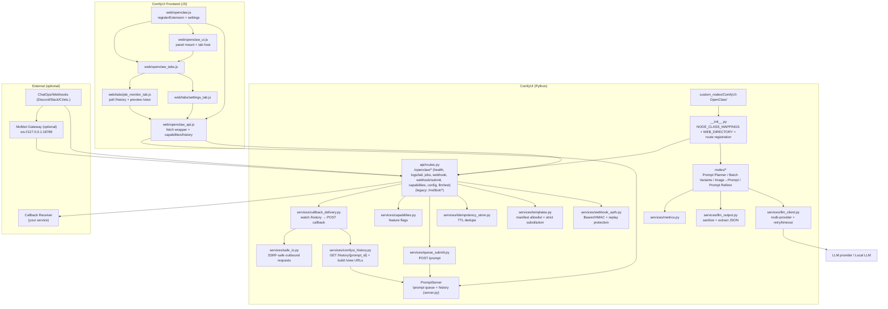

# ComfyUI-OpenClaw — Architecture & Roadmap (MVP)

> Note: Project renamed to **ComfyUI-OpenClaw**. New API prefix is `/openclaw/*` (legacy `/moltbot/*` remains supported for compatibility).

> Goal: distill the proven **ChatOps / automation / LLM orchestration** patterns from `REFERENCE/moltbot/` (Moltbot, formerly Clawdbot; upstream keeps legacy compat) into a practical **ComfyUI custom node pack** MVP:
>
> - Auto-write prompts + generation parameters
> - Batch variant generation
> - Image → prompt (caption/tags) + refinement loop
> - ChatOps-triggered ComfyUI runs
> - Scheduling / external events → auto-generate images

---

## 1. Architecture

### 1.1 Core Module Structure (aligned with ComfyUI-Doctor’s extension shape)

**Key references already in `REFERENCE/`:**

- ComfyUI backend queue entrypoint: `REFERENCE/ComfyUI/server.py` → `POST /prompt`.
- Extension backend registration + `WEB_DIRECTORY`: `REFERENCE/ComfyUI-Doctor/__init__.py`.
- Extension frontend injection + Settings: `REFERENCE/ComfyUI-Doctor/web/doctor.js` (`app.registerExtension`, `app.ui.settings.addSetting`).
- Node help docs routing: `REFERENCE/ComfyUI_frontend/src/services/nodeHelpService.ts` (`/extensions/<customNodeName>/docs/...`).
- Cherry Studio (architecture patterns): hook-based plugin pipeline + provider/model registry discipline:
  - `REFERENCE/cherry-studio/packages/aiCore/src/core/plugins/*`
  - `REFERENCE/cherry-studio/packages/aiCore/src/core/providers/*`
  - `REFERENCE/cherry-studio/packages/aiCore/src/core/models/ModelResolver.ts`
  - `REFERENCE/cherry-studio/packages/mcp-trace/*` (tracing patterns only; **do not** adopt MCP tool execution surfaces)

### 1.2 MVP Node Set (prioritize “prompt/params” + “batch strategy” first)

| Node (proposed) | Inputs | Outputs | MVP notes |
|---|---|---|---|
| `openclaw: Prompt Planner` | requirements/style/constraints/profile | `positive`, `negative`, `params(json)` | Auto-generate prompt + generation params (steps/cfg/sampler/seed/size, etc.) |
| `openclaw: Batch Variants` | `positive`, `negative`, `variant_policy`, `count` | `positive_list`, `seed_list`, `params_list` | Batch variants via seed sweep / prompt perturbation / param scan |
| `openclaw: Image → Prompt` | `image`, `goal` | `caption`, `tags`, `prompt_suggestion` | Start with caption + tags MVP; expand later |
| `openclaw: Prompt Refiner` | `image`, `orig_prompt`, `issue` | `refined_prompt`, `param_patch(json)` | “Critique & fix” loop (composition, identity, material, lighting, etc.) |
| `openclaw: Queue Trigger (Template)` (optional) | `job_spec` / `template_id` | `prompt_id` | Submits allowlisted templates to `/prompt` (strict allowlist required) |

### 1.3 UI / Docs (match comfyui_frontend + Doctor patterns)

- **Status**: frontend (R6+R7+F7) + job monitor/callback delivery (R19+F16+F17) are **implemented**.
- Baseline (Doctor-style structure we will follow):
  - `web/openclaw.js`: `app.registerExtension({ name, setup() { ... } })` for settings registration, sidebar entry, and About badges (see `REFERENCE/ComfyUI-Doctor/web/doctor.js`).
  - `web/openclaw_api.js`: a thin fetch wrapper for backend routes (`/openclaw/*` with legacy `/moltbot/*`), with consistent error handling (see `REFERENCE/ComfyUI-Doctor/web/doctor_api.js`).
  - `web/openclaw_ui.js`: UI bootstrap + panel mounting (see `REFERENCE/ComfyUI-Doctor/web/doctor_ui.js`).
  - `web/openclaw_tabs.js` + `web/tabs/*.js`: a tab registry + tab manager (Chat/Stats/Settings pattern) to keep code modular (see `REFERENCE/ComfyUI-Doctor/web/doctor_tabs.js` and `web/tabs/*`).
  - `web/global_error_handler.js` + `web/ErrorBoundary.js` (+ CSS): optional but recommended for resilience during long-running sessions (see Doctor’s frontend hardening files).
  - `web/docs/`: node help markdown at `/extensions/<pack>/docs/<NodeName>.md` (see `REFERENCE/ComfyUI_frontend/src/services/nodeHelpService.ts`).
- Configuration persistence: prefer ComfyUI Settings API (not ad-hoc localStorage) to avoid fragmented configuration and accidental secret exposure.

---

## 2. `REFERENCE/moltbot/` (Moltbot, formerly Clawdbot) — architecture, code quality, security (what to reuse)

### 2.1 What it is

Moltbot (formerly Clawdbot) is a **personal AI assistant** you run on your own devices. A central **Gateway** acts as a control plane: it receives messages (many channels), runs agent turns, and triggers tools/automation/device nodes.

From `REFERENCE/moltbot/src/`, the subsystems relevant to this project are:

- `gateway/`: WS + HTTP server, auth, hooks, cron, plugins, sessions, routing.
- `channels/` + `telegram/discord/slack/signal/imessage/...`: multi-surface ChatOps ingress/egress.
- `cron/` + `hooks/`: scheduler + webhook ingress (see docs below).

### 2.2 Code quality (engineering view)

- Strengths
  - Clear module boundaries (Gateway / Channels / CLI / Tools / UI) with a large automated test surface.
  - Good operational docs (`docs/`), plus explicit security policy and threat-model guidance.
- Tradeoffs
  - The product scope is broad; directly “porting everything into Python/ComfyUI” is not realistic.
  - The reusable assets are **patterns** (schemas, auth, idempotency, scheduling, allowlists), not the full codebase.

### 2.3 Security posture (patterns worth copying)

Moltbot treats an AI gateway as a high-risk service: lock down inbound access, minimize tool blast radius, and run audits.
Patterns directly applicable to ComfyUI-OpenClaw:

- **Webhook token required** (see `REFERENCE/moltbot/docs/automation/webhook.md`).
- **Persisted cron jobs + concurrency limits** (see `REFERENCE/moltbot/docs/automation/cron-jobs.md`).
- **Gateway WS protocol + device tokens + pairing**: roles/scopes, connect nonce, idempotency keys, and approval events (see `REFERENCE/moltbot/docs/gateway/protocol.md`, `REFERENCE/moltbot/docs/gateway/pairing.md`).
- **Scan-only diagnostics**: a compact checklist for safe deployment, without auto-fix/migrations (avoid “repair” logic that can become a privilege escalation surface).
- **Prompt injection is practical risk**: treat all external inputs as untrusted; restrict what can be triggered (template allowlists).

### 2.4 As a “personal AI assistant product”, what it can do (most relevant capabilities)

- **Multi-channel ChatOps**: WhatsApp/Telegram/Slack/Discord/Google Chat/Signal/iMessage/MS Teams/WebChat, plus extensions.
- **Event → automation**: webhook ingress with payload mapping; runs can wake the main session or run in an isolated session.
- **Scheduler (cron)**: persisted job store + run history + concurrency controls; can deliver results back to chat.
- **Tools/skills platform**: packaging repeatable workflows as skills with installation/allowlist governance.
- **Security governance**: the “audit + auto-tighten” mindset (`moltbot security audit --deep/--fix`) maps well to protecting ComfyUI automation.

---

## 3. MVP feasibility & implementation approaches

### 3.1 Feasibility conclusion

Feasible, but only with the right cut:

- Do **not** port Moltbot into Python.
- Build a ComfyUI custom node pack that owns prompt/params/variant logic.
- Optionally integrate with a running Moltbot Gateway as a ChatOps/scheduler sidecar.

### 3.2 Three delivery modes (recommend A → C)

- A. Pure ComfyUI extension (smallest MVP)
  - Nodes call LLM/Vision over HTTP.
  - Minimal or no ChatOps/scheduling.

- B. Moltbot as an external controller (fastest ChatOps/scheduling)
  - Moltbot hooks/cron receive events → call ComfyUI `POST /prompt`.
  - ComfyUI side uses workflow templates; nodes can come later.

- C. Hybrid (recommended product shape)
  - ComfyUI-OpenClaw nodes: prompt/params/batch/image→prompt/refine.
  - Moltbot (optional): Discord/Telegram ChatOps + cron/webhook; translates events into JobSpecs and submits to ComfyUI.

### 3.3 MVP automation use-cases (mapped to the initial 5 goals)

- Auto-write prompt/params: turn “requirements/style/constraints” into ready-to-run prompt + params JSON.
- Batch variants: seed sweeps, prompt perturbations, param scans feeding ComfyUI batch workflows.
- Image → prompt + refine loop: caption/tags → prompt suggestion; compare result vs goal → refined prompt + param patch.
- ChatOps-triggered runs: chat command/webhook → JobSpec → allowlisted template → `POST /prompt`.
- Scheduling/external triggers: timed posts, PR merges, form submissions → auto-generate images; optionally deliver back to chat.

---

## 4. Engineering backlog (IDs: S/R/F; ordered by foundation → difficulty)

- References: `REFERENCE/moltbot/`, `REFERENCE/lobster/`, `REFERENCE/clawdhub/`, `REFERENCE/clawdbot-ansible/`, `REFERENCE/desktop/`, plus ComfyUI-Doctor for extension UI patterns.

> Each item includes `Diff` (difficulty) and `Depends` (dependencies). MVP prioritizes “usable, controlled, extensible”.

### 4.0 Recommended MVP order (cross-category)

- Progress records: `.planning/260127-R1S1R2F1_MVP_IMPLEMENTATION_RECORD.md`
  - `.planning/260127-F2_BATCH_VARIANTS_IMPLEMENTATION_RECORD.md`
  - `.planning/260127-F3_IMAGE_TO_PROMPT_IMPLEMENTATION_RECORD.md`
  - `.planning/260127-F4_PROMPT_REFINER_IMPLEMENTATION_RECORD.md`
  - `.planning/260128-R5_OBSERVABILITY_IMPLEMENTATION_RECORD.md`
  - `.planning/260128-S3_PROMPT_INJECTION_DEFENSE_IMPLEMENTATION_RECORD.md`
  - `.planning/260128-S4_FILE_PATH_URL_SAFETY_IMPLEMENTATION_RECORD.md`

  - `.planning/260128-R16_LLM_PROVIDER_CATALOG_IMPLEMENTATION_RECORD.md`
  - `.planning/260128-S2_CHATOPS_WEBHOOK_AUTH_IMPLEMENTATION_RECORD.md`
  - `.planning/260128-R6R7F7_FRONTEND_FOUNDATION_IMPLEMENTATION_RECORD.md`
  - `.planning/260203-S24R14R31_POST_MVP_REINFORCEMENT_IMPLEMENTATION_RECORD.md`
  - `.planning/260203-R14_FAILOVER_INTEGRATION_IMPLEMENTATION_RECORD.md`

1. **R1** ✅ → **S1** ✅ → **R2** ✅ (schemas, secrets boundary, stable LLM client) — *Completed (2026-01-27; implemented by Expert B)*
2. **F1** ✅ → **F2** ✅ (prompt/params, then batch variants) — *Completed (2026-01-27; implemented by Expert B)*
3. **F3** ✅ → **F4** ✅ (image→prompt, then refine loop) — *Completed (2026-01-27; implemented by Expert B)*
4. **S3** ✅ → **S4** ✅ → **R16** ✅ → **R5** ✅ (tighten IO boundaries + providers + observability)
5. **S2** ✅ → **R3** ✅ → **R8** ✅ → **F5** ✅ → **R18** (secure webhook/chatops + idempotency + normalization + queue trigger; resilience follow-up)
6. **R4** → **F6** (persisted scheduler → scheduled/event-driven generation)

7. **R6** ✅ → **R7** ✅ → **F7** ✅ → **R19** → **F17** → **F16** (frontend job monitoring + auto-return results)

### 4.0.1 Post-MVP reinforcement (prioritized)

Completed:
  - **S24** ✅ (central redaction for logs/tail + trace + audit) — *Completed (2026-02-03)*
  - **R14** ✅ (provider/model failover + cooldowns) — *Completed (2026-02-03)*
  - **R31** ✅ (logs/tail trace filtering + safer defaults) — *Completed (2026-02-03)*
  - **R28** ✅ (audit event schema + payload budgets) — *Completed (2026-02-03)*
  - **R32** ✅ (webhook/template dry-run validation endpoint) — *Completed (2026-02-04)*
  - **R33** ✅ (execution budgets + concurrency caps) — *Completed (2026-02-04)*
  - **R35** ✅ (Antigravity Claude Proxy preset) — *Completed (2026-02-04)*
  - **R36** ✅ (Retry-After/reset parsing + standardized backoff headers) — *Completed (2026-02-04)*
  - **R37** ✅ (adaptive failover scoring + dedupe window to avoid retry storms) — *Completed (2026-02-04)*
  - **R38-Lite** ✅ (staged loading UX + cancel + timeout/cancel error handling) — *Completed (2026-02-04)*
  - **R39** ✅ (JSON Schema sanitizer for tool/function schemas; Gemini compatibility) — *Completed (2026-02-04)*
  - **F25 (Phase A)** ✅ (tool calling structured outputs for Planner/Refiner; OpenAI-compat/Gemini) — *Completed (2026-02-05)*

P0 (do first):
- **R35** (Antigravity Claude Proxy preset: local Anthropic-compatible base_url + safe defaults)
- **R36** (Retry-After/reset parsing + standardized backoff headers)

P1 (next):
- **R37** (adaptive failover scoring + dedupe window to avoid retry storms)
- **R38** (optional LLM streaming UX path; SSE-style incremental updates) — ⏸️ Deferred; ship R38-Lite instead

P2 (later):
- **R34** (scheduler burst/jitter controls)
- **R17** (expanded provider presets incl. Antigravity Claude Proxy)
- **F25 (Phase B)** (automation payload composer: generate-only JSON for webhook/trigger; no side effects)

### 4.1 Security

> Public release baseline: treat ComfyUI deployments as potentially internet-exposed; ship secure-by-default guardrails for all Moltbot-added endpoints.
> Minimum bar for public release: **S13 + S14 + S16 + S17 + S18** (plus S2/S4 already completed).
> Bridge-enabled deployments (Sidecar Bridge / remote control) must additionally complete **S19 + S20 + S21 + R22** before being considered safe.

- [x] **S1**: Secrets & settings boundary (Diff: M, Depends: -) ✅ *Completed (2026-01-27; implemented by Expert B)*
  - Goal: prevent API keys/tokens from being trivially readable by frontend JS; support config versioning/migrations.
  - Approach: store non-sensitive config via ComfyUI Settings; keep secrets backend-only (file/env) with explicit policy.

- [x] **S10**: Secret scanning + pre-commit guardrails (Diff: E, Depends: -) ✅ *Completed (2026-01-28)*
  - Goal: prevent accidental commits/leaks of API keys, tokens, and credentials in this repo.
  - Approach: adopt `detect-secrets` baseline + pre-commit hook; add CI check to block new secrets.
  - References: `REFERENCE/moltbot/.detect-secrets.cfg`, `REFERENCE/moltbot/.secrets.baseline`, `REFERENCE/moltbot/.pre-commit-config.yaml`.
  - Plan: `.planning/260128-S10F9R11_RELEASE_READINESS_PLAN.md`
  - Record: `.planning/260128-S10F9R11_RELEASE_READINESS_IMPLEMENTATION_RECORD.md`

- [ ] **S11**: Optional secret manager integration (1Password CLI / keychain) (Diff: H, Depends: S1)
  - Goal: avoid long-lived API keys in env vars or plaintext files; allow opt-in secret retrieval from a local secret manager.
  - Approach: pluggable secret-provider interface (env/file/default) + optional 1Password provider (requires explicit enable + command allowlist); never log secrets; add tests for redaction + failure modes.
  - Reference: `REFERENCE/moltbot/skills/1password/SKILL.md` (1Password CLI workflow; upstream removed the Bitwarden skill).
  - ComfyUI note: treat this as **optional** and likely “sidecar-first” (keychain/desktop integrations are OS-dependent). Prefer a backend-only secret provider interface and keep ComfyUI UI surfaces secret-blind.

- [ ] **S12**: External tooling execution policy (allowlist + redaction) (Diff: M, Depends: S1, S4)
  - Goal: safely integrate optional local CLIs (e.g., 1Password `op`, ffmpeg, camera tools) without turning the pack into a command-execution surface.
  - Approach: one backend-only runner with explicit allowlist, fixed arg templates, timeouts, max output bytes, and log redaction; never accept arbitrary commands/args from UI or webhooks.
  - References (concepts): `REFERENCE/moltbot/skills/1password/SKILL.md` (no-secret discipline) + `REFERENCE/moltbot/skills/video-frames/SKILL.md` (ffmpeg wrapper pattern) + `REFERENCE/moltbot/skills/camsnap/SKILL.md` (camera snapshot workflow).
  - ComfyUI note: required before any “media ingestion” nodes that shell out (see **F18**); keep it **opt-in** and admin-token gated.

- [x] **S13**: UI config write safety (admin boundary + base_url policy) (Diff: M, Depends: S2, S4, R7) ✅ *Completed (2026-01-28)*
  - Goal: allow Moltbot UI to change non-secret runtime config without turning exposed ComfyUI into a takeover vector.
  - Plan: `.planning/260128-S13R21F20_LLM_SETTINGS_UI_PLAN.md`
  - Record: `.planning/260128-S13R21F20_LLM_SETTINGS_UI_IMPLEMENTATION_RECORD.md`

- [x] **S25**: Dual-mode secrets (env + UI convenience path) (Diff: H, Depends: S1, S13, S24) ✅ *Completed (2026-02-05)*
  - Goal: support CLI/portable/Desktop workflows by allowing env-first secrets, plus a Settings-tab UX to enter LLM API keys/admin token with explicit risk warnings.
  - Behavior: UI key store is visible but OFF by default; env keys always take priority over stored keys.
  - Safety: never echo secrets back to UI; never log secrets; remote admin denied by default unless `OPENCLAW_ALLOW_REMOTE_ADMIN=1`.
  - Plan: `.planning/260205-S25_DUAL_MODE_SECRETS_UI_AND_ENV_PLAN.md`
  - Record: `.planning/260205-S25_DUAL_MODE_SECRETS_RECORD.md`

- [x] **S26**: Simplify Settings write gating + in-UI help modals (Diff: M, Depends: S13, S25) ✅ *Completed (2026-02-05)*
  - Goal: remove “enable flags” friction while keeping a clear admin boundary; add `?` help icons and modal dialogs for usage + security guidance.
  - Scope: allow Save/Test/Model list/Secrets without `OPENCLAW_ENABLE_UI_CONFIG_WRITE=1`; keep token-required behavior when a server admin token is configured; loopback-only convenience mode when it is not.
  - Plan: `.planning/260205-S26_SIMPLIFIED_SETTINGS_DUAL_MODE_SECRETS_AND_HELP_PLAN.md`
  - Record: `.planning/260205-S26_SIMPLIFIED_SETTINGS_RECORD.md`

- [ ] **S27**: Loopback CSRF hardening for convenience mode (Origin/Sec-Fetch checks) (Diff: M, Depends: S13, S26)
  - Goal: keep localhost convenience (no admin token configured) without enabling browser-based CSRF cost-abuse from a malicious webpage.
  - Scope: enforce `Origin`/`Sec-Fetch-Site` checks (or explicit CSRF token) on all state-changing endpoints when running without a configured admin token; add tests.

- [x] **S2**: ChatOps/webhook auth + least privilege (Diff: M, Depends: R1) ✅ *Completed (2026-01-28)*
  - Goal: external events can only trigger allowlisted templates; no raw prompt JSON injection.
  - Approach: secure-by-default (auth required when enabled); header Bearer token + optional signature/HMAC (constant-time); never accept query-param tokens; strict schema validation + template allowlist; optional per-sender overrides (allow/deny/alsoAllow).
  - Plan: `.planning/260128-S2_CHATOPS_WEBHOOK_AUTH_PLAN.md`
  - Record: `.planning/260128-S2_CHATOPS_WEBHOOK_AUTH_IMPLEMENTATION_RECORD.md`
  - References: `REFERENCE/moltbot/docs/gateway/security/index.md` (auth defaults + trusted proxies) + `REFERENCE/moltbot/docs/automation/webhook.md` (hook patterns).

- [x] **S2.1**: HMAC replay protection (Diff: M, Depends: S2, R3) ✅ *Completed (2026-01-28)*
  - Goal: prevent replay attacks on HMAC-signed webhook requests for internet-exposed deployments.
  - Approach: require `X-Moltbot-Timestamp` + `X-Moltbot-Nonce` headers; server-side TTL (e.g., 5 min) + nonce dedupe store (leverages R3 idempotency store); reject stale/replayed requests.

- [x] **S3**: Prompt-injection defensive design (Diff: M, Depends: R2) ✅ *Completed (2026-01-28)*
  - Goal: LLM output is advisory; never directly executable as a workflow.
  - Approach: 2-phase pipeline: LLM output → sanitizer/validator → JobSpec; clamp params (steps/cfg/size, etc.).
  - Plan: `.planning/260128-S3_PROMPT_INJECTION_DEFENSE_PLAN.md`
  - Record: `.planning/260128-S3_PROMPT_INJECTION_DEFENSE_IMPLEMENTATION_RECORD.md`

- [x] **S4**: File/path/URL safety (Diff: M, Depends: R1) ✅ *Completed (2026-01-28)*
  - Goal: prevent path traversal, arbitrary reads, SSRF (if adding URL fetch/download).
  - Approach: single “safe IO” module; deny-by-default file access; for URL fetch add host allowlist + DNS/IP pinning + redirect limits; for file serving enforce path normalization + allowlisted roots.
  - Plan: `.planning/260128-S4_FILE_PATH_URL_SAFETY_PLAN.md`
  - Record: `.planning/260128-S4_FILE_PATH_URL_SAFETY_IMPLEMENTATION_RECORD.md`

- [ ] **S5**: Security audit + auto-fix guardrails (moltbot-style) (Diff: M, Depends: S1, S2)
  - Goal: detect and tighten common footguns (missing webhook auth, overly broad allowlists, unsafe paths/SSRF, leaky error responses, weak filesystem perms incl. Windows ACL).
  - References: `REFERENCE/moltbot/docs/gateway/security/index.md` (audit + remediation) + `REFERENCE/moltbot/docs/gateway/security/formal-verification.md` (threat modeling mindset).
  - Approach: **read-only audits by default**; optional fixes are limited to safe local state/config permission tightening and “turn off dangerous toggles”, require explicit admin confirmation (token-gated), and never run external commands.
  - OpenClaw ref: `REFERENCE/openclaw/src/security/audit.ts` + `REFERENCE/openclaw/src/security/audit-extra.ts` (finding model + severity + fix discipline).

- [x] **S24**: Central redaction service (logs/tail + trace + audit) [P0] (Diff: M, Depends: S1, R5, R25, R23) ✅ *Completed (2026-02-03)*
  - Goal: prevent accidental secret leakage in observability surfaces (`/openclaw/logs/tail`, trace timelines, plugin audit logs).
  - Approach: one redaction module with configurable patterns + safe defaults (headers, common token prefixes, PEM blocks); apply consistently to:
    - `/openclaw/logs/tail` output
    - `/openclaw/trace/*` redacted timelines
    - plugin audit logging (`llm.audit_request`)
  - OpenClaw ref: `REFERENCE/openclaw/src/logging/redact.ts` (pattern set + masking rules).
  - Record: `.planning/260203-S24R14R31_POST_MVP_REINFORCEMENT_IMPLEMENTATION_RECORD.md`

- [x] **S6**: Network exposure hardening (loopback/Tailscale/trusted proxies) (Diff: M, Depends: S2) ✅ *Completed (2026-01-28)*
  - Plan: `.planning/260128-S6S16S18_SECURE_DEPLOYMENT_AND_SSRF_HARDENING_PLAN.md`
  - Record: `.planning/260128-S6S16S18_SECURE_DEPLOYMENT_AND_SSRF_HARDENING_IMPLEMENTATION_RECORD.md`
  - Goal: prevent accidental LAN/public exposure of trigger surfaces; document safe reverse-proxy settings.
  - References: `REFERENCE/moltbot/docs/gateway/security/index.md` (bind/auth/trustedProxies) + `REFERENCE/moltbot/docs/gateway/bonjour.md` (mDNS disclosure) + `REFERENCE/moltbot/docs/gateway/tailscale.md` (Serve/Funnel).

- [x] **S14**: Observability endpoint access control (logs/config) (Diff: M, Depends: R5, R7, S13) ✅ *Completed (2026-01-28)*
  - Plan: `.planning/260128-S14S15S17_PUBLIC_DEPLOYMENT_BASELINE_SECURITY_PLAN.md`
  - Goal: prevent `/moltbot/logs/tail` and config surfaces from becoming an internet-facing reconnaissance endpoint.
  - Default policy: allow loopback clients only; optionally enable remote access with a dedicated token (`MOLTBOT_OBSERVABILITY_TOKEN`).
  - Notes: keep `/moltbot/health` low-sensitivity; never include secrets; cap payload sizes.
  - Record: `.planning/260128-S14S15S17_PUBLIC_DEPLOYMENT_BASELINE_SECURITY_IMPLEMENTATION_RECORD.md`

- [x] **S15**: Remote exposure detection + UI warnings (Diff: E, Depends: R7, F7) ✅ *Completed (2026-01-28)*
  - Plan: `.planning/260128-S14S15S17_PUBLIC_DEPLOYMENT_BASELINE_SECURITY_PLAN.md`
  - Goal: make unsafe deployments obvious to non-expert users.
  - Scope: detect non-loopback access and show a persistent warning banner in Moltbot UI (and optionally in `/moltbot/health`).
  - Record: `.planning/260128-S14S15S17_PUBLIC_DEPLOYMENT_BASELINE_SECURITY_IMPLEMENTATION_RECORD.md`

- [x] **S16**: SSRF-safe LLM Base URL policy (Diff: M, Depends: S4, S13, R21) ✅ *Completed (2026-01-28)*
  - Plan: `.planning/260128-S6S16S18_SECURE_DEPLOYMENT_AND_SSRF_HARDENING_PLAN.md`
  - Record: `.planning/260128-S6S16S18_SECURE_DEPLOYMENT_AND_SSRF_HARDENING_IMPLEMENTATION_RECORD.md`
  - Goal: prevent config from being used to exfiltrate API keys or route traffic to internal networks.
  - Default policy: known provider base URLs only; `custom` requires explicit opt-in; validate hosts via DNS resolution and block private/reserved IP ranges.
  - Reference: `services/safe_io.py` (SSRF validation primitives).

- [x] **S17**: Rate limiting + abuse controls for Moltbot endpoints (Diff: M, Depends: S2, R5) ✅ *Completed (2026-01-28)*
  - Plan: `.planning/260128-S14S15S17_PUBLIC_DEPLOYMENT_BASELINE_SECURITY_PLAN.md`
  - Goal: reduce brute-force/token guessing and DoS risks when users deploy with reverse proxies or public exposure.
  - Scope: per-IP rate limits for `/moltbot/webhook*`, `/moltbot/config`, `/moltbot/logs/tail` (separate buckets); clear `429` responses.
  - Record: `.planning/260128-S14S15S17_PUBLIC_DEPLOYMENT_BASELINE_SECURITY_IMPLEMENTATION_RECORD.md`

- [x] **S18**: Safe deployment documentation (SECURITY.md + README hardening) (Diff: E, Depends: -) ✅ *Completed (2026-01-28)*
  - Plan: `.planning/260128-S6S16S18_SECURE_DEPLOYMENT_AND_SSRF_HARDENING_PLAN.md`
  - Record: `.planning/260128-S6S16S18_SECURE_DEPLOYMENT_AND_SSRF_HARDENING_IMPLEMENTATION_RECORD.md`
  - Goal: ship a clear minimum security posture for a diverse open-source user base.
  - Scope: add `SECURITY.md` + README section: do not expose ComfyUI directly to the internet; recommend Tailscale/SSH tunnel; reverse proxy auth + rate limits; token hygiene.
  - References: `REFERENCE/moltbot/docs/gateway/security/index.md`, `REFERENCE/moltbot/docs/gateway/tailscale.md`.

- [x] **S19**: Sidecar Bridge baseline security (Diff: H, Depends: F10, F13, S4, S6, S17) ✅ *Completed (2026-01-29; environment-dependent verification)*
  - Goal: make `/bridge/*` safe-by-default for OSS deployments (deny-by-default + least privilege).
  - Scope: harden device-token auth, require scopes, tighten defaults, document safe reverse-proxy/Tailscale patterns.
  - Plan: `.planning/260129-S19S20S21R22_POST_MOLTBOT_RISK_HARDENING_PLAN.md`
  - Record: `.planning/260129-RISK_HARDENING_STATUS.md`

- [x] **S20**: Loopback CSRF hardening for admin/bridge endpoints (Diff: H, Depends: S13, S19) ✅ *Completed (2026-01-29; environment-dependent verification)*
  - Risk: localhost/loopback implicit trust can enable CSRF-style cost abuse from a malicious webpage.
  - Scope: require token even on loopback for all state-changing endpoints OR enforce strict `Origin`/`Sec-Fetch-Site` checks + CSRF token; add tests.
  - Plan: `.planning/260129-S19S20S21R22_POST_MOLTBOT_RISK_HARDENING_PLAN.md`
  - Record: `.planning/260129-RISK_HARDENING_STATUS.md`

- [x] **S21**: DNS-validated SSRF hardening for bridge callback delivery (non-pinned) (Diff: H, Depends: F13, S4, S16) ✅ *Completed (2026-01-29; environment-dependent verification)*
  - Risk: string-based SSRF checks are bypassable (DNS rebinding/redirects).
  - Scope: switch callback delivery to `services/safe_io` (DNS/IP validation + redirect revalidation); fail-closed without an explicit allowlist; remove wildcard patterns.
  - Plan: `.planning/260129-S19S20S21R22_POST_MOLTBOT_RISK_HARDENING_PLAN.md`
  - Record: `.planning/260129-RISK_HARDENING_STATUS.md`

- [x] **R22**: Bounded idempotency caches for bridge/delivery (Diff: M, Depends: F10, F13, R3) ✅ *Completed (2026-01-29; environment-dependent verification)*
  - Risk: unbounded in-memory dicts can become a memory DoS vector.
  - Scope: TTL/LRU eviction + size caps; optionally reuse `services/idempotency_store.py` for persistence.
  - Plan: `.planning/260129-S19S20S21R22_POST_MOLTBOT_RISK_HARDENING_PLAN.md`
  - Record: `.planning/260129-RISK_HARDENING_STATUS.md`

- [x] **S16.1**: Tighten LLM `base_url` custom policy (Diff: M, Depends: S16, S13) ✅ *Completed (2026-01-29; environment-dependent verification)*
  - Risk: allowing any public host can enable API-key exfiltration if admin token is compromised.
  - Scope: provider-known base URLs only by default; custom URLs require explicit host allowlist + port policy; add tests.
  - Plan: `.planning/260129-S19S20S21R22_POST_MOLTBOT_RISK_HARDENING_PLAN.md`
  - Record: `.planning/260129-RISK_HARDENING_STATUS.md`

- [x] **S22**: Remove or hard-gate dev-only auth bypass stubs (Diff: M, Depends: R20) ✅ *Completed (2026-01-29; environment-dependent verification)*
  - Risk: reference adapters with `auth bypass when secret missing` must never be wired into runtime codepaths.
  - Scope: keep stub adapters behind `MOLTBOT_DEV_MODE=1` (default off) or remove them from the distribution; add regression test to ensure production routes never call them.
  - Plan: `.planning/260129-S19S20S21R22_POST_MOLTBOT_RISK_HARDENING_PLAN.md`
  - Record: `.planning/260129-RISK_HARDENING_STATUS.md`

- [x] **S7**: Approval gates (require admin confirmation for specific triggers) [P0] ✅
  - Goal: external triggers cannot enqueue/execute irreversible jobs without an explicit approval checkpoint.
  - Reference: `REFERENCE/lobster/VISION.md` (hard-stop approvals + resume).
  - Plan: `.planning/260130-S7F12R10_APPROVAL_GATES_PLAN.md`
  - Record: `.planning/260130-S7F12R10_APPROVAL_GATES_Record.md`

- [ ] **S8**: Template/profile pack allowlist + integrity (manifest + hash) (Diff: H, Depends: R1)
  - Plan: `.planning/260130-S8S23F11_ASSET_PACKS_AND_SUPPLY_CHAIN_SECURITY_PLAN.md`
  - Goal: only explicitly trusted template/profile packs can be loaded or triggered; prevent supply-chain surprises.
  - Default posture: local-only packs; remote subscriptions are opt-in and must be protected by strict host allowlists + integrity hashes (and safe redirect handling; see **S21**).
  - References: `REFERENCE/moltbot/docs/gateway/security/index.md` (plugins) + Doctor plugin hardening patterns.

- [ ] **S9**: Telemetry discipline + opt-out (if any metrics added) (Diff: E, Depends: -)
  - Goal: keep telemetry minimal, documented, and disableable.
  - References:
    - `REFERENCE/clawdhub/README.md` (telemetry opt-out env)
    - `REFERENCE/openclaw/docs/logging.md` (diagnostics/OTel notes + opt-out patterns)

- [ ] **S23**: Dependency vulnerability scanning in CI (Diff: E, Depends: S10)
  - Plan: `.planning/260130-S8S23F11_ASSET_PACKS_AND_SUPPLY_CHAIN_SECURITY_PLAN.md`
  - Goal: catch known vulnerable deps before release (Python + frontend JS).
  - Approach: add CI jobs for `pip-audit` (or equivalent) and `npm audit`/`pnpm audit` (if/when a frontend build pipeline exists); keep results actionable (allow suppressions with justification).
  - References:
    - `REFERENCE/cherry-studio/SECURITY.md` (explicit dependency scanning + release discipline)
    - `REFERENCE/openclaw/zizmor.yml` (workflow scanning config patterns)

### 4.2 Robustness

- [x] **R1**: Data models: `JobSpec` / `Profile` / `ParamPatch` (Diff: E, Depends: -) ✅ *Completed (2026-01-27; implemented by Expert B)*
  - Goal: one canonical schema for nodes + webhooks + scheduler; versioned.
  - Output: `job_spec.json` (for triggers) + `params.json` (for workflow templates).

- [x] **R40**: ComfyUI pack load + route diagnostics (import hygiene + actionable 404 debugging) [P0] (Diff: M, Depends: F24) ✅ *Completed (2026-02-05)*
  - Goal: eliminate “Settings tab 404 / Backend Not Loaded” by ensuring the Python pack reliably imports and registers routes in real ComfyUI runtimes.
  - Scope:
    - import hygiene: prefer package-relative imports; avoid `services.*` name collisions
    - route registration: clear success logging + stack-trace on failure
    - smoke script + docs for quick validation in ComfyUI venv
  - Plan: `.planning/260204-R40_COMFYUI_PACK_LOAD_AND_ROUTE_DIAGNOSTICS_PLAN.md`
  - Record: `.planning/260205-R40_PACK_LOAD_DIAGNOSTICS_RECORD.md`

- [ ] **R41**: OpenClaw-first namespaces + legacy alias cleanup (Diff: M, Depends: R23, R40, F7)
  - Goal: reduce confusion by preferring `openclaw` in logs/UI/settings while keeping backwards compatibility for existing installs.
  - Scope:
    - UI settings IDs: migrate `Moltbot.*` keys to `OpenClaw.*` with read-old/write-new behavior
    - plugin IDs: prefer `openclaw.*` with compatibility alias for `moltbot.*`
    - headers: introduce `X-OpenClaw-Trace-Id` (keep `X-Moltbot-Trace-Id` accepted); normalize logging to OpenClaw-first
  - Safety: never break existing stored settings/state; keep dual-accept for at least one minor release; add migration tests.

- [ ] **R42**: ComfyUI workflow/template preflight diagnostics (missing nodes/models) (Diff: M, Depends: R40, S4, R33)
  - Goal: reduce “queue accepted but run fails immediately” incidents by validating rendered workflows against the *actual* local ComfyUI environment.
  - Scope:
    - gather installed node classes (prefer in-process `nodes.NODE_CLASS_MAPPINGS` / ComfyUI internals; fallback to `/api/object_info`)
    - gather local model inventories where possible (e.g., checkpoints/loras/vae) via `folder_paths`
    - preflight a rendered workflow (from webhook/trigger/scheduler/templates/packs) and report:
      - missing node classes
      - missing or unknown model names (best-effort heuristics)
      - obvious invalid input fields (schema mismatch) where detectable
    - integrate into existing dry-run endpoints (`/openclaw/webhook/validate`) as an optional flag (no side effects)
  - UX: return actionable remediation tips (e.g., “install custom node X”, “download model Y”, “check template version”).
  - References (concepts):
    - Copilot “One-Click Debug” and node info search (`REFERENCE/ComfyUI-Copilot/backend/service/debug_agent.py`, `REFERENCE/ComfyUI-Copilot/backend/service/workflow_rewrite_tools.py`)
    - ComfyUI object info route (`REFERENCE/ComfyUI/server.py` `/api/object_info`)

- [ ] **R46**: Targeted diagnostics flags (subsystem debug without verbose logs) (Diff: E, Depends: R5, S24)
  - Goal: enable support-grade logging for specific subsystems (webhook auth, templates, failover, secrets, UI routes) without raising global log level.
  - Scope:
    - config + env override (e.g., `OPENCLAW_DIAGNOSTICS=webhook.*,templates.render`)
    - wildcard matching and safe-by-default redaction (S24)
  - Reference: OpenClaw diagnostics flags (`REFERENCE/openclaw/docs/diagnostics/flags.md`)

- [x] **R2**: LLM/Vision client (timeout/retry/backoff/rate-limit) (Diff: M, Depends: -) ✅ *Completed (2026-01-27; implemented by Expert B)*
  - Goal: avoid blocking ComfyUI; survive flaky providers.
  - Approach: shared `services/llm_client.py` used by all nodes.
  - Follow-ups (post-MVP): **R14** (provider/model failover + cooldowns) and **S24** (redaction in observability/audit surfaces).
- [x] **R16**: Default LLM provider catalog + adapters (cloud + local) (Diff: M, Depends: R2, S1, S3, S4) ✅ *Completed (2026-01-28)*
  - Goal: support mainstream providers by default (Doctor-style dropdown + default base URLs), while keeping secrets backend-only.
  - Provider catalog (default): `openai`, `anthropic`, `openrouter`, `gemini`, `groq`, `deepseek`, `xai`, `ollama`, `lmstudio`, `custom`.
  - Notes: treat OpenAI-compatible APIs as one adapter; Anthropic as a dedicated adapter; local providers (Ollama/LM Studio) via OpenAI-compatible endpoints where applicable.
  - Notes: `custom` can be used to point at other OpenAI-compatible services, but R17 aims to add first-class presets for the most common ones.
  - Reference: ComfyUI-Doctor frontend provider defaults list (`REFERENCE/ComfyUI-Doctor/web/doctor.js`).
  - Plan: `.planning/260128-R16_LLM_PROVIDER_CATALOG_PLAN.md`
  - Record: `.planning/260128-R16_LLM_PROVIDER_CATALOG_IMPLEMENTATION_RECORD.md`

- [x] **R23**: Hook-based middleware/plugin pipeline (LLM + JobSpec transforms) (Diff: M, Depends: R2, R5, S3) ✅ *Completed (2026-01-30)*
  - Plan: `.planning/260129-R23R24F22_CHERRY_STUDIO_PATTERNS_ADOPTION_PLAN.md`
  - Record: `.planning/260129-R23R25F22_RUNTIME_WIRING_IMPLEMENTATION_RECORD.md`
  - **Status**: ✅ Complete (plugin system + LLM wiring + route registration retry + preset auth hardening)
    - [x] Hook contract definition (FIRST/SEQUENTIAL/PARALLEL)
    - [x] Plugin manager with async execution
    - [x] Built-in plugins (model alias, params clamp, audit log)
    - [x] LLM client integration with fail-closed validation
    - [x] Async/sync bridge for event loop safety
    - [x] Route registration retry loop in `__init__.py`
    - [x] Preset API auth hardening
  - Goal: keep LLM and JobSpec processing extensible without scattering logic across nodes/routes (model aliasing, param clamping, logging, redaction, retries).
  - Approach: a small in-process plugin manager with explicit hook semantics:
    - `first`: resolve model/template (first non-null wins)
    - `sequential`: transform params/results (chain of transforms)
    - `parallel`: side effects (metrics/logging)
  - Safety: plugins are backend-registered only (no dynamic install/load from UI/webhooks); default set is minimal and safe.
  - Reference (concept): `REFERENCE/cherry-studio/packages/aiCore/src/core/plugins/*` (First/Sequential/Parallel hook design).
  - Follow-ups (post-MVP): **S24** (stronger redaction patterns) + **R28** ✅ (stable audit event schema + bounded payload sizes).

- [x] **R28**: Audit event schema + payload budgets [P1] (Diff: M, Depends: R23, S24) ✅ *Completed (2026-02-03)*
  - Goal: keep audit/trace/observability surfaces reliable and safe (bounded output, stable fields for tests/consumers).
  - Scope:
    - define canonical event types + schema for `llm.audit_request` and trace timeline entries
    - enforce payload size caps (bytes / depth) + consistent truncation markers
    - ensure all emitted fields are redaction-safe by default (S24)
  - OpenClaw ref: `REFERENCE/openclaw/src/logging/redact.ts` (redaction patterns + masking discipline).
  - Plan: `.planning/260203-R28_AUDIT_EVENT_SCHEMA_AND_PAYLOAD_BUDGETS_PLAN.md`
  - Record: `.planning/260203-R28_AUDIT_EVENT_SCHEMA_IMPLEMENTATION_RECORD.md`

- [x] **R24**: Provider/model ID normalization + alias resolution (Diff: M, Depends: R16, R21, R23) ✅ *Completed (2026-01-29)*
  - Plan: `.planning/260129-R23R24F22_CHERRY_STUDIO_PATTERNS_ADOPTION_PLAN.md`
  - Record: `.planning/260129-R23R24F22_CHERRY_STUDIO_PATTERNS_IMPLEMENTATION_RECORD.md`
  - **Status**: ✅ Complete (centralized catalog + alias tables)
  - Goal: a single model identifier convention across UI, nodes, JobSpec, and transports (avoid "provider + model drift").
  - Approach: namespaced IDs (e.g., `provider|model`), plus explicit alias tables and validation; keep the provider catalog as a single source of truth.
  - Reference (concept): `REFERENCE/cherry-studio/packages/aiCore/src/core/providers/*` + `REFERENCE/cherry-studio/packages/aiCore/src/core/models/ModelResolver.ts`.

- [x] **R25**: Trace context + per-job timeline (Diff: M, Depends: R5, R19, R23) ✅ *Completed (2026-01-30; pending runtime verification)*
  - Plan: `.planning/260129-R23R25F22_RUNTIME_WIRING_AND_TRACING_PLAN.md`
  - Record: `.planning/260129-R23R25F22_RUNTIME_WIRING_IMPLEMENTATION_RECORD.md`
  - **Status**: ✅ Code Complete (trace_id propagation + trace_store + timeline UI + bridge fail-closed)
    - [x] `services/trace.py`: TRACE_HEADER, normalize_trace_id, get_effective_trace_id (snake_case + camelCase support)
    - [x] `services/trace_store.py`: in-memory ring buffer with TTL
    - [x] Webhook/Bridge → trace_id injection → Queue extra_data → Callback delivery
    - [x] Job Monitor UI: trace_id display + timeline visualization (evt.ts)
    - [x] Bridge fail-closed: returns 503 if submit_service not wired
  - Goal: make remote-triggered runs debuggable (who triggered, which template, which provider/model, which callback target, which errors) without leaking secrets.
  - Approach: propagate a `trace_id` from webhook/bridge → queue submit → history polling → delivery; expose a redacted timeline in Job Monitor; optional OpenTelemetry export (default off).
  - Reference (concept): `REFERENCE/cherry-studio/packages/mcp-trace/*` (context propagation + tracing export).
  - Follow-ups (post-MVP): **S24** (redaction consistency for timeline + logs/tail) + **R31** (trace filtering ergonomics in logs/tail + UI).

- [x] **R14**: Provider failover + cooldowns [P0] (Diff: M, Depends: R16) ✅ *Completed (2026-02-03)*
  - Goal: reduce flakiness when providers/models rate-limit or error; avoid rapid flapping.
  - Approach: add a routing layer above `LLMClient`:
    - classify errors (auth/billing/rate_limit/timeout/invalid_request) and decide retry vs failover
    - maintain per-(provider, model) cooldown state in the OpenClaw state dir
    - attempt next candidate (provider presets + model fallbacks) with bounded backoff
  - References:
    - `REFERENCE/moltbot/docs/concepts/model-failover.md` (rotation + cooldown rules)
    - `REFERENCE/openclaw/docs/concepts/model-failover.md` (error classes + cooldown schedule + persistence model)
  - Record: `.planning/260203-R14_FAILOVER_INTEGRATION_IMPLEMENTATION_RECORD.md`

- [ ] **R17**: Expanded provider presets (Moonshot/Kimi, Kimi Code, MiniMax, Z.AI/GLM, Cerebras, Qwen OAuth, Vercel AI Gateway, GitHub Copilot, etc.) (Diff: M, Depends: R16)
  - Goal: make provider selection “batteries included” beyond the initial Doctor-style list, while keeping adapters minimal (OpenAI-compat + Anthropic).
  - Baseline references: `REFERENCE/moltbot/docs/concepts/model-providers.md`, `REFERENCE/moltbot/docs/providers/*`, `REFERENCE/moltbot/src/agents/models-config.providers.ts`.
  - Notes: track upstream churn in model IDs (e.g., Moonshot default `kimi-k2.5`) and endpoints (e.g., MiniMax base URL changes).
  - Additions: include `antigravity-claude-proxy` as a local Anthropic-compatible provider preset (see **R35**).

- [x] **R11**: Portable data paths + permissions (Desktop-safe) (Diff: M, Depends: -) ✅ *Completed (2026-01-28)*
  - Goal: store state (logs, schedules, runs, caches) under a canonical user data dir, not repo-relative paths; enforce safe perms.
  - Notes: support “state dir override” patterns for multi-instance isolation.
  - Plan: `.planning/260128-S10F9R11_RELEASE_READINESS_PLAN.md`
  - Record: `.planning/260128-S10F9R11_RELEASE_READINESS_IMPLEMENTATION_RECORD.md`

- [x] **R21**: Runtime config persistence (non-secret) + precedence (env > file > defaults) (Diff: M, Depends: R11, R16) ✅ *Completed (2026-01-28)*
  - Scope: persist provider/model/base_url/timeout/retries under the state dir (`OPENCLAW_STATE_DIR`, legacy `MOLTBOT_STATE_DIR`); expose `/openclaw/config` (legacy `/moltbot/config`) (no secrets).
  - Plan: `.planning/260128-S13R21F20_LLM_SETTINGS_UI_PLAN.md`
  - Record: `.planning/260128-S13R21F20_LLM_SETTINGS_UI_IMPLEMENTATION_RECORD.md`

- [x] **R5**: Observability (logs + minimal health endpoints) (Diff: E, Depends: -) ✅ *Completed (2026-01-28; implemented by Codex)*
  - Goal: quickly distinguish LLM/Vision/Queue/Template failures.
  - Approach: `/openclaw/health`, `/openclaw/jobs` (read-only), `/openclaw/logs/tail` (read-only) (legacy `/moltbot/*`); surface in UI.
  - References: `REFERENCE/moltbot/docs/gateway/health.md`, `REFERENCE/moltbot/docs/gateway/logging.md`.
  - Follow-ups (post-MVP): **S24** ✅ (central redaction) + **R31** ✅ (logs/tail filtering + safer defaults) + **R14** ✅ (failover integration) + **R28** ✅ (audit schema) + **R32** ✅ (dry-run validation) + **R33** ✅ (execution budgets); remaining: **R34** (scheduler jitter/burst).

- [x] **R31**: Observability ergonomics (trace filters + safer defaults) [P1] (Diff: E, Depends: R5, R25, S24) ✅ *Completed (2026-02-03)*
  - Goal: make real-world debugging easier without increasing leakage risk.
  - Scope:
    - add server-side filtering for logs/tail by `trace_id` (and/or `prompt_id`)
    - keep strict caps (lines/bytes) and apply redaction consistently (S24)
    - surface “copy trace id” + “open trace” affordances in Job Monitor UI
  - Record: `.planning/260203-S24R14R31_POST_MVP_REINFORCEMENT_IMPLEMENTATION_RECORD.md`

- [ ] ~~**R15**: Doctor-style diagnostics + repair suggestions~~ (Diff: M, Depends: R11, R5) — *Removed (2026-01-28)*
  - Goal: one endpoint to audit config/state/deps and return actionable fixes (safe-by-default; destructive actions require explicit confirmation).
  - Approach: Decided to rely on `/openclaw/health` and logs instead of a separate diagnostics endpoint.
  - Status: Feature removed — use `/openclaw/health` for status checks and `/openclaw/logs/tail` for debugging.

- [x] **R6**: Frontend runtime hardening (ErrorBoundary + global handler) (Diff: M, Depends: -) ✅ *Completed (2026-01-28)*
  - Goal: prevent a broken extension UI from breaking the whole ComfyUI frontend; provide actionable error IDs.
  - Approach: copy Doctor’s pattern (`ErrorBoundary.js`, `global_error_handler.js`, `error_boundary.css`) and gate behind a settings flag.
  - Plan: `.planning/260128-R6R7F7_FRONTEND_FOUNDATION_PLAN.md`
  - Record: `.planning/260128-R6R7F7_FRONTEND_FOUNDATION_IMPLEMENTATION_RECORD.md`
- [x] **R7**: Frontend API wrapper + request discipline (Diff: M, Depends: R5) ✅ *Completed (2026-01-28)*
  - Goal: consistent fetch behavior (timeouts, JSON parsing, typed errors) across all UI actions.
  - Approach: a single `web/openclaw_api.js` module mirroring Doctor’s `doctor_api.js`.
  - Plan: `.planning/260128-R6R7F7_FRONTEND_FOUNDATION_PLAN.md`
  - Record: `.planning/260128-R6R7F7_FRONTEND_FOUNDATION_IMPLEMENTATION_RECORD.md`

- [x] **R19**: Frontend/backend contract + version compatibility gates (Diff: M, Depends: R6, R7) ✅ *Completed (2026-01-28)*
  - Goal: keep the extension UI resilient across ComfyUI frontend/server changes (feature detection + graceful degradation).
  - Scope: capability probing (`/openclaw/health`, optional `/openclaw/capabilities` with legacy `/moltbot/*`), explicit API versioning, and UI fallbacks when endpoints are missing/changed.
  - References: `REFERENCE/ComfyUI_frontend/` (frontend services patterns) + `REFERENCE/ComfyUI-Doctor/web/*` (stable extension patterns).
  - Plan: `.planning/260128-R19F16F17_REMOTE_RESULTS_DELIVERY_AND_JOB_MONITOR_PLAN.md`
  - Record: `.planning/260128-R19F16F17_REMOTE_RESULTS_DELIVERY_AND_JOB_MONITOR_IMPLEMENTATION_RECORD.md`

- [x] **R3**: Idempotency + queue submit flow (Diff: M, Depends: R1) ✅ *Completed (2026-01-28)*
  - Goal: duplicate external events don’t flood the queue.
  - Approach: `job_id`/`event_id` de-dupe; optional small local KV store; (optional) check `/queue`.
  - Plan: `.planning/260128-R3R8F5_CHATOPS_TRIGGER_PIPELINE_PLAN.md`
  - Record: `.planning/260128-R3R8F5_CHATOPS_TRIGGER_PIPELINE_IMPLEMENTATION_RECORD.md`

- [x] **R18**: ChatOps transport resilience (Telegram-style network error classification + retries) (Diff: M, Depends: S2, R3) ✅ *Completed (2026-01-29)*
  - Plan: `.planning/260129-R18R20R13_CHATOPS_TRANSPORT_AND_SIDECAR_CONTRACT_PLAN.md`
  - Record: `.planning/260129-R18R20R13_CHATOPS_TRANSPORT_IMPLEMENTATION_RECORD.md`
  - Goal: prevent ChatOps transports from crashing the extension or silently failing on common network errors.
  - Approach: classify retryable failures by code/name/message across nested `cause` chains; retry with backoff; surface a clear “temporary failure” status.
  - References: `REFERENCE/moltbot/src/telegram/network-errors.ts`, `REFERENCE/moltbot/src/telegram/monitor.ts`.

- [x] **R20**: ChatOps transport adapter contract (Discord/Slack patterns) (Diff: M, Depends: S2, R18) ✅ *Completed (2026-01-29)*
  - Plan: `.planning/260129-R18R20R13_CHATOPS_TRANSPORT_AND_SIDECAR_CONTRACT_PLAN.md`
  - Record: `.planning/260129-R18R20R13_CHATOPS_TRANSPORT_IMPLEMENTATION_RECORD.md`
  - Goal: enable multiple chat transports without duplicating business logic (auth, idempotency, template allowlist, queue submit).
  - Approach: define a small internal interface:
    - inbound: normalize message/event → `WebhookJobRequest` (or a strictly-scoped superset)
    - outbound: deliver status/results via `DeliveryTarget` (channel/user/thread)
    - action gating per transport (enable/disable groups) to reduce blast radius
  - Notes: adopt moltbot-style *session scope keys* for chat contexts (e.g., per account/channel/thread/peer) so state, dedupe, and delivery targets don't collide across transports.
  - References (concepts): `REFERENCE/moltbot/skills/discord/SKILL.md` (target formats + action gating) + `REFERENCE/moltbot/skills/slack/SKILL.md` (action groups + safe identifiers).

- [x] **R8**: Schema alignment + normalization for triggers (Diff: H, Depends: R1, S2) ✅ *Completed (2026-01-28)*
  - Goal: reduce invalid-request spam by unwrapping common wrapper payloads and inferring safe defaults when appropriate.
  - Reference: `REFERENCE/moltbot/docs/experiments/plans/cron-add-hardening.md` (schema drift + normalization).
  - Plan: `.planning/260128-R3R8F5_CHATOPS_TRIGGER_PIPELINE_PLAN.md`
  - Record: `.planning/260128-R3R8F5_CHATOPS_TRIGGER_PIPELINE_IMPLEMENTATION_RECORD.md`

- [x] **R32**: Webhook/template dry-run validation endpoint [P1] (Diff: M, Depends: F5, R8, S2) ✅ *Completed (2026-02-04)*
  - Goal: let users validate payloads/mappings/templates without enqueueing jobs or spending tokens.
  - Scope:
    - validate request auth + schema + template allowlist + template render (no `/prompt` submit)
    - return normalized `JobSpec` + rendered prompt JSON preview (redacted/safe)
    - keep output strictly bounded (bytes/keys) and deny-by-default for remote access unless token-protected
  - Plan: `.planning/260203-R32R33_VALIDATION_AND_EXECUTION_BUDGETS_PLAN.md`
  - Record: `.planning/260204-R32R33_VALIDATION_AND_EXECUTION_BUDGETS_IMPLEMENTATION_RECORD.md`

- [x] **R4**: Persisted scheduler + recovery (Diff: H, Depends: R1, S2) ✅ *Completed (2026-01-30)*
  - Plan: `.planning/260130-R4R9F6_SCHEDULER_AND_RUN_HISTORY_PLAN.md`
  - Record: `.planning/260130-R4R9F6_SCHEDULER_IMPLEMENTATION_RECORD.md`
  - **Status**: ✅ Code Complete (persistent schedules + background runner + CRUD API)
    - [x] Schedule model with cron/interval triggers + validation
    - [x] Atomic JSON storage with 200-schedule cap
    - [x] Background tick loop (daemon thread) + due calculation
    - [x] Full CRUD REST API with admin token auth
  - Goal: schedules survive restarts; concurrency control; retry & run history.
  - Approach: local JSON store + run history (mirroring `REFERENCE/moltbot/docs/automation/cron-jobs.md` concepts).

- [x] **R9**: Run history + cursor/resume semantics (Diff: M, Depends: R4) ✅ *Completed (2026-01-30)*
  - Plan: `.planning/260130-R4R9F6_SCHEDULER_AND_RUN_HISTORY_PLAN.md`
  - Record: `.planning/260130-R4R9F6_SCHEDULER_IMPLEMENTATION_RECORD.md`
  - **Status**: ✅ Code Complete (history log + idempotency + retention)
    - [x] RunRecord/RunHistory with idempotency index
    - [x] Deterministic idempotency keys per tick
    - [x] Cursor (last_tick_ts) per schedule for resume
    - [x] Retention limits (10K runs, 30-day TTL)
  - Goal: keep a durable run log; support resuming or skipping already-processed triggers safely.
  - Reference: `REFERENCE/moltbot/docs/automation/cron-jobs.md` (run history) + `REFERENCE/lobster/VISION.md` (resume tokens).

- [x] **R33**: Execution budgets + concurrency caps [P1] (Diff: M, Depends: F5, F6, R4, R9) ✅ *Completed (2026-02-04)*
  - Goal: prevent queue floods and “thundering herd” behavior from webhooks/schedules.
  - Scope:
    - max in-flight submissions per source (webhook/trigger/scheduler/bridge) with clear 429 errors
    - rendered workflow size budget (prevents huge template render payloads) with clear 413 errors
    - consistent Retry-After guidance on 429 for client-side backoff
  - Follow-ups (post-MVP): per-template budgets + per-template rate limits; optional “budget headers” for clients.
  - Plan: `.planning/260203-R32R33_VALIDATION_AND_EXECUTION_BUDGETS_PLAN.md`
  - Record: `.planning/260204-R32R33_VALIDATION_AND_EXECUTION_BUDGETS_IMPLEMENTATION_RECORD.md`

- [ ] **R34**: Scheduler burst + jitter controls [P2] (Diff: E, Depends: R4, R9)
  - Goal: avoid a large catch-up burst after downtime/restarts.
  - Scope: jitter initial runs, cap catch-up iterations per tick window, and optionally “skip missed intervals” mode.

- [x] **R35**: Antigravity Claude Proxy preset (local Anthropic-compatible base_url) [P0] (Diff: E, Depends: R16, S16) ✅ *Completed (2026-02-04)*
  - Goal: make it trivial to use `REFERENCE/antigravity-claude-proxy/` (or any Anthropic-compatible local proxy) as a safe local provider for Planner/Refiner/Vision.
  - Scope:
    - add provider preset (e.g., `antigravity_proxy`) to provider catalog + Settings dropdown
    - default base_url: `http://127.0.0.1:8080` (loopback-only); document required env flags for custom URLs
    - keep SSRF policy strict-by-default; require explicit allowlist for non-loopback
  - References: `REFERENCE/antigravity-claude-proxy/docs/openclaw.md`, `REFERENCE/antigravity-claude-proxy/docs/configuration.md`.
  - Plan: `.planning/260204-R35R36_ANTIGRAVITY_PROXY_PRESET_AND_RETRY_AFTER_PLAN.md`
  - Record: `.planning/260204-R35R36_ANTIGRAVITY_PROXY_AND_RETRY_AFTER_IMPLEMENTATION_RECORD.md`

- [x] **R36**: Retry-After/reset parsing + standardized backoff headers [P0] (Diff: M, Depends: R14, R33) ✅ *Completed (2026-02-04)*
  - Goal: make cooldowns/backoff accurate and consistent across providers and OpenClaw endpoints.
  - Scope:
    - parse reset times from headers (`Retry-After`, `x-ratelimit-reset*`) and provider error bodies
    - feed reset hints into R14 cooldown durations (avoid “guessing 5 minutes”)
    - standardize `Retry-After` across OpenClaw 429 responses (`rate_limit_exceeded`, `budget_exceeded`)
  - Reference: `REFERENCE/antigravity-claude-proxy/src/cloudcode/rate-limit-parser.js`.
  - Plan: `.planning/260204-R35R36_ANTIGRAVITY_PROXY_PRESET_AND_RETRY_AFTER_PLAN.md`
  - Record: `.planning/260204-R35R36_ANTIGRAVITY_PROXY_AND_RETRY_AFTER_IMPLEMENTATION_RECORD.md`

- [x] **R37**: Adaptive failover scoring + dedupe window (hybrid strategy patterns) [P1] (Diff: H, Depends: R14) ✅ *Completed (2026-02-04)*
  - Goal: reduce failover flapping and prevent concurrent retry storms under load.
  - Scope:
    - provider/model health score: reward success; penalize rate limits and non-retriable failures
    - dedupe window for rate-limit events to avoid “thundering herd” retries from multiple requests
    - optional token-bucket throttling per provider/model for smoother traffic shaping
  - References: `REFERENCE/antigravity-claude-proxy/docs/load-balancing.md`, `REFERENCE/antigravity-claude-proxy/src/account-manager/strategies/hybrid-strategy.js`.
  - Status: Infrastructure + runtime integration completed (as of 2026-02-04).
  - Plan: `.planning/260204-R37_RUNTIME_INTEGRATION_PLAN.md`
  - Record: `.planning/260204-R37_STORM_CONTROL_IMPLEMENTATION_RECORD.md`
  - Record (runtime): `.planning/260204-R37_RUNTIME_INTEGRATION_RECORD.md`

- [ ] **R38**: Optional streaming LLM UX path (SSE-style incremental updates) [P1] (Diff: H, Depends: R7, R19, R16)
  - Goal: improve long-running LLM UX (Planner/Refiner/Image-to-Prompt) by streaming partial outputs to UI while keeping safe-by-default guardrails.
  - Scope:
    - streaming support in provider adapters (where available) with bounded buffers and redaction
    - UI plumbing for incremental rendering (no “UI freeze”; cancel support)
  - Reference: `REFERENCE/antigravity-claude-proxy/src/cloudcode/sse-streamer.js`.
  - Status: ⏸️ Deferred (as of 2026-02-04). Adopt R38-Lite unless/ until demand emerges.
  - Decision: `.planning/260204-R38_STREAMING_UX_DEFERRAL_DECISION.md`
  - Plan: `.planning/260204-R38_STREAMING_UX_PLAN.md`
  - Plan (lite): `.planning/260204-R38_LITE_LOADING_AND_CANCEL_PLAN.md`

- [x] **R39**: JSON Schema sanitizer for tool/function schemas (Gemini compatibility) [P2] (Diff: M, Depends: R16)
  - Goal: if/when we adopt tool-calling or structured schemas, ensure schemas are accepted across providers by sanitizing/flattening complex JSON Schema features.
  - Scope: handle `$ref`, `allOf`, `anyOf/oneOf`, `type: [...]`, remove unsupported keywords; keep output bounded.
  - Reference: `REFERENCE/antigravity-claude-proxy/src/format/schema-sanitizer.js`.
  - Plan: `.planning/260204-R39_JSON_SCHEMA_SANITIZER_PLAN.md`
  - Status: ✅ Implemented (2026-02-04). Runtime usage is inactive until tool/function calling is enabled.
  - Decision (historical): `.planning/260204-R39_SCHEMA_SANITIZER_DEFERRAL_DECISION.md`
  - Record: `.planning/260204-R39_IMPLEMENTATION_RECORD.md`

- [ ] **F25**: Tool calling for structured outputs + automation payload composer (Gemini/OpenAI-compat) [P1] (Diff: H, Depends: R39, S3, S13, F20)
  - Reference (concept): OpenClaw “single tool invoke” HTTP shape + 404-on-not-allowlisted policy (`REFERENCE/openclaw/docs/gateway/tools-invoke-http-api.md`).
  - Goal: improve reliability by using tool calling for structured outputs (Planner/Refiner) and generate safe webhook/trigger payloads for automation.
  - Scope:
    - Planner/Refiner: tool-call arguments parsed and validated/clamped server-side; fallback to JSON extraction when unavailable.
    - Automation composer: admin-only generate-only endpoint for trigger/webhook payload JSON (no side effects).
  - Status: Phase A ✅ Completed (2026-02-05). Phase B ⏸️ Deferred.
  - Note: Claude/Anthropic path remains JSON-extraction only until a dedicated tool-calling implementation is added.
  - Plan: `.planning/260204-F25_TOOL_CALLING_STRUCTURED_OUTPUTS_AND_AUTOMATION_PAYLOADS_PLAN.md`
  - Record: `.planning/260205-F25_TOOL_CALLING_IMPLEMENTATION_RECORD.md`

- [x] **R10**: Deterministic plan runner (build plan -> approval checkpoint -> execute) [P1] ✅
  - Goal: move multi-step automation out of ad-hoc LLM planning; support hard stops + resume for side effects.
  - Reference: `REFERENCE/lobster/VISION.md` (deterministic pipelines + approvals).
  - Plan: `.planning/260130-S7F12R10_APPROVAL_GATES_PLAN.md`
  - Record: `.planning/260130-S7F12R10_APPROVAL_GATES_Record.md`

- [x] **R12**: Test harness + integration tests for UI/routes (Diff: M, Depends: R6, R7) ✅ *Completed (2026-01-28)*
  - Plan: `.planning/260128-F8F21R12_INTERACTIVE_TABS_AND_UI_HARNESS_PLAN.md`
  - Record: `.planning/260128-F8F21R12_INTERACTIVE_TABS_IMPLEMENTATION_RECORD.md`
  - Goal: fast UI regression coverage and route contract tests without a full ComfyUI instance.
  - Reference: `REFERENCE/ComfyUI-Doctor/tests/e2e/test-harness.html` approach + moltbot’s extensive test culture.

- [x] **R13**: Sidecar bridge reliability contract (Diff: M, Depends: S2, R3) ✅ *Completed (2026-01-29)*
  - Plan: `.planning/260129-R18R20R13_CHATOPS_TRANSPORT_AND_SIDECAR_CONTRACT_PLAN.md`
  - Record: `.planning/260129-R18R20R13_CHATOPS_TRANSPORT_IMPLEMENTATION_RECORD.md`
  - Goal: when integrating a running Moltbot Gateway, enforce retries/timeouts/idempotency and align auth with device tokens + pairing where applicable.
  - References: `REFERENCE/moltbot/docs/gateway/protocol.md`, `REFERENCE/moltbot/docs/gateway/pairing.md`, `REFERENCE/moltbot/docs/gateway/discovery.md`, `REFERENCE/moltbot/docs/automation/webhook.md`.

### 4.3 Functionality

- [x] **F1**: `openclaw: Prompt Planner` node (Diff: M, Depends: R1, R2) ✅ *Completed (2026-01-27; implemented by Expert B)*
  - Scope: turn requirements into `positive/negative + params`.
  - MVP: a few profiles (e.g., SDXL/Flux) with explicit param fields; outputs a JSON blob usable downstream.

- [x] **F2**: `openclaw: Batch Variants` node (Diff: E, Depends: F1) ✅ *Completed (2026-01-27; implemented by Expert B)*
  - Scope: seed sweep, prompt perturbation, param scan.
  - MVP: `count + seed_policy` producing lists compatible with ComfyUI batch workflows.

- [x] **F3**: `openclaw: Image → Prompt` node (Diff: M, Depends: R2) ✅ *Completed (2026-01-27; implemented by Expert B)*
  - Scope: caption/tags + prompt suggestion.
  - MVP strategy: single image first; later add multi-image comparison for consistency/style.

- [x] **F4**: `openclaw: Prompt Refiner` node (Diff: M, Depends: F1, F3) ✅ *Completed (2026-01-27; implemented by Expert B)*
  - Scope: produce refined prompt + param patch given a detected issue.
  - MVP: constrained `issue` enum (hands/face/lighting/composition/style drift) to keep it templateable.

- [x] **F5**: ChatOps-triggered ComfyUI runs (Diff: H, Depends: S2, R3) ✅ *Completed (2026-01-28)*
  - Scope: `POST /openclaw/webhook` (legacy `/moltbot/webhook`) JobSpec → template render → `POST /prompt`.
  - Strategy: start with strict template allowlist + small parameter surface; then add payload mapping/transforms (moltbot-style `hooks.mappings`/`transformsDir`) for real-world webhook sources.
  - Plan: `.planning/260128-R3R8F5_CHATOPS_TRIGGER_PIPELINE_PLAN.md`
  - Record: `.planning/260128-R3R8F5_CHATOPS_TRIGGER_PIPELINE_IMPLEMENTATION_RECORD.md`
  - Follow-ups (post-MVP): **F15** (mapping-only first; transforms gated by S12) + **R32** ✅ (dry-run/validate endpoint) + **R33** ✅ (execution budgets/concurrency caps).

- [x] **F6**: Scheduling + external triggers → auto-generate images (Diff: H, Depends: R4, F5) ✅ *Completed (2026-01-30)*
  - Plan: `.planning/260130-R4R9F6_SCHEDULER_AND_RUN_HISTORY_PLAN.md`
  - Record: `.planning/260130-R4R9F6_SCHEDULER_IMPLEMENTATION_RECORD.md`
  - **Status**: ✅ Code Complete (trigger endpoint + scheduler integration)
    - [x] POST `/openclaw/triggers/fire` endpoint (legacy `/moltbot/triggers/fire`)
    - [x] Admin token auth + template allowlist enforcement
    - [x] Unified submit function shared with scheduler
  - Scope: timed jobs, event-driven jobs, optional delivery (chat / folder).
  - Strategy: start with minimal in-server scheduler; later shift scheduling to Moltbot cron/hooks if desired.
  - References: `REFERENCE/moltbot/docs/automation/cron-vs-heartbeat.md`, `REFERENCE/moltbot/docs/automation/poll.md`, `REFERENCE/moltbot/docs/automation/gmail-pubsub.md`.
  - References (concepts): `REFERENCE/moltbot/skills/blogwatcher/SKILL.md` (polling updates) + `REFERENCE/moltbot/skills/weather/SKILL.md` (keyless external data) + `REFERENCE/moltbot/skills/camsnap/SKILL.md` (sensor/camera event source).
  - Follow-ups (post-MVP): **R33** ✅ (execution budgets + concurrency caps) + **R34** (scheduler burst/jitter controls after downtime).

- [ ] **F18**: Media ingestion helper nodes (Video → Frames, Camera Snapshot) (Diff: H, Depends: S4, S12)
  - Scope: optional nodes to turn external media into ComfyUI-native inputs for F3/F4:
    - `openclaw: Video → Frame(s)` (ffmpeg-backed, local-only)
    - `openclaw: Camera Snapshot` (optional, local-only)
  - Safety: no remote URLs by default; strict path allowlists; bounded CPU/time; tool execution allowlist (S12).
  - References (concepts): `REFERENCE/moltbot/skills/video-frames/SKILL.md` + `REFERENCE/moltbot/skills/camsnap/SKILL.md`.

- [x] **F7**: Interactive frontend: Settings + Sidebar shell (Doctor-style) (Diff: M, Depends: R5, R7) ✅ *Completed (2026-01-28)*
  - Scope: register settings, mount a sidebar panel, and show health/status (no streaming yet).
  - Deliverable: `web/openclaw.js` + `web/openclaw_ui.js` + `web/tabs/settings_tab.js`.
  - Plan: `.planning/260128-R6R7F7_FRONTEND_FOUNDATION_PLAN.md`
  - Record: `.planning/260128-R6R7F7_FRONTEND_FOUNDATION_IMPLEMENTATION_RECORD.md`

- [x] **F20**: OpenClaw UI: LLM settings panel + test connection (Diff: M, Depends: R21, S13, R7, F7) ✅ *Completed (2026-01-28)*
  - Scope: editable provider/model/base_url/timeout/retries in sidebar Settings tab; show key status (env-only) and support an optional “Test Connection”.
  - Plan: `.planning/260128-S13R21F20_LLM_SETTINGS_UI_PLAN.md`
  - Record: `.planning/260128-S13R21F20_LLM_SETTINGS_UI_IMPLEMENTATION_RECORD.md`

- [x] **F8**: Interactive frontend: Prompt Planner + Variants tabs (Diff: M, Depends: F1, F2, R7) ✅ *Completed (2026-01-28)*
  - Scope: drive node-centric workflows from the UI (fill inputs, show outputs, copy/export params JSON).
  - Approach: tab modules (`web/tabs/prompt_tab.js`, `web/tabs/variants_tab.js`) to keep features isolated.
  - Plan: `.planning/260128-F8F21R12_INTERACTIVE_TABS_AND_UI_HARNESS_PLAN.md`
  - Record: `.planning/260128-F8F21R12_INTERACTIVE_TABS_IMPLEMENTATION_RECORD.md`

- [x] **F21**: Interactive frontend: Prompt Refiner tab (Diff: M, Depends: F4, F7, R7, S13) ✅ *Completed (2026-01-28)*
  - Scope: refine an existing prompt with goal/failure notes; output revised `positive/negative/params` for downstream use.
  - Plan: `.planning/260128-F8F21R12_INTERACTIVE_TABS_AND_UI_HARNESS_PLAN.md`
  - Record: `.planning/260128-F8F21R12_INTERACTIVE_TABS_IMPLEMENTATION_RECORD.md`
  - Notes: uses admin-token protected UI endpoints and the same sanitization/clamping rules as nodes (S3).

- [x] **F22**: Preset/Library tab (prompt blocks, templates, profiles) (Diff: M, Depends: F7, F20, R11, R1, S3, S8) ✅ *Completed (2026-01-30)*
  - Plan: `.planning/260129-R23R24F22_CHERRY_STUDIO_PATTERNS_ADOPTION_PLAN.md`
  - Record: `.planning/260129-R23R25F22_RUNTIME_WIRING_IMPLEMENTATION_RECORD.md`
  - **Status**: ✅ Code Complete (preset CRUD + Library UI + schema validation + Apply-to actions)
  - Goal: make Moltbot usable without hunting JSON files—manage reusable prompt blocks and template inputs directly in the UI.
  - Scope (MVP): local-first CRUD + search + tags + import/export (JSON); "Apply to tab" actions for Planner/Variants/Refiner.
  - Security: no remote subscriptions by default; if enabled later, require strict allowlists + integrity (S8) and DNS-safe outbound policy (S21).
  - Reference (concept): Cherry Studio's assistant presets + prompt libraries (`REFERENCE/cherry-studio/src/renderer/src/pages/store/assistants/presets/*`, `REFERENCE/cherry-studio/src/renderer/src/config/prompts.ts`).

- [ ] **F23**: Frontend UX polish + graceful degradation (Diff: M, Depends: F7, R7, R19)
  - Goal: make the Moltbot sidebar usable and readable; hide/disable unsupported features; provide actionable error states.
  - Scope: CSS primitives + tab re-layout + capabilities gating + error UX.
  - Plan: `.planning/260130-F23_FRONTEND_UX_AND_GRACEFUL_DEGRADATION_PLAN.md`
  - Record: `.planning/260130-F23_FRONTEND_UX_AND_GRACEFUL_DEGRADATION_IMPLEMENTATION_RECORD.md` (🟡 partially complete)

- [ ] **F26**: Frontend stability hardening for ComfyUI upgrades (Diff: M, Depends: F7, F23, R40)
  - Goal: reduce “ComfyUI update broke the extension UI” incidents via strict feature detection, robust mounting, and self-diagnostics.
  - Scope:
    - isolate DOM assumptions (no hard dependency on sidebar DOM structure)
    - avoid brittle selectors; degrade gracefully when `app` APIs change
    - keep error boundaries + Settings usable even if some tabs fail
    - add “UI boot diagnostics” (ComfyUI version, `fetchApi` availability, base path, capabilities probe)
  - Testing: add a lightweight Playwright smoke that verifies the extension can mount + Settings renders + basic API calls succeed.

- [ ] **F27**: Settings UX: remote model list → dropdown selection + caching (Diff: M, Depends: F20, S25, S26, R2)
  - Goal: reduce manual typing errors by letting users fetch a provider’s model list and select via dropdown (while still allowing custom model strings).
  - Scope:
    - “Load Models” fetches provider-appropriate model catalog (OpenAI-compatible `/v1/models` where applicable; safe fallbacks for providers without listing)
    - render as `<select>` with search/filter + “Custom…” option (do not break current text-input flow)
    - cache in-memory per provider/base_url; refresh-on-demand; never persist model lists across sessions unless explicitly enabled
  - Safety: never store API keys in browser storage; model fetch must not leak keys in logs; errors should be redacted and actionable.

- [ ] **F28**: UI “Copilot-style” node/model explorer + preflight (Diff: M, Depends: F7, F22, F26, R42)
  - Goal: make ComfyUI environment issues debuggable from inside OpenClaw without leaving the UI.
  - Scope:
    - search installed node classes (name/category/param keywords) and show node I/O metadata (read-only)
    - show local model inventory snapshots (checkpoints/loras/vae) (read-only)
    - preflight a selected template/preset/workflow and display missing deps (wired to R42)
    - optional convenience links/instructions for ComfyUI-Manager installs (no automated installs)
  - Reference (concept): Copilot node query + debug UX (`REFERENCE/ComfyUI-Copilot/README.md`, `REFERENCE/ComfyUI-Copilot/backend/service/workflow_rewrite_tools.py`)

- [x] **F9**: Interactive frontend: Node docs + About integration (Diff: E, Depends: -) ✅ *Completed (2026-01-28)*
  - Scope: ship markdown docs under `web/docs/` and add About badges (pack version/repo).
  - Goal: first-run discoverability and self-documenting nodes.
  - Plan: `.planning/260128-S10F9R11_RELEASE_READINESS_PLAN.md`
  - Record: `.planning/260128-S10F9R11_RELEASE_READINESS_IMPLEMENTATION_RECORD.md`

- [x] **F10**: Moltbot sidecar mode (hooks/cron → ComfyUI job submit) (Diff: H, Depends: S2, R3, R13) ✅ *Completed (2026-01-29)*
  - Plan: `.planning/260129-F10F13_BRIDGE_ENDPOINTS_AND_DELIVERY_PIPELINE_PLAN.md`
  - Record: `.planning/260129-F10F13_BRIDGE_ENDPOINTS_IMPLEMENTATION_RECORD.md`
  - Scope: use Moltbot Gateway hooks/cron to trigger allowlisted ComfyUI templates and optionally deliver results.
  - Security: production use requires **S19 + S20 + S21 + R22** (bridge scopes, SSRF hardening, cache bounds).
  - References: `REFERENCE/moltbot/docs/automation/webhook.md`, `REFERENCE/moltbot/docs/automation/cron-jobs.md`, `REFERENCE/moltbot/docs/gateway/protocol.md`, `REFERENCE/moltbot/docs/gateway/pairing.md`, `REFERENCE/moltbot/docs/gateway/discovery.md`.

- [ ] **F11**: Versioned asset packs (profiles/templates/presets) (Diff: M, Depends: R1, S8)
  - Plan: `.planning/260130-S8S23F11_ASSET_PACKS_AND_SUPPLY_CHAIN_SECURITY_PLAN.md`
  - Scope: define a pack format + versioning for reusable profiles/templates; import/export as files.
  - Reference: `REFERENCE/clawdhub/README.md` (registry + versioning idea).

- [x] **F12**: Approval UI for external triggers (Diff: H, Depends: S7, R7, F7) ✅ *Completed (2026-01-30)*
  - Scope: show pending trigger requests, allow approve/reject/resume; tie into R10 checkpoints.
  - Reference: `REFERENCE/lobster/VISION.md` (approve primitive).
  - Plan: `.planning/260130-S7F12R10_APPROVAL_GATES_PLAN.md`
  - Record: `.planning/260130-S7F12R10_APPROVAL_GATES_Record.md`

- [x] **F13**: Result delivery adapters (Diff: M, Depends: F10) ✅ *Completed (2026-01-29)*
  - Plan: `.planning/260129-F10F13_BRIDGE_ENDPOINTS_AND_DELIVERY_PIPELINE_PLAN.md`
  - Record: `.planning/260129-F10F13_BRIDGE_ENDPOINTS_IMPLEMENTATION_RECORD.md`
  - Scope: deliver completion + outputs back to ChatOps surfaces (Discord/Telegram/etc.) via sidecar or webhook response.
  - Security: deny-by-default callback allowlists + DNS-safe SSRF validation (see **S21**).
  - Notes: include robust recipient parsing/resolution (e.g., Discord DM by username → user ID) to avoid silent delivery failures; add unit tests.
  - Reference: `REFERENCE/moltbot/src/discord/targets.ts` + `REFERENCE/moltbot/src/discord/targets.test.ts`.
  - References (concepts): `REFERENCE/moltbot/skills/discord/SKILL.md` + `REFERENCE/moltbot/skills/slack/SKILL.md` (target resolution + action gating; adapt as backend delivery adapters).

- [x] **F16**: Callback delivery adapter (webhook) (Diff: M, Depends: F5, S4, S6, R3) ✅ *Completed (2026-01-28)*
  - Scope: allow a submit request to declare a callback destination, then POST results (status, `prompt_id`, image URLs/metadata) when the run completes.
  - Approach: background poll `/history/{prompt_id}` until completion, then deliver payload; include retry/backoff + bounded timeouts; persist a minimal delivery queue if needed.
  - Security: callback host allowlist (exact match), SSRF defenses + redirect revalidation (S4), no credentials in URL, optional HMAC signing for callback requests.
  - Plan: `.planning/260128-R19F16F17_REMOTE_RESULTS_DELIVERY_AND_JOB_MONITOR_PLAN.md`
  - Record: `.planning/260128-R19F16F17_REMOTE_RESULTS_DELIVERY_AND_JOB_MONITOR_IMPLEMENTATION_RECORD.md`

- [x] **F17**: Frontend job monitor + output viewer integration (Diff: M, Depends: F7, R7, R5, F5) ✅ *Completed (2026-01-28)*
  - Scope: after submit, show `prompt_id`, poll ComfyUI `/history/{prompt_id}` for completion, and present output image previews/links via `/view?filename=...&subfolder=...&type=...`.
  - UX: show progress, last status, retry (re-submit), and copy/share actions; surface errors from `/moltbot/logs/tail` and `/moltbot/health`.
  - References: `REFERENCE/ComfyUI/server.py` (`/prompt`, `/history/{prompt_id}`, `/view`) + `REFERENCE/ComfyUI-Doctor/web/*` (tabs/panels patterns).
  - Plan: `.planning/260128-R19F16F17_REMOTE_RESULTS_DELIVERY_AND_JOB_MONITOR_PLAN.md`
  - Record: `.planning/260128-R19F16F17_REMOTE_RESULTS_DELIVERY_AND_JOB_MONITOR_IMPLEMENTATION_RECORD.md`

- [ ] **F14**: Deployment recipes (Tailscale/firewall/service hardening) (Diff: M, Depends: S6, R11)
  - Scope: publish hardened deployment guides for sidecar + ComfyUI; include least-privilege defaults.
  - References: `REFERENCE/clawdbot-ansible/README.md` (firewall-first + systemd hardening) + `REFERENCE/moltbot/docs/gateway/security/index.md` (bind/auth) + `REFERENCE/moltbot/docs/gateway/tailscale.md` (Serve/Funnel).

- [ ] **F15**: Webhook mapping + transforms engine (Diff: H, Depends: S2, R8)
  - Scope: declaratively map external payloads into `JobSpec` / template inputs; optionally allow transform modules **only with S12** constraints.
  - Recommendation (split):
    - **F15a (Mapping-only)**: config-driven mapping + templating with strict schema validation (no code execution).
    - **F15b (Transforms)**: optional transform modules loaded from a directory allowlist, executed in a constrained runner (timeouts/output caps/redaction); admin-token gated; never accept arbitrary modules from the request.
  - References:
    - `REFERENCE/moltbot/docs/automation/webhook.md` (mappings/transformsDir)
    - `REFERENCE/openclaw/src/config/types.hooks.ts` + `REFERENCE/openclaw/src/gateway/hooks.ts` (mapping + transformsDir concepts)

---

## 5. Interactive Frontend Roadmap (reference: ComfyUI-Doctor)

### 5.1 Phase A — Minimal settings + health

- Register a minimal ComfyUI settings surface (toggles only):
  - `Moltbot.General.Enable` (requires restart)
  - `Moltbot.General.ErrorBoundaries` (requires restart, for R6)
- Main runtime configuration (LLM provider/model/base_url/timeout) is managed inside **Moltbot UI** and persisted server-side (see F20/R21/S13).
- Add `/moltbot/health` backend route and show status in Settings tab.
- Default provider catalog (Doctor-style) for `Moltbot.LLM.Provider` + base URLs:
  - `openai`: `https://api.openai.com/v1`
  - `anthropic`: `https://api.anthropic.com` (adapter uses Messages API)
  - `deepseek`: `https://api.deepseek.com/v1`
  - `groq`: `https://api.groq.com/openai/v1`
  - `gemini`: `https://generativelanguage.googleapis.com/v1beta/openai`
  - `xai`: `https://api.x.ai/v1`
  - `openrouter`: `https://openrouter.ai/api/v1`
  - `ollama` (local): `http://127.0.0.1:11434`
  - `lmstudio` (local): `http://localhost:1234/v1`
  - `custom`: user-provided base URL
  - (optional) `azure_openai`: user-provided resource endpoint + deployment
  - Additional mainstream presets (planned; R17):
    - `moonshot`: `https://api.moonshot.ai/v1` (OpenAI-compatible; Moonshot/Kimi)
    - `kimi-code`: `https://api.kimi.com/coding/v1` (OpenAI-compatible; separate key from Moonshot)
    - `minimax`: `https://api.minimax.chat/v1` (OpenAI-compatible; upstream recently changed endpoints)
    - `cerebras`: `https://api.cerebras.ai/v1` (OpenAI-compatible)
    - `qwen-portal`: `https://portal.qwen.ai/v1` (OAuth; may require a sidecar/auth helper)
- Reference implementation: `REFERENCE/ComfyUI-Doctor/web/doctor.js` (provider defaults + settings patterns).

### 5.2 Phase B — Sidebar + tabs (modular)

- Implement a tab manager + registry (Doctor’s `doctor_tabs.js` pattern).
- Tabs (MVP):
  - **Planner**: run prompt planning and show `positive/negative/params` with copy/export.
  - **Variants**: generate variant strategies and export lists.
  - **Settings**: provider config, feature flags, debug/health.
  - **Job Monitor**: track submitted runs (prompt_id), show status/history, preview outputs, and copy links.
  - **Refiner**: iterate on prompts and export refined results as JSON (works with F4).

### 5.3 Phase C — Reliability + UX

- Add Error Boundaries + global error handler (R6).
- Add API wrapper with consistent error UX (R7):
  - toast/banner errors
  - request timeout
  - server-side error text surfaced safely

### 5.4 Phase D — Docs + tests

- Ship node help markdown under `web/docs/` to integrate with ComfyUI’s node help viewer.
- Add a UI test harness similar to Doctor’s `tests/e2e/test-harness.html` (load extension without full ComfyUI) for faster iteration.
- [x] **R26**: Frontend API shim alignment (`/scripts/api.js`) + base-path safe requests (Diff: M, Depends: R7, F7) ✅ *Completed (2026-01-31)*
  - Goal: ensure Moltbot UI works under reverse proxies/base paths and matches ComfyUI-frontend conventions (`api.fetchApi` → `/api/*`).
  - Plan: `.planning/260131-R26F24_COMFYUI_API_SHIM_ALIGNMENT_PLAN.md`
  - Completion bundle: `.planning/260131-R26F24_COMPLETION_BUNDLE_PLAN.md`
  - References: `REFERENCE/ComfyUI_frontend/docs/extensions/development.md` + `REFERENCE/ComfyUI_frontend/src/scripts/api.ts`.

- [x] **F24**: Backend route registration hardening for `/api/moltbot/*` (Diff: H, Depends: R26, R25) ✅ *Completed (2026-01-31)*
  - Goal: guarantee Moltbot endpoints exist under `/api/moltbot/*` even if the pack loads after ComfyUI has already built `/api` routes.
  - Plan: `.planning/260131-R26F24_COMFYUI_API_SHIM_ALIGNMENT_PLAN.md`
  - Completion bundle: `.planning/260131-R26F24_COMPLETION_BUNDLE_PLAN.md`
  - References: `REFERENCE/ComfyUI/server.py` (`add_routes()` route prefixing) + Doctor’s `PromptServer.instance.routes` usage.
