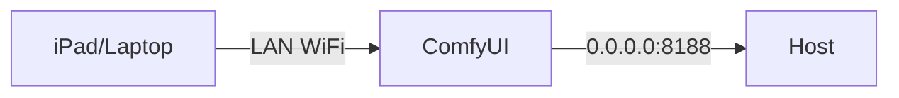

# Deployment Recipe 2: LAN (Restricted)

This recipe allows access from other devices on your local network (e.g., an iPad on WiFi) but **NOT** from the internet.

> [!WARNING]
> This configuration exposes ComfyUI to **everyone** on your WiFi/LAN.
> Do NOT use this on public WiFi (cafes, airports) or untrusted networks.

## Architecture



## Configuration

### 1. Bind Address

You must tell ComfyUI to listen on all interfaces.

**Command:**

```bash
python main.py --listen 0.0.0.0
```

### 2. OpenClaw Security (Mandatory)

Since any device on the LAN can access the API, you MUST secure sensitive actions.
Set these Environment Variables:

```ini
# Require a token for admin actions (Stop/Approve)
OPENCLAW_CONNECTOR_ADMIN_TOKEN=your-strong-secret-token

# Require a token for Logs/Config viewing
MOLTBOT_OBSERVABILITY_TOKEN=observability-secret
```

### 3. Firewall Rules (Host)

Ensure your host firewall blocks inbound traffic from the Internet (WAN) but allows LAN.

**Windows (PowerShell):**

```powershell
New-NetFirewallRule -DisplayName "ComfyUI LAN" -Direction Inbound -LocalPort 8188 -Protocol TCP -Action Allow -RemoteAddress LocalSubnet
```

*Note: `-RemoteAddress LocalSubnet` restricts access to your local network segment.*

**Linux (ufw):**

```bash
sudo ufw allow from 192.168.1.0/24 to any port 8188
```

### 4. "Red Lines"

- ❌ Do not forward port 8188 on your router.
- ❌ Do not use `--listen 0.0.0.0` on a laptop connected to public WiFi.

## Testing

1. Find your host IP (e.g., `192.168.1.10`).
2. From another device on WiFi, visit `http://192.168.1.10:8188`.
3. Open OpenClaw Settings.
4. Try to view logs. It should challenge you for the `MOLTBOT_OBSERVABILITY_TOKEN` or deny access.
