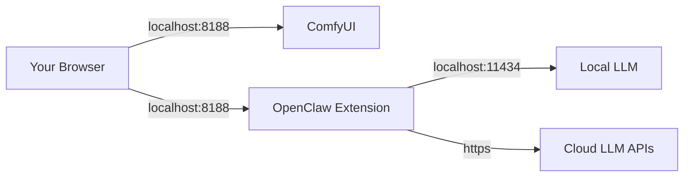

# Deployment Recipe 1: Local-only (Default)

This is the **safest and recommended** configuration for most users.
ComfyUI and OpenClaw run on your local machine, and no ports are exposed to the network.

## Architecture



## Configuration

### 1. Bind Address

Ensure ComfyUI is bound to `127.0.0.1` (loopback), not `0.0.0.0`.
This is the default for ComfyUI.

**Verification:**
Run ComfyUI and check the console output:

```text
Starting server
To see the GUI go to: http://127.0.0.1:8188
```

### 2. OpenClaw Settings

No special configuration is required.

- **Admin Token**: Not required for loopback-only operations (unless `OPENCLAW_CONNECTOR_ADMIN_TOKEN` is explicitly set).
- **Webhooks**: Disabled by default.

### 3. "Red Lines" (What NOT to do)

- ❌ Do not run with `--listen 0.0.0.0` or `--listen`.
- ❌ Do not port-forward port 8188 on your router.

## Testing

1. Open `http://127.0.0.1:8188` in your browser.
2. Open the OpenClaw tab in the sidebar.
3. Go to **Settings** -> **Health**.
4. All checks should be green.
